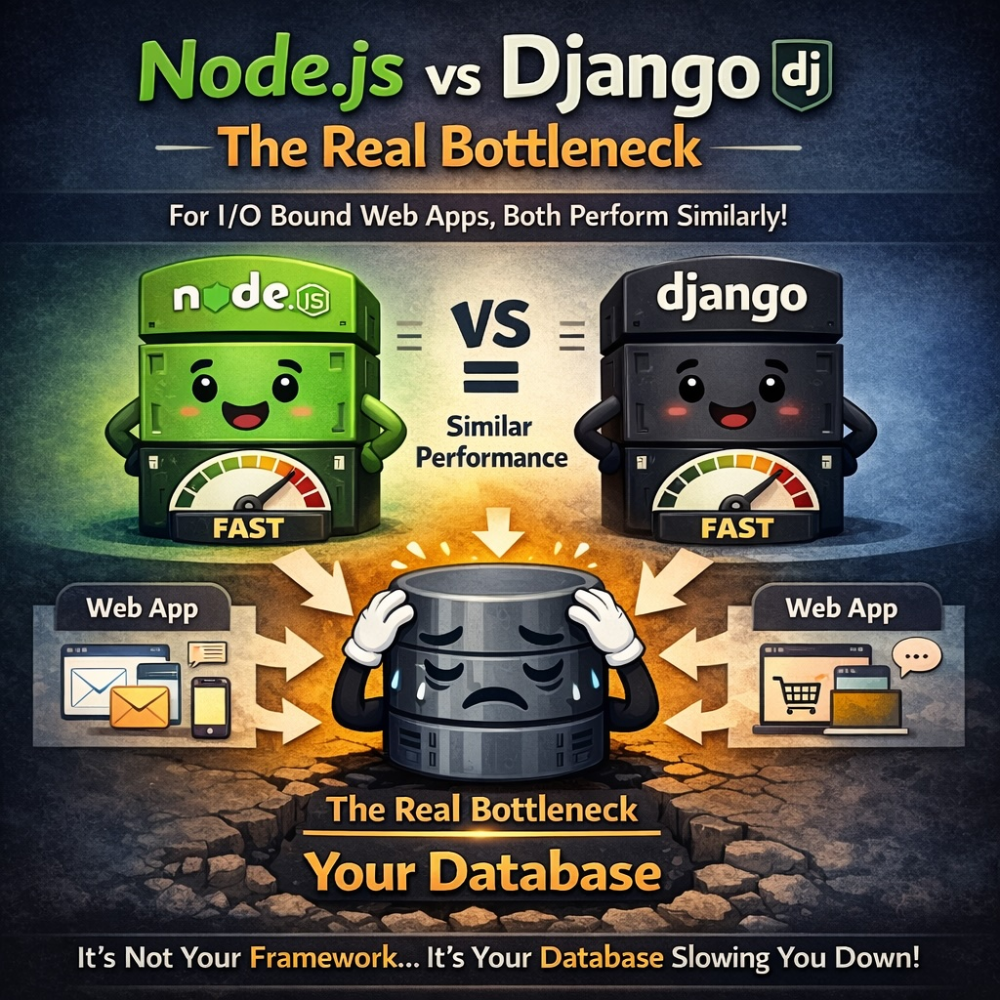

After years of building production APIs with both Django and Node.js, I've developed a clear preference. Here's my practical comparison.

## The Case for Django

Django's "batteries included" philosophy means you get a lot out of the box:

- **ORM**: Django's ORM is mature and handles complex queries elegantly
- **Admin Panel**: Auto-generated admin interface saves weeks of development
- **Security**: Built-in protection against common vulnerabilities
- **Migrations**: Database migrations that just work

```python
# Django makes complex queries readable
orders = Order.objects.filter(
    status='completed',
    created_at__gte=last_month
).select_related('customer').prefetch_related('items')
```

## When Node.js Shines

Node.js has its strengths too:

- **Real-time applications**: WebSocket handling is more natural
- **Microservices**: Lightweight for small, focused services
- **JavaScript ecosystem**: If your frontend is React/Vue, shared code is possible

## My Decision Framework

Choose **Django** when:
- Building data-heavy applications
- Need an admin interface
- Want rapid prototyping with production-ready code
- Team has Python experience

Choose **Node.js** when:
- Building real-time features (chat, live updates)
- Creating lightweight microservices
- Full-stack JavaScript is a requirement

## Performance Myths

"Node.js is faster than Django" - this is often misunderstood. For I/O bound operations (most web apps), both perform similarly. The bottleneck is usually your database, not your framework.



## Conclusion

I reach for Django more often because it lets me ship faster without sacrificing quality. The admin panel alone saves significant development time. That said, I still use Node.js for real-time features and lightweight services.

The best framework is the one that helps you ship quality software efficiently.

---

*Building an API and not sure which to choose? [Let's discuss](/contact).*
