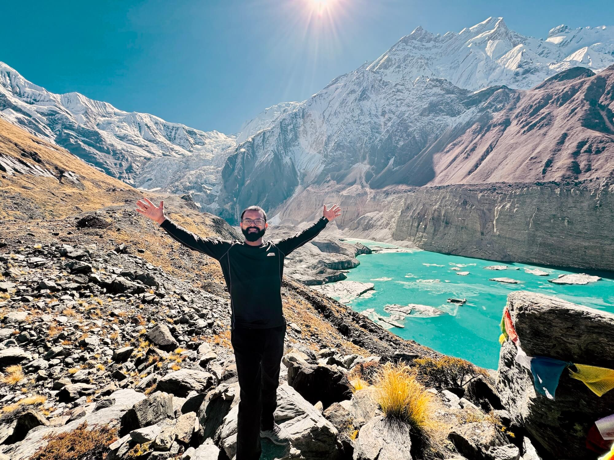
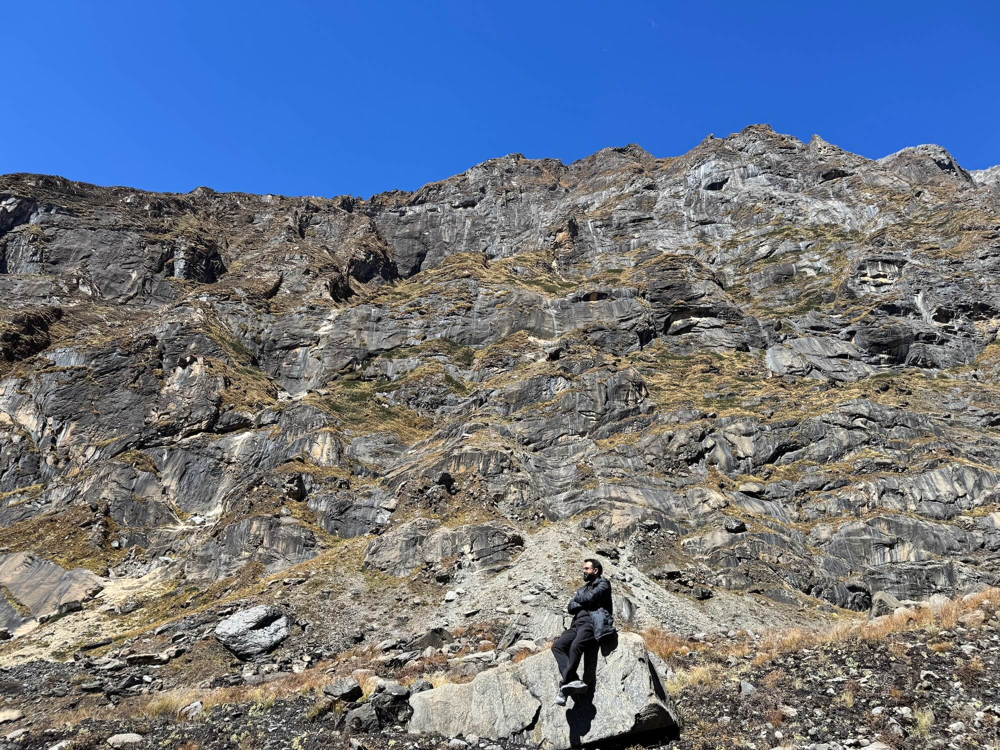

It's been over 15 years since I wrote my first line of code. What started as curiosity back in 2009 — tinkering with Python and building custom CMS systems — has turned into a career spanning 15+ countries, 100+ projects, and a journey I never could have predicted. Here's a look back at how it all unfolded.

## The Early Days

I'm Kishor Kumar Mahato, a software engineer based in Kathmandu, Nepal. I started programming in 2009, initially building custom CMS systems with Python before discovering WordPress. That discovery changed everything. I didn't just want to use WordPress — I wanted to build for it. I started developing plugins, contributed them to wordpress.org, and eventually created a WordPress theme business from scratch. I grew that business, learned hard lessons about product development, and eventually sold it. That experience taught me more about product thinking than any course ever could.

Along the way, I also explored cross-platform mobile development with Titanium, which gave me an early appreciation for building software that works across different environments.

## Contributing to WordPress

WordPress gave me my start, and I've tried to give back ever since. I became a [Plugin Developer on wordpress.org](https://profiles.wordpress.org/cyberkishor/), contributing plugins like **3 in One Slider**, **RSS Feed Modify**, and **Relic Sales Motivator WooCommerce Lite**. Beyond code, I've been a Translation Contributor, helping localize WordPress into Nepali (नेपाली) — because open source should be accessible to everyone, regardless of language.

## Building a Technical Foundation

Over the years, I expanded my skill set well beyond WordPress. I dove deep into Python and Django, fell in love with building robust backend systems, and picked up Laravel and PHP for projects that demanded it. JavaScript and TypeScript became second nature as React took over the frontend world. Today, my daily stack includes:

- **Backend**: Django, Laravel, Node.js
- **Frontend**: React, TypeScript, Tailwind CSS
- **eCommerce**: Shopify (apps, themes, and custom integrations)
- **DevOps**: Docker, CI/CD pipelines, cloud deployments

Each technology was learned not in isolation, but by solving real problems for real clients.

## From Freelancer to Entrepreneur

One of the biggest leaps in my career was founding [OctSpace](https://octspace.com) — a company focused on eCommerce and software innovation. I also work with [Amplecube](https://amplecube.com), taking on the role of Project Manager. OctSpace became the vehicle through which I could take on larger, more complex projects. From building scalable Shopify apps to architecting SaaS platforms, it allowed me to work with businesses across the globe.

Beyond running OctSpace, I also took on a role as a Technical Advisor for a global organization, where I help shape technical strategies and guide teams through complex engineering challenges. It's a role that forces me to think beyond code — about systems, people, and long-term impact.

## The WordPress Community and WordCamps

The tech community in Nepal has given me a lot, and I believe in giving back. My WordPress community journey has been one of the most fulfilling parts of my career:

- **[WordCamp Kathmandu 2016](https://kathmandu.wordcamp.org/2016/speaker/kishor-mahato/)** — I spoke about the WordPress REST API, which had just been integrated into WordPress 4.7. It was exciting to share how this feature would change the way developers build with WordPress.
- **[WordCamp Kathmandu 2022](https://kathmandu.wordcamp.org/2022/)** — Joined the organizing team.
- **[WordCamp Kathmandu 2023](https://kathmandu.wordcamp.org/2023/organizer/kishor-kumar-mahato/)** — Continued organizing, helping bring the community together.
- **[WordCamp Nepal 2025](https://nepal.wordcamp.org/2025/organizer/kishor-kumar-mahato/)** — Serving as AV Team Lead, making sure the event's audio-visual experience runs smoothly.

As I said in [an interview with DevotePress](https://devotepress.com/wordpress-news/wcktm-2016-stars-interview-kishor-kumar-mahato/) back in 2016, what I value most about WordCamps is "the sharing of knowledge" — people of different experience levels coming together to exchange expertise. That hasn't changed.

I also believe strongly in making the WordPress community more inclusive. Women's participation in the Nepal WordPress community has been below 15%, and I've always advocated for bringing that number up. Everyone is an important asset to this community.

## Lessons Learned Along the Way

After 15+ years and 50+ happy clients, here are a few things I've come to believe:

1. **Understand the problem before writing code.** Clear communication upfront saves everyone time and money. I spend more time asking questions than most developers, and it pays off every time.

2. **Repeat clients are the best metric.** Most of my clients come back. That's not because I'm the cheapest or the fastest — it's because I care about delivering work that actually solves their problem.

3. **Technology is a tool, not the goal.** I've worked with Django, Laravel, React, Shopify, WordPress, and more. The best technology is the one that fits the problem. Don't marry a framework.

4. **Ship things that work.** My tagline is "Building products that solve real problems" and I mean it. Elegance in code matters, but not more than a product that works reliably for users.

5. **Stay curious.** The tech landscape changes fast. What kept me relevant over 15 years wasn't any single skill — it was the willingness to keep learning.

## Beyond Code

<!--  -->
<!--  -->

When I'm not coding, you'll find me watching movies, traveling, playing futsal or volleyball, or trekking through Nepal's incredible trails with friends. These experiences keep me grounded and remind me that the best ideas often come when you step away from the screen.

## What's Next

I'm continuing to build with OctSpace, take on challenging projects, and contribute to the developer community in Nepal and beyond. If you're a developer starting out in Nepal or anywhere else — know that geography doesn't have to limit your impact. The internet is the great equalizer, and good work speaks for itself.

---

*Want to work together or just say hi? [Get in touch](/contact).*

                                                                                                                                    
  6 SVG placeholder images in public/blog/images/

  ┌─────────────────────────────┬─────────────────────────────────┬────────────────────────────────────────────────────┐        │            Image            │             Section             │               Suggested replacement             │                        
  ├─────────────────────────────┼─────────────────────────────────┼────────────────────────────────────────────────────┤          
  │ journey-cover.svg           │ Blog cover/hero                 │ Your professional headshot or a scenic Nepal photo    │                         
  ├─────────────────────────────┼─────────────────────────────────┼────────────────────────────────────────────────────┤
  │ early-days.svg              │ The Early Days                  │ A throwback photo from your early coding days      │
  ├─────────────────────────────┼─────────────────────────────────┼────────────────────────────────────────────────────┤
  │ wordpress-contributions.svg │ Contributing to WordPress       │ Screenshot of your WP profile or plugin page       │
  ├─────────────────────────────┼─────────────────────────────────┼────────────────────────────────────────────────────┤
  │ octspace-team.svg           │ From Freelancer to Entrepreneur │ OctSpace team or workspace photo                   │
  ├─────────────────────────────┼─────────────────────────────────┼────────────────────────────────────────────────────┤
  │ wordcamp-speaking.svg       │ WordCamps                       │ Photo of you speaking or at a WordCamp event       │
  ├─────────────────────────────┼─────────────────────────────────┼────────────────────────────────────────────────────┤
  │ trekking-nepal.svg          │ Beyond Code                     │ A trekking or travel photo                         │
  └─────────────────────────────┴─────────────────────────────────┴────────────────────────────────────────────────────┘
  Each SVG has a colored background with labeled text showing what to replace it with. Just swap any .svg file with your actual .jpg/.png photo
  (update the file extension in the markdown accordingly).