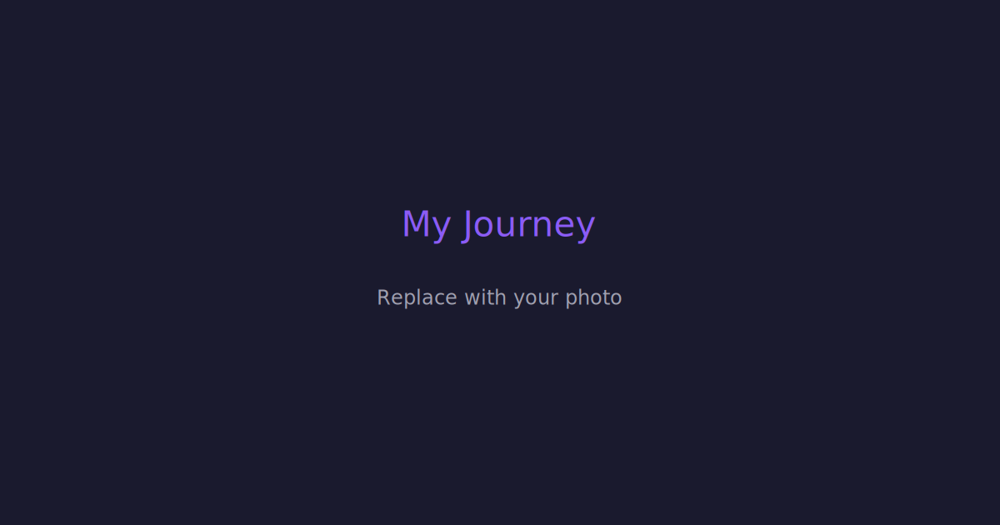
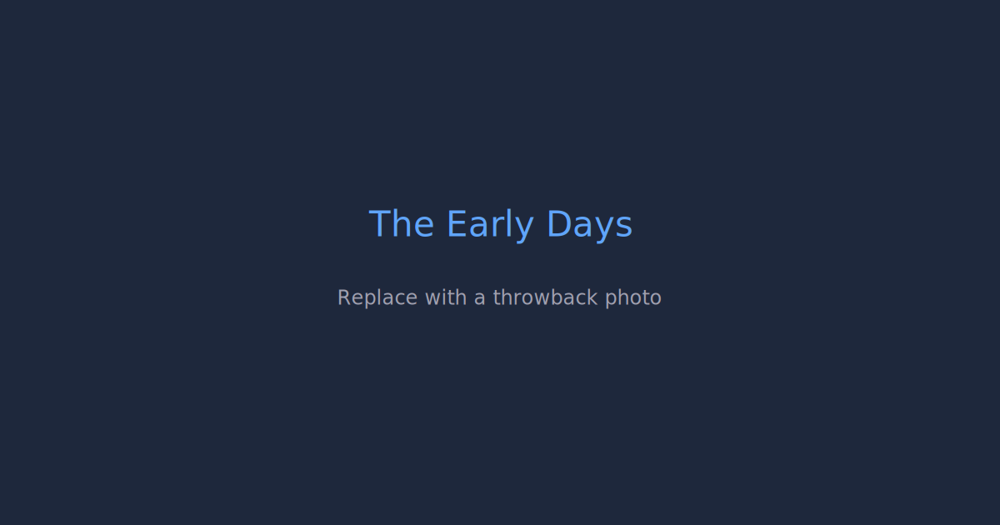
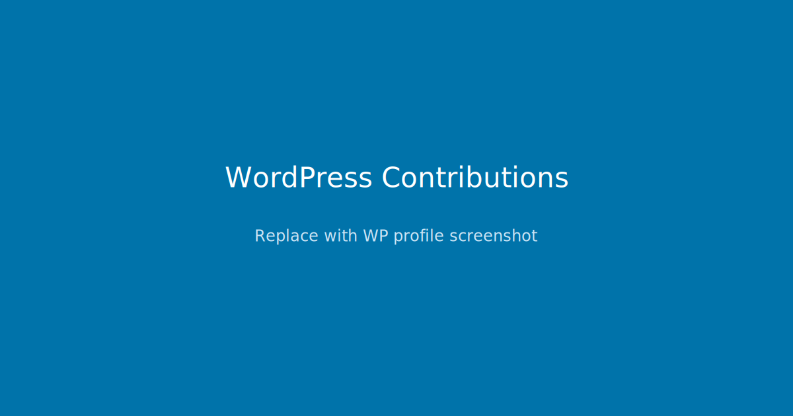
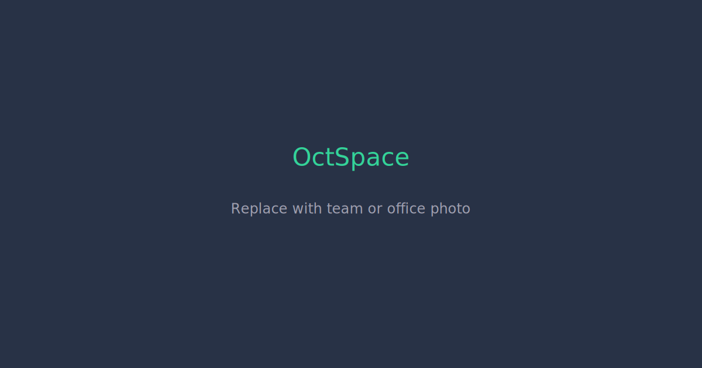
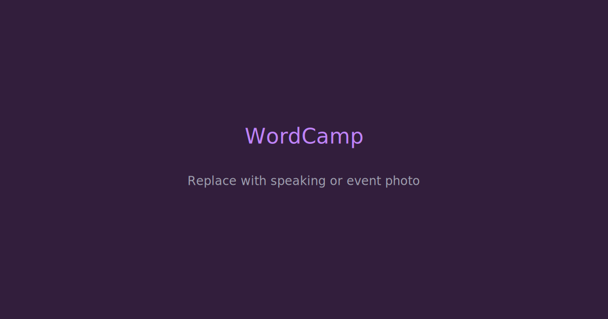
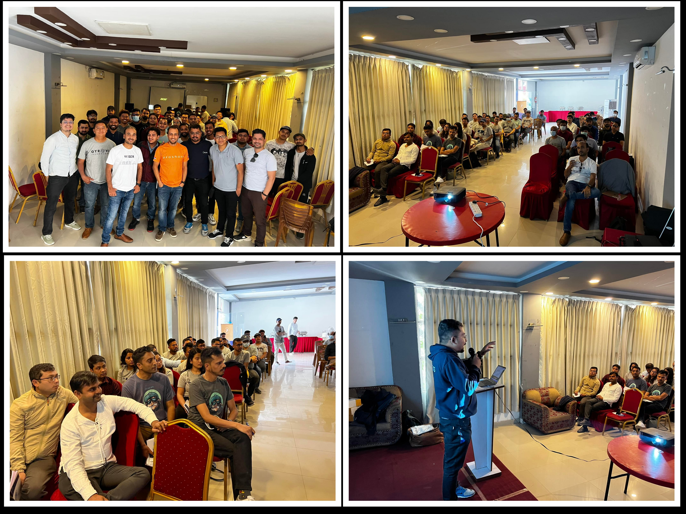
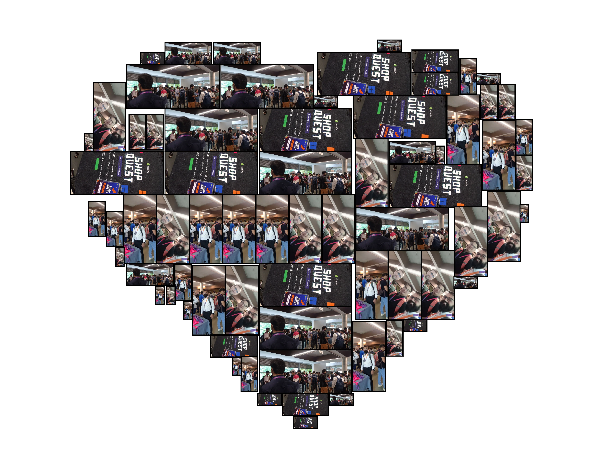
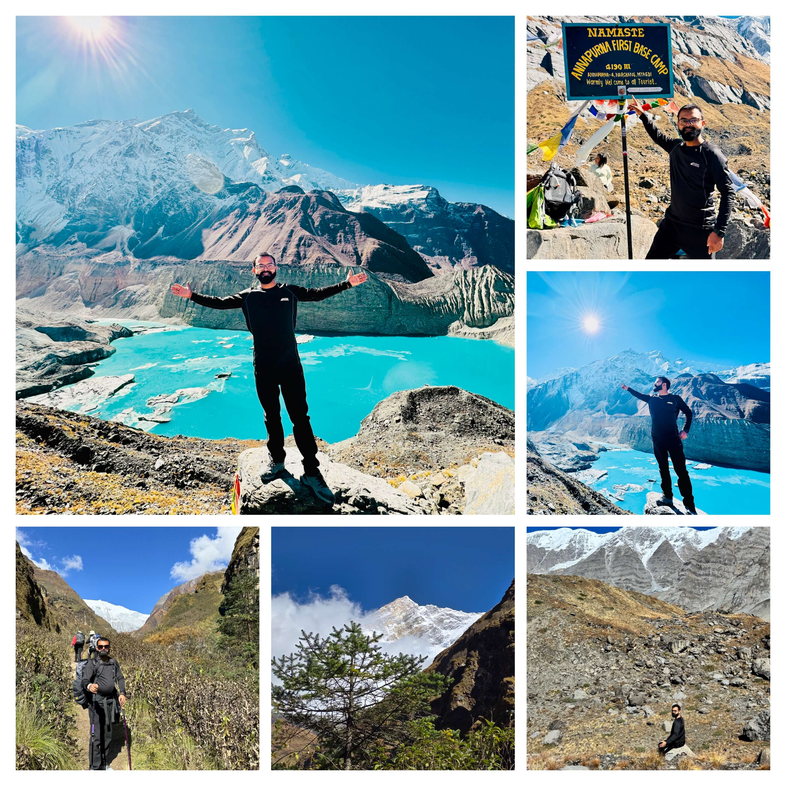
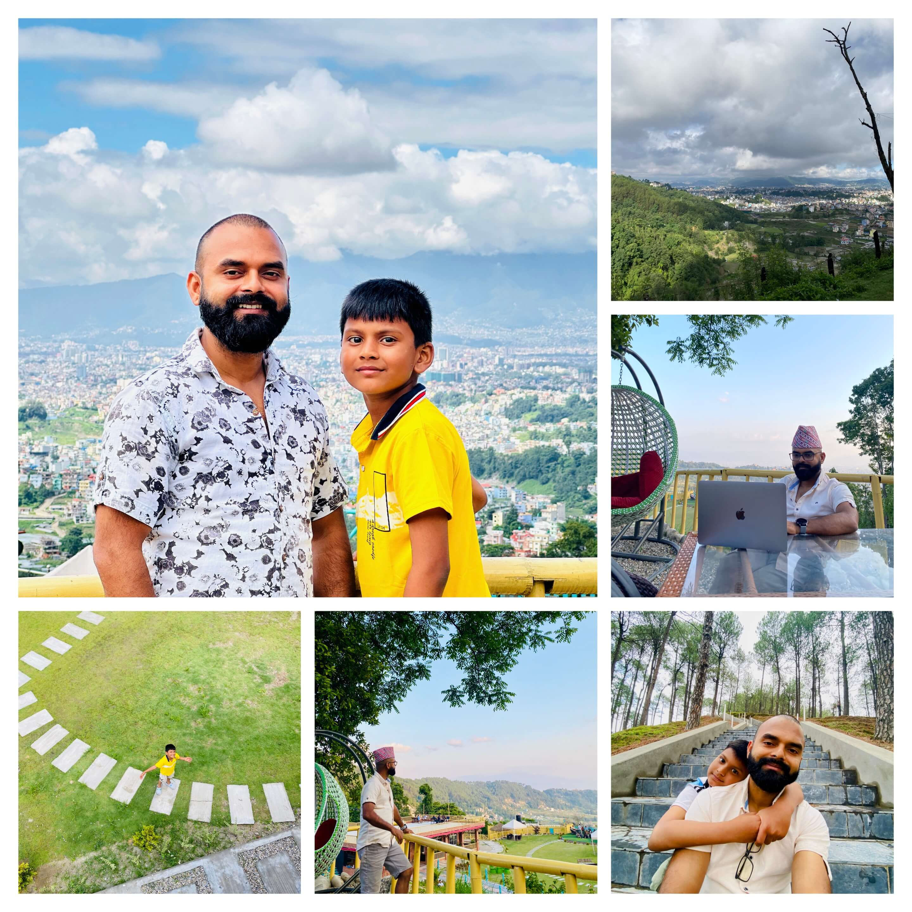

More than fifteen years have passed since I initially wrote a line of code; what began in 2009 as simply being curious – playing around with Python and making bespoke CMSs – has become a career which has covered more than fifteen nations, over a hundred projects, and a path I never would have anticipated. Here's a recall of how everything came about.

## The Early Days

I am Kishor Kumar Mahato, a software engineer who is located in Kathmandu, Nepal. I began to program in 2009, at first constructing custom CMSs with Python, before I found WordPress. That discovery altered everything. I did not only want to employ WordPress – I wished to develop for it. I commenced creating plugins, provided them to wordpress.org, and ultimately made a WordPress theme business from the ground up. I caused that business to grow, acquired difficult lessons regarding product development, and at last sold it. That experience taught me more regarding product thought than any class could.

Alongside the way, I also investigated cross-platform mobile development using Titanium, which gave me an early respect for creating software that operates across differing environments.

## Contributing to WordPress

WordPress gave me my commencement, and I have attempted to return the favour since. I became a [Plugin Developer on wordpress.org](https://profiles.wordpress.org/cyberkishor/), contributing plugins such as *3 in One Slider, RSS Feed Modify, and Relic Sales Motivator WooCommerce Lite. Apart from code, I have been a Translation Contributor, assisting in localizing WordPress into Nepali (नपल) – as open source ought to be accessible to everyone, regardless of language.

## Building a Technical Foundation

Over the years, I broadened my skill set well beyond WordPress. I went deeply into Python and Django, became fond of creating strong backend systems, and acquired Laravel and PHP for projects that required it. JavaScript and TypeScript became instinctive as React took over the frontend world. Currently, my daily stack includes:

- Backend: Django, Laravel, Node.js
- Frontend: React, TypeScript, Tailwind CSS
- eCommerce: Shopify (apps, themes and custom integrations)
- DevOps*: Docker, CI/CD pipelines, cloud deployments

Each technology was learned not in isolation, but by resolving actual problems for actual clients.

## From Freelancer to Entrepreneur

If there's one company that has shaped who I am as a professional, it's [Amplecube](https://amplecube.com). This is where it all started for me – and honestly, it never ends. I was working there, I am working there, and I will always be working there. Amplecube is not just a company to me; it's family. We grew this company from scratch, from nothing to something real. The boss? He's my college mate, my best friend, more like an elder brother. He has always had my back – whether it's work, finances, family, anything. He's one of the most responsible people I know, and I wouldn't be where I am today without him. Amplecube holds a special place in my heart, and it always will.

Then there's [OctSpace](https://octspace.com) – a company I started a few years ago for my personal projects and ideas around eCommerce and software innovation. There's a lot more to the OctSpace story, but I'll save that for a dedicated blog post. Stay tuned for that one.

Beyond these, I also took on a role as a Technical Advisor for a worldwide organization, where I help shape technical strategies and guide teams through complex engineering challenges. It's a role that pushes me to think beyond code – about systems, people, and long-term impact.

## The WordPress Community and WordCamps

The tech community in Nepal has given me a lot, and I believe in giving back. My time with the WordPress community has been among the most rewarding aspects of my professional life:

- *[WordCamp Kathmandu 2016](https://kathmandu.wordcamp.org/2016/speaker/kishor-mahato/) – I presented on the WordPress REST API, newly included in WordPress 4.7; it was great to explain to people how this feature would alter WordPress development.
- [WordCamp Kathmandu 2022](https://kathmandu.wordcamp.org/2022/) – I joined the team organising the event.
- [WordCamp Kathmandu 2023](https://kathmandu.wordcamp.org/2023/organizer/kishor-kumar-mahato/) – I continued to help organise, assisting in bringing the community together.
- [WordCamp Nepal 2025](https://nepal.wordcamp.org/2025/organizer/kishor-kumar-mahato/) – I am currently the AV Team Lead, working to ensure the event has a good audio-visual experience.

As I stated in [an interview with DevotePress](https://devotepress.com/wordpress-news/wcktm-2016-stars-interview-kishor-kumar-mahato/) in 2016, the most valuable thing about WordCamps, for me, is "the exchange of knowledge" – people with a range of abilities meeting to share what they know. This has not changed.

I also feel very strongly about making the WordPress community more welcoming to all. In the Nepal WordPress community, less than 15% of participants are women, and I have consistently supported increasing this figure. Every person is a valuable part of this community.

## Shopify – A Platform That Changed Everything

One platform that deserves its own mention is Shopify. We were the [first Shopify Expert from Nepal](https://www.shopify.com/partners/directory/partner/partner-156) – and that's something I'm genuinely proud of. Through Amplecube, we've been a Shopify Partner since 2016, maintaining a perfect 5.0 rating from our clients. We do it all: theme customization, building stores from scratch, app integration, and custom app development.

But we didn't stop at client work. Through OctSpace, we've built and published our own [apps on the Shopify App Store](https://apps.shopify.com/partners/developer-933705c0463ee1c8). You can check out all our apps and projects at [octspace.com/project](https://octspace.com/project.php):

- [**Oct: Upsello – Sales Motivator**](https://octspace.com/bundle) – A powerful all-in-one app that combines bundling, upsells, popups, and real-time notifications to maximize your store's revenue
- [**Oct: Bought Together**](https://octspace.com/bought_together) – Create compelling bundle deals, Buy X Get Y offers, and post-purchase upsells to increase average order value
- [**Oct: Sales Notifier**](https://octspace.com/sales-popup) – Display real-time sales notifications with customer names, locations, and timestamps to build trust and urgency
- [**Oct: Notifications & Popups**](https://octspace.com/popup+) – Announcement bars, discount progress indicators, and timed promotional popups to capture attention and drive conversions
- [**B2B Suite**](https://octspace.com/b2b) – Manage wholesale customers with storefront lock, custom and tiered pricing, order limits, and business registration
- [**Store Locator**](https://octspace.com/project-details.html) – Help customers find your physical store locations with maps and directions

Building apps that other merchants use every day to grow their businesses – that's a different kind of satisfaction. Shopify has been a huge part of our journey, and there's a lot more we're planning to build on this platform.

### Active in the Shopify Community

It's not just about building on Shopify – I'm actively involved in the Shopify community too. I attended [Shop Quest – Developer Edition](https://www.linkedin.com/feed/update/urn:li:activity:7247865958143344640/), an official Shopify event where developers and agency partners come together to learn, share, and connect. It was an amazing experience meeting fellow Shopify developers, exchanging ideas, and staying on top of what's new in the ecosystem.

Being part of these events keeps me connected with the global Shopify developer community and helps me bring the latest knowledge back to our work at Amplecube and OctSpace.

## Things I Have Learned

With over fifteen years of experience and more than fifty satisfied clients, I have come to believe a few things:

1. Make sure you know the issue before you write any code. Good communication at the beginning saves everyone time and money. I ask more questions than most programmers, and it always works out well.

2. Clients who return are the best measure of success. The majority of my clients are repeat customers; this is not due to my being the cheapest or the quickest, but because I focus on delivering work that effectively addresses their needs.

3. Technology is a means to an end, not the end itself. I have experience with Django, Laravel, React, Shopify, WordPress, and other systems. The best technology is the one which suits the problem; do not become too attached to any one framework.

4. Deliver things which function. My slogan is "Building products that solve real problems" and I intend this. Elegant code is important, but less so than a product which works for users, consistently.

5. Remain inquisitive. The technology world moves quickly. What has kept me current over fifteen years was not a single skill – it was a willingness to continue to study.

## My Family – The Best Part of Life

Beyond all the code, the projects, and the late-night debugging sessions – what truly matters is my family. I'm blessed with a lovely wife who has been my pillar of support through every career twist and turn. We have two beautiful boys: our elder son, who is 7 years old and already full of curiosity and energy, and our little one, just 7 months old, who fills our home with pure joy. They remind me every day why I do what I do. Family comes first, always.

## Away From Code

I enjoy watching films, travelling, playing futsal and volleyball, and hiking Nepal's amazing paths with friends when I'm not coding. These activities help me to stay sensible, and remind me that the best ideas often come when you step away from the computer.

## What I Plan to Do

I'm still building with Amplecube and OctSpace, taking on challenging projects, and giving back to the developer community in Nepal and beyond. There's a lot more I've done along the way that didn't make it into this post – I'll be sharing those stories in separate blog posts soon.

If you're a developer just starting out in Nepal, or anywhere else – know that your location doesn't have to limit your impact. The internet is the great equalizer, and good work speaks for itself.

---

*Would you like to collaborate or simply say hello? [Get in touch](/contact).*

  6 SVG placeholder images in public/blog/images/

  ┌─────────────────────────────┬─────────────────────────────────┬────────────────────────────────────────────────────┐        │            Image            │             Section             │               Suggested replacement             │
  ├─────────────────────────────┼─────────────────────────────────┼────────────────────────────────────────────────────┤
  │ journey-cover.svg           │ Blog cover/hero                 │ Your professional headshot or a scenic Nepal photo    │
  ├─────────────────────────────┼─────────────────────────────────┼────────────────────────────────────────────────────┤
  │ early-days.svg              │ The Early Days                  │ A throwback photo from your early coding days      │
  ├─────────────────────────────┼─────────────────────────────────┼────────────────────────────────────────────────────┤
  │ wordpress-contributions.svg │ Contributing to WordPress       │ Screenshot of your WP profile or plugin page       │
  ├─────────────────────────────┼─────────────────────────────────┼────────────────────────────────────────────────────┤
  │ octspace-team.svg           │ From Freelancer to Entrepreneur │ OctSpace team or workspace photo                   │
  ├─────────────────────────────┼─────────────────────────────────┼────────────────────────────────────────────────────┤
  │ wordcamp-speaking.svg       │ WordCamps                       │ Photo of you speaking or at a WordCamp event       │
  ├─────────────────────────────┼─────────────────────────────────┼────────────────────────────────────────────────────┤
  │ trekking-nepal.svg          │ Beyond Code                     │ A trekking or travel photo                         │
  └─────────────────────────────┴─────────────────────────────────┴────────────────────────────────────────────────────┘
  Each SVG has a colored background with labeled text showing what to replace it with. Just swap any .svg file with your actual .jpg/.png photo
  (update the file extension in the markdown accordingly).
