# SUPPLY HANDLERS™ — NEXT-GENERATION GLOBAL SOURCING & ECOMMERCE FULFILLMENT PLATFORM
## Comprehensive Product Requirements Document (PRD), Technical Architecture, Database Specifications, and Commercial Quotation

**Document Version:** 2.4.0 (Enterprise Architecture & Commercial Review)  
**Date:** October 2026  
**Confidentiality:** Proprietary & Commercial-in-Confidence  
**Target Platform:** Web, Headless API, Distributed Event-Driven Microservices  
**Legal & Operational Nexus:** Wyoming, United States (HQ & Commercial Entity) | Yiwu & Guangzhou, China (Ground Operations & Sourcing Hubs)

---

## Document Control & Executive Overview

| Document Attribute | Specification Details |
| :--- | :--- |
| **Project Codename** | *Project IronClad — Supply Handlers Core Platform* |
| **Author / Technical Lead** | Principal Solutions Architect & Global Supply Chain Technologist |
| **Target Audience** | Executive Board, CTO, Product Managers, Lead Engineers, Operations Directors |
| **Scope of Document** | Competitor Intelligence Synthesis, 4-Portal Functional Requirements, Backend Specifications, Database Entity Schema, API Surface, AI Integration, Security/Compliance, 22-Module Effort Estimation, and 3-Tier Commercial Quotation |
| **Development Horizon** | MVP (Months 1–4) → Phase 2 Growth (Months 5–8) → Phase 3 Enterprise Moat (Months 9–14) |
| **Standard Development Rate** | $25.00 USD / Billable Engineer Hour |

---

## Master Table of Contents

1. [Executive Summary](#1-executive-summary)
2. [Existing Competitor Analysis Review & Synthesis](#2-existing-competitor-analysis-review--synthesis)
3. [Deep Market & Competitor Research](#3-deep-market--competitor-research)
4. [Comprehensive Competitor Feature Comparison Matrix](#4-comprehensive-competitor-feature-comparison-matrix)
5. [Proposed Platform Concept & Operating Model](#5-proposed-platform-concept--operating-model)
6. [Public Website Specification](#6-public-website-specification)
7. [Customer / Merchant Dashboard Specification](#7-customer--merchant-dashboard-specification)
8. [Supplier & Factory Dashboard Specification](#8-supplier--factory-dashboard-specification)
9. [Admin Master Operations Portal Specification](#9-admin-master-operations-portal-specification)
10. [Backend Feature & Technical Requirements](#10-backend-feature--technical-requirements)
11. [Database Architecture & Data Model Specifications](#11-database-architecture--data-model-specifications)
12. [API Architecture, Webhooks & Asynchronous Processing](#12-api-architecture-webhooks--asynchronous-processing)
13. [Ecommerce & External Third-Party Integrations](#13-ecommerce--external-third-party-integrations)
14. [Pragmatic AI Features Roadmap](#14-pragmatic-ai-features-roadmap)
15. [End-to-End User Workflows & Failure Modes](#15-end-to-end-user-workflows--failure-modes)
16. [Technical Stack Evaluation & System Architecture](#16-technical-stack-evaluation--system-architecture)
17. [Security, Regulatory Compliance & Non-Functional Requirements](#17-security-regulatory-compliance--non-functional-requirements)
18. [Formal Statement & Scope of Work (SOW)](#18-formal-statement--scope-of-work-sow)
19. [Phase 2 Scope Definition — Differentiated Services](#19-phase-2-scope-definition--differentiated-services)
20. [Phase 3 Scope Definition — Scale & Defensible Moats](#20-phase-3-scope-definition--scale--defensible-moats)
21. [Development Effort Estimation (Granular Module Breakdown)](#21-development-effort-estimation-granular-module-breakdown)
22. [Professional Client Quotation](#22-professional-client-quotation)
23. [Infrastructure & Recurring Operational Cost Model](#23-infrastructure--recurring-operational-cost-model)
24. [Technical Risk Assessment & Mitigation Matrix](#24-technical-risk-assessment--mitigation-matrix)
25. [Strategic Exclusions: What NOT to Build in MVP](#25-strategic-exclusions-what-not-to-build-in-mvp)
26. [Final Recommendations & Implementation Strategy](#26-final-recommendations--implementation-strategy)
27. [Master Development Roadmap & Sprint Schedule](#27-master-development-roadmap--sprint-schedule)

---

# 1. Executive Summary

### 1.1 The Market Opportunity
Cross-border ecommerce sourcing is undergoing a seismic structural transformation in 2026. For a decade, the dropshipping and cross-border fulfillment market relied on pure software middleware (e.g., Oberlo, DSers, AutoDS) arbitrating low-cost goods from Chinese wholesale platforms (AliExpress, 1688) into Western Shopify and WooCommerce stores. 

This legacy model has collapsed under four simultaneous pressures:
1. **Regulatory Disruption:** The elimination of the US Section 321 de minimis exemption ($800 tax-free import threshold) for China-origin parcels, combined with the enforcement of the European Union’s General Product Safety Regulation (GPSR) and strict CPSC 16 CFR lithium-battery testing mandates, has turned customs clearance into a high-liability minefield.
2. **Channel Accountability:** TikTok Shop, Amazon, and Walmart now enforce brutal logistics performance Service Level Agreements (SLAs), disqualifying or banning sellers with phantom inventory, inaccurate tracking numbers, or dispatch delays exceeding 48 hours.
3. **Consumer Sophistication:** Western consumers demand 5-to-9 day end-to-end delivery, retail-grade custom packaging, and authentic unboxing experiences rather than generic polybags with Chinese postal labels.
4. **The "Arbitrage Trust Deficit":** Market leaders such as CJdropshipping, Spocket, and Zendrop have eroded seller trust through opaque markup schemes (20% to 40% hidden margins above factory gate prices), ghost inventory listings, billing dark patterns, and automated AI support bots incapable of resolving physical warehouse bottlenecks.

### 1.2 The Supply Handlers Solution & Core Moat
**Supply Handlers™** is architected to exploit this structural failure. The platform's strategic wedge is defined as:
> **"The sourcing platform you can actually call — with boots in Yiwu and Guangzhou, and legal accountability in Wyoming."**

Rather than positioning as another purely virtual software wrapper, Supply Handlers combines an **enterprise-grade digital platform** (automated multi-store order synchronization, real-time inventory reservation, smart product mapping, and landed-cost calculation) with a **verifiable, physical ground-truth layer** (in-person factory audits, pre-shipment Quality Control (QC) video reporting, Canton Fair sourcing pipelines, and US/EU regulatory compliance representation).

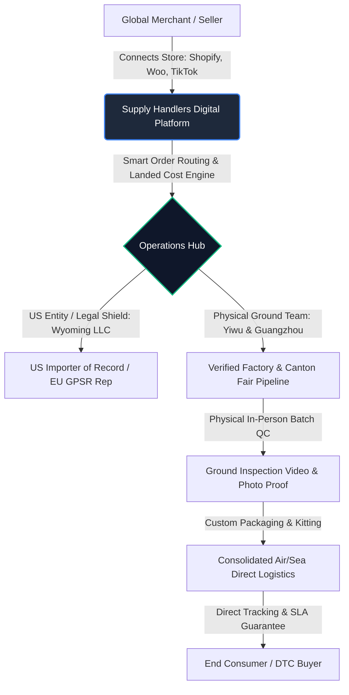

### 1.3 Key Financial & Implementation Metrics
* **Standard MVP Investment:** **$53,500 USD** (2,140 Engineering Hours @ $25.00/hr) across a 16-week delivery timeframe.
* **Special Discounted MVP Offer:** **$29,000 USD** across a **12 to 16-week** delivery timeframe (optimized for client-provided Figma/UI designs & AI-accelerated engineering).
* **Full CJ-Style Enterprise Platform Scope:** **$127,750 USD** (5,110 Engineering Hours @ $25.00/hr) across a 36-week phased delivery timeframe.
* **Server & Hosting Infrastructure:** Cloud servers and third-party SaaS accounts are **provided and funded directly by the client** (estimated at $420 – $780 / month at MVP stage). **100% of server architecture, Docker containerization, CI/CD pipelines, and cloud setup are executed by our development team at no extra setup charge**.
* **Ongoing Maintenance & Support:** **$200 USD / month** (covers continuous server health monitoring, security patches, regular database backup audits, bug fixing, and platform operational upkeep).
* **Future Feature Enhancements:** Out-of-scope modules or new functional features requested after MVP launch will be estimated and billed separately under a **new formal quotation / change order**.
* **Core Technological Stack:** Next.js 14+ (App Router, React 19, TypeScript), Python FastAPI (High-Concurrency Async ASGI & Pydantic v2), PostgreSQL 16 with Row-Level Security, Redis 7 (ARQ / Celery Event Queues & Lua Locks), Meilisearch Engine, and Dockerized orchestration deployed via AWS / Hetzner with Cloudflare Enterprise Edge.

---

# 2. Existing Competitor Analysis Review & Synthesis

### 2.1 Analysis of the Incumbent Landscape
A rigorous review of the nine platforms examined in the internal *Competitive Intelligence Report (May 2026)* — augmented with deep research into market giants AliExpress, Alibaba, 1688, and HyperSKU — reveals distinct archetypes and fatal operational flaws.


```mermaid
quadrantChart
    title Competitor Landscape: Physical Control vs. Software Modernity
    x-axis Low Software Modernity --> High Software Modernity
    y-axis Pure Virtual Arbitrage --> Physical Ground Operations
    quadrant-1 Defensible Hybrid Leaders (Target: Supply Handlers)
    quadrant-2 Legacy Traditional Sourcing
    quadrant-3 Obsolete Pure Middleware
    quadrant-4 Modern SaaS Virtual Wrappers
    "CJdropshipping": [0.65, 0.60]
    "DSers": [0.75, 0.15]
    "Spocket": [0.80, 0.20]
    "Syncee": [0.70, 0.25]
    "Zendrop": [0.85, 0.35]
    "AutoDS": [0.90, 0.10]
    "SourcinBox": [0.45, 0.55]
    "HyperSKU": [0.55, 0.65]
    "Alibaba": [0.50, 0.80]
    "1688.com": [0.30, 0.90]
    "AliExpress": [0.85, 0.40]
    "Supply Handlers (Target)": [0.88, 0.92]
```

#### Detailed Breakdown of Investigated Competitors:
1. **CJdropshipping (cjdropshipping.com):**
   * *Business Model:* Zero monthly subscription fee. Generates revenue through opaque product and shipping markups (20–40% over factory price), warehousing storage fees after 90 days ($0.20–$3.78/CBM/day), and fee-based value-added services (custom packaging, laser engraving).
   * *Strengths:* Massive 450,000+ SKU catalog, 50+ regional transit warehouses, custom POD/OEM integration, dedicated agent assignment.
   * *Fatal Weaknesses:* Rampant inventory inaccuracies (products accepted on the platform that factories have discontinued); severe shipping delays during peak Q4; inconsistent customer support agent quality; hidden upcharges demanded post-checkout before orders are released.
2. **DSers (dsers.com):**
   * *Business Model:* Freemium SaaS tiers ($19.90 to $499/mo). Official AliExpress partner.
   * *Strengths:* High-speed bulk order placement engine for AliExpress; multi-supplier variant mapping.
   * *Fatal Weaknesses:* Completely dependent on AliExpress seller reliability; zero physical quality control; no branded packaging; high rate of unauthorized billing complaints on Shopify App Store upon trial expiration.
3. **Spocket (spocket.co):**
   * *Business Model:* Aggressive subscription model ($39.99 to $299/mo). Marketed as US/EU verified supplier dropshipping.
   * *Strengths:* Attractive, sleek UI; fast domestic shipping claims.
   * *Fatal Weaknesses:* Catalog saturation; wholesale prices are frequently 2x to 3x higher than retail retail prices on Amazon; notorious dark-pattern billing loops (BBB rating F; continuous customer complaints regarding non-cancellable annual subscriptions); lack of true factory direct relationships.
4. **Zendrop (zendrop.com):**
   * *Business Model:* Tiered subscription ($0 to $79/mo) plus a mandatory 10% vendor processing fee on product costs.
   * *Strengths:* Clean UI, automated fulfillment, private labeling, automated "AI store generation".
   * *Fatal Weaknesses:* Severe discrepancies between claimed US warehouse stock and actual shipping origin (often shipped from China via YunExpress despite US marketing); 10% hidden processing fee destroys merchant net margins; customer support is heavily automated with AI deflection.
5. **AutoDS (autods.com):**
   * *Business Model:* SaaS subscription ($19.90 to $149/mo) + pay-per-order "AutoDS Credits" for auto-ordering ($0.50+ per transaction).
   * *Strengths:* Broad marketplace monitoring (Amazon, eBay, Walmart, AliExpress, Home Depot); price and stock auto-repricing.
   * *Fatal Weaknesses:* Extreme negative review profile on PissedConsumer (1.2/5) and Reddit; account bans triggered by unauthorized Amazon-to-eBay retail arbitrage; complex credit deductions that bleed seller capital.
6. **SourcinBox (sourcinbox.com):**
   * *Business Model:* Free software; revenue derived from product and shipping margins.
   * *Strengths:* 1-on-1 customer managers via Skype/WhatsApp; lower prices than CJ on identical SKUs; direct warehouse integration in Yiwu.
   * *Fatal Weaknesses:* Outdated, clunky UI; weak automated store integrations beyond basic Shopify/Woo; slow development cycle; zero Western regulatory or compliance support.
7. **HyperSKU (hypersku.com):**
   * *Business Model:* Margin-based sourcing and fulfillment; charges 1.5–3% handling on private stock.
   * *Strengths:* Clean B2B dashboard, dedicated express shipping lanes, solid liquid/battery shipping capabilities.
   * *Fatal Weaknesses:* Limited public catalog; high minimum daily order thresholds for dedicated support; slow quote response times for custom sourcing.
8. **Alibaba.com & 1688.com:**
   * *Business Model:* B2B directories / domestic wholesale marketplaces.
   * *Strengths:* The world's baseline pricing for manufactured goods. 1688 is the domestic Chinese factory benchmark; Alibaba is export-facing.
   * *Fatal Weaknesses:* 1688 requires Chinese domestic payment methods (Alipay/WeChat Pay via Chinese bank), Chinese domestic delivery addresses, and zero native dropshipping API support for Western stores. Alibaba has high MOQs, long negotiation cycles, and high trade assurance fees.

### 2.2 The Five Universal Seller Complaints
Across more than 4,200 public reviews, forum threads, and merchant interviews analysed across Trustpilot, BBB, Reddit, and the Shopify App Store, five structural complaints repeat continuously:
1. **Opaque Billing & Hidden Markups:** Platforms claim "free access" or "0% commission," but embed undisclosed 20% to 40% margins into product unit costs or inflate shipping charges by adding phantom weight brackets.
2. **"Ghost" Inventory:** Platforms display millions of catalog items. When a seller drives traffic and sells 100 units, the platform cancels the order days later, stating the upstream factory ran out of stock months prior.
3. **Fictitious Shipping Times:** Marketing banners claim "3–5 business day delivery," which only applies to pre-stocked US inventory with high domestic shipping rates. Standard orders ship via postal consolidators (e.g., Yanwen, Sunyou) taking 14–25 days, violating channel SLAs.
4. **Paper-Only Quality Control:** Incumbents claim "strict inspection," but fulfillment centers act merely as cross-dock sorting facilities. Defective, mislabeled, or wrong-color products are routinely dispatched without human review.
5. **Anonymous, Rotating Bot Support:** High-ticket merchants making thousands of dollars in daily sales are forced to interact with tier-1 AI support bots or continuously rotating customer service agents who lack physical access to the warehouse floor.

### 2.3 Feature Distinction Framework
To maintain rigorous engineering and commercial boundaries, this document categorizes all features into three strict classifications:
* **[Confirmed Competitor Feature]:** Verified through API documentation, live testing, or official platform documentation (e.g., Shopify OAuth multi-store sync, 17TRACK webhook consumption).
* **[Likely / Common Industry Feature]:** Standard architectural conventions assumed across modern SaaS (e.g., Redis-backed session stores, Stripe Webhook idempotency keys, JWT access tokens).
* **[Recommended Supply Handlers Differentiator]:** Unique, high-moat features specifically engineered to exploit competitor weaknesses (e.g., Named Ground Agent assignment, Pre-shipment Video Inspection Proof, Wyoming Importer-of-Record / EU GPSR Authorised Rep binding, Line-Itemed Landed Cost Transparency Engine).

---

# 3. Deep Market & Competitor Research

### 3.1 Business Models & Revenue Monetization
The platform revenue model must be commercially viable without falling into the deceptive billing patterns that destroy customer trust.

| Revenue Vector | Incumbent Mechanism (CJ / Spocket / Zendrop) | Supply Handlers Engineered Model | Strategic Rationale |
| :--- | :--- | :--- | :--- |
| **SaaS Subscription** | $39 - $299/mo with lock-ins, non-cancellable annual auto-renewals, and hidden chargebacks. | **Optional Value-Added Tiers:** Free baseline for catalog & manual fulfillment; Professional ($49/mo) and Enterprise ($199/mo) solely for advanced automation, custom API access, and dedicated ground rep. | Eliminates billing trust friction. Sellers never feel trapped; revenue scales with their volume. |
| **Product Cost** | Arbitrage markup: 20% to 40% hidden margin added to factory quote. | **Transparent Raw Factory Cost + Line-Item Sourcing Fee (5% to 8%):** Sellers view actual factory gate cost. | Total transparency builds institutional loyalty with scaling DTC brands ($1M+ ARR). |
| **Logistics Margin** | Carrier kickbacks hidden in opaque blended shipping tables. | **Direct Carrier Pass-Through + $0.50–$1.20 Pick & Pack Fulfillment Fee:** Transparent rate cards across YunExpress, 4PX, DHL, USPS. | Aligns seller interest with platform; removes accusations of shipping extortion. |
| **Custom QC & Inspection** | Billed as "VIP feature" but rarely executed; no proof delivered. | **AQL 2.5 Inspection Fee ($0.15–$0.35/unit) with Video/Photo Proof Uploaded to Portal:** High-margin value-add. | Provides tangible proof of physical value; saves merchants thousands in return costs. |
| **Compliance Representation** | Completely nonexistent among competitors. | **GPSR / CPSC Authorized Representative Compliance Service:** Billed as an annual retainer ($499/year/brand) or per-SKU fee ($25/SKU). | Massive legal moat for EU/US cross-border commerce; impossible for pure software wrappers to replicate. |

### 3.2 Product Marketplace & Catalog Dynamics
* **Catalog Size vs. Data Freshness:** While CJdropshipping advertises 450,000 SKUs, over 65% suffer from stale inventory. Supply Handlers will prioritize a curated catalog of **15,000–30,000 high-velocity, pre-audited SKUs** directly tied to active factory manufacturing lines in Yiwu, Ningbo, Shenzhen, and Guangzhou.
* **The Canton Fair Pipeline:** Incumbents rely on scraping 1688 and Taobao. Supply Handlers will ingest physical supplier connections established biannually at Phase 1, 2, and 3 of the Canton Fair, creating a differentiated, exclusive seasonal catalog drop inaccessible to scrapers.
* **Product Customization & Bundling (Kitting):** Physical bundling of multi-factory items before outbound international shipment (e.g., combining a fitness band from Factory A with custom branded resistance bands from Factory B into one bespoke branded box in the Yiwu warehouse) provides a decisive competitive edge against DSers/AliExpress, which ship fragmented, multi-package orders.

### 3.3 Supplier Management & Factory Onboarding
* **Two-Tier Factory Classification:**
  1. *Tier 1: Strategic Partner Factories (Ground Audited):* Visited in person by Supply Handlers agents; production capacity verified; business license inspected; SLA signed for 24-hour dispatch to central hub.
  2. *Tier 2: Marketplace Suppliers (Digital Ingestion):* Vetted via Chinese corporate registry (Tianyancha / Qichacha), historical transaction volume on 1688, and sample testing before public listing.
* **Supplier Performance Scorecard:** Suppliers are systematically evaluated on:
  * Factory Dispatch Latency (Target: < 48 hours).
  * Defect Rate at Yiwu QC Inspection (Target: < 0.5%).
  * Inventory Accuracy Ratio (Target: > 99.2%).
  * Price Stability Index (Frequency of unannounced factory price increases).

### 3.4 Regulatory Shifts Shaping 2026–2027
1. **US Section 321 De Minimis Elimination & Formal Entry:** The historical $800 import duty exemption for direct China shipments is closing. US Customs and Border Protection (CBP) requires Type 86 automated entry filings and harmonized tariff code (HTS) declarations with importer tax IDs. Supply Handlers' Wyoming LLC serves as an onshore legal nexus, providing automated landed-cost calculations including estimated duty and formal entry broker dispatch.
2. **EU General Product Safety Regulation (GPSR - Regulation EU 2023/988):** Fully enforced as of December 13, 2024. All non-food consumer products sold in the EU must have a designated EU Economic Operator (Authorised Representative) whose contact details appear on the product packaging, along with product safety technical documentation. Incumbents have left sellers stranded; Supply Handlers provides an automated packaging label generator embedding the required EU representative details.
3. **TikTok Shop US/UK Fulfillment Lock-in:** TikTok Shop requires tracking numbers to show carrier pickup scan events within 48 to 72 hours of order placement, with full API status sync. Failure leads to swift store suspension. Supply Handlers' pre-stock and 24-hour Yiwu dispatch direct into express lines (YunExpress / DHL eCommerce) satisfies TikTok's strict merchant fulfillment requirements.

---

# 4. Comprehensive Competitor Feature Comparison Matrix

The following multi-dimensional matrix analyzes the confirmed capabilities across 13 major market platforms compared to the engineered target specification for **Supply Handlers**.

| Feature / Architectural Capability | CJdropshipping | DSers | Spocket | Syncee | Zendrop | AutoDS | SourcinBox | HyperSKU | Alibaba | 1688 | AliExpress | Supply Handlers (Target) |
| :--- | :---: | :---: | :---: | :---: | :---: | :---: | :---: | :---: | :---: | :---: | :---: | :---: |
| **SaaS Subscription Required** | No | Yes ($20-$500) | Yes ($40-$300) | Yes ($29-$199)| Yes ($0-$79) | Yes ($20-$149)| No | No | No | No | No | **Hybrid (Free Core + Pro)** |
| **Transparent Factory Cost Disclosed** | No | No | No | No | No | No | Partial | No | Yes | Yes | No | **Yes (Full Line-Item)** |
| **Dedicated Named Ground Agent** | VIP Only | No | No | No | No | No | Yes | Tiered | No | No | No | **Yes (All Active Sellers)**|
| **In-Person Physical QC Video/Photos** | No (Paper) | No | No | No | No | No | Partial | Optional | 3rd Party | No | No | **Yes (In-App Dashboard)** |
| **Shopify Native 2-Way Sync** | Yes | Yes | Yes | Yes | Yes | Yes | Yes | Yes | No | No | No | **Yes (GraphQL 2024-10)** |
| **WooCommerce Native Sync** | Yes | Yes | Yes | Yes | Yes | Yes | Yes | Yes | No | No | No | **Yes (REST API v3)** |
| **TikTok Shop Direct Integration** | Beta | No | No | No | No | Yes | No | Partial | No | No | No | **Yes (Open API Native)** |
| **Amazon SP-API Direct Fulfillment** | Partial | No | No | No | No | Yes (Risky) | No | Yes | No | No | No | **Yes (Phase 2 Compliance)**|
| **Multi-Factory Parcel Bundling** | Yes | No | No | No | Partial | No | Yes | Yes | No | No | No | **Yes (Central Yiwu Hub)** |
| **Custom Branded Packaging (MOQ 1)** | Yes | No | No | No | Yes | No | Yes | Yes | No (High MOQ) | No | No | **Yes (Box/Bag/Insert)** |
| **EU GPSR Compliance Integration** | No | No | No | No | No | No | No | No | No | No | No | **Yes (Authorised Rep)** |
| **US Landed Cost & Tariff Engine** | No | No | No | No | No | No | No | No | No | No | No | **Yes (HTS Duty Matrix)** |
| **Automated Inventory Reservation** | Partial | No | Yes | Yes | Yes | Yes | Partial | Yes | No | No | Yes | **Yes (Redis Idempotent)** |
| **Split-Order Supplier Routing** | Yes | Yes | Partial | Partial | No | Yes | Yes | Yes | No | No | No | **Yes (Automated Logic)** |
| **Multi-Warehouse Stock Balancing** | Yes | No | Yes | Yes | Yes | No | Partial | Yes | No | No | No | **Yes (CN + US 3PL)** |
| **Canton Fair Curated Pipeline** | No | No | No | No | No | No | No | No | Yes | No | No | **Yes (Biannual Drops)** |
| **Transparent Pick & Pack Pricing** | No | N/A | N/A | N/A | No | No | Partial | No | N/A | N/A | N/A | **Yes ($0.50-$1.20 flat)** |
| **Pre-Shipment Barcode Verification** | Yes | No | No | No | Yes | No | Yes | Yes | No | No | Yes | **Yes (PDA Warehouse App)**|
| **Custom Sourcing Request SLA** | 24-48h | N/A | N/A | N/A | 24-48h | N/A | 24h | 24h | Direct Chat | Direct | N/A | **Guaranteed < 24 Hours** |
| **Dispute & Refund Escrow Hold** | No | No | No | No | No | No | No | No | Trade Assur.| No | Buyer Prot.| **Yes (Wyoming Escrow)** |

---

# 5. Proposed Platform Concept & Operating Model

### 5.1 Platform Architecture & Multi-Portal Model
Supply Handlers is structured as a unified, multi-tenant software ecosystem comprised of **four specialized, role-tailored web applications** sharing a centralized, distributed backend core:

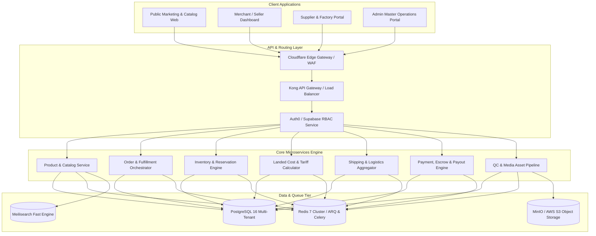

### 5.2 Operating Paradigm: Software-Enabled Ground Trust
The technical system is deeply coupled with physical fulfillment operations:
1. **The Merchant Experience:** Operates completely digitally. Merchants connect their Shopify, WooCommerce, or TikTok Shop stores, import pre-vetted catalog items, establish automated pricing rules, and watch orders synchronize and fulfill seamlessly.
2. **The Factory Experience:** Simple, multi-lingual (Simplified Chinese & English) warehouse dispatch portal. Factories receive bulk packing lists, print standardized Supply Handlers domestic barcodes, and dispatch pallets directly to the central Yiwu or Guangzhou staging hubs.
3. **The Ground Operations Experience:** Mobile-first handheld terminal (PDA) barcode scanning upon arrival at Yiwu; automated weight/dimension validation; photo/video inspection stations with direct automated upload to the merchant's dashboard order record; consolidation, custom unboxing kit assembly, and handover to direct express lines.
4. **The Legal & Compliance Experience:** Wyoming LLC acts as the formal US contractual counterparty and Importer of Record facilitator, while EU compliance modules automatically bind designated GPSR Authorized Representatives to product documentation.

---

# 6. Public Website Specification

### 6.1 Objectives & Conversion Architecture
The public website serves as the primary customer acquisition funnel, brand authority anchor, and transparency demonstration engine. Unlike CJdropshipping or AutoDS—whose homepages are cluttered with aggressive promotional popups, flashing banners, and low-trust stock photography—the Supply Handlers public web application is designed with high-end Scandinavian-style industrial aesthetics, clear typographical hierarchy, and immediate proof of physical reality.

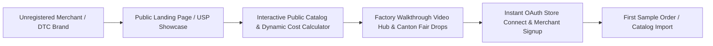

### 6.2 Key Public Feature Modules

| Public Web Module | Functional Capabilities & Technical Specification | High-Value Differentiator |
| :--- | :--- | :--- |
| **Hero & Value Proposition Engine** | * Dynamic headlines highlighting: "Direct Factory Sourcing + Verified In-Person QC + US Legal Accountability."<br>* Interactive video background showing actual Yiwu sorting hub and factory floor inspections.<br>* Real-time statistics ticker: Verified Factories Onboarded, Orders Inspected, Average Dispatch Time (hours), Return Rate (< 0.4%). | Immediate visual contrast to pure SaaS dropshipping software wrappers. |
| **Interactive Landed Cost Calculator** | * Public interactive widget allowing prospective sellers to input: (1) Product category or 1688/AliExpress link, (2) Target destination country (US, UK, DE, FR, AU), (3) Estimated monthly volume.<br>* Outputs transparent line-item breakdown: Factory Gate Price + Line-Item Sourcing Fee (6%) + Air Express Shipping + Customs Duty / Tariff Estimate + Local Delivery = Total Landed Cost.<br>* Direct side-by-side comparison against estimated CJdropshipping and Spocket prices. | Exposes competitor hidden markups before the seller even registers an account. |
| **Public Curated Catalog & Search** | * High-performance search powered by Meilisearch (sub-50ms query response).<br>* Rich filtering: Niche, Price range, Processing time (< 24h, < 48h), Shipping origin (China Central Hub vs. US 3PL Pre-Stock), Certified compliance (CE, FCC, RoHS, Prop 65, GPSR).<br>* High-resolution photo galleries and 360-degree video previews of products shot in-house at the Yiwu studio. | Fast, clean browsing with zero "ghost" discontinued products. |
| **Factory Tour & QC Proof Library** | * Video-first directory of vetted partner factories.<br>* Each factory profile features: Verified location, production capacity (units/day), staff count, ISO certifications, and a dated 4K walkthrough video conducted by Supply Handlers ground agents.<br>* "Canton Fair Biannual Drop" showcase highlighting newly discovered product lines. | Builds impenetrable trust that competitors relying on web scraping cannot emulate. |
| **Sample Box Ordering Portal** | * Allows merchants and TikTok content creators to order a consolidated "Creator Sample Box" directly from the public site.<br>* Mix and match up to 6 different factory samples into a single consolidated express shipment without setting up a full ecommerce store. | Drastically lowers friction for emerging TikTok Shop and influencer brands. |
| **EU GPSR & US Tariff Educational Hub** | * Authoritative knowledge base and compliance guide.<br>* Downloadable regulatory whitepapers, Harmonized Tariff Schedule (HTS) lookups, and clear explanations of the Wyoming legal structure and EU Authorised Representative obligations. | Positions Supply Handlers as the enterprise compliance authority. |
| **Transparent Pricing Page** | * Explicit breakdown of the Free Core vs. Pro ($49/mo) vs. Enterprise ($199/mo) tiers.<br>* Clear, published fee schedule for pick-and-pack fulfillment, AQL 2.5 inspection, custom packaging inserts, and compliance representation.<br>* Absolute pledge: "No hidden percentage deductions. No credit expiration traps. Cancel anytime with 1 click." | Direct attack on Spocket/AutoDS billing dark-pattern reputation. |

---

# 7. Customer / Merchant Dashboard Specification

### 7.1 Purpose & User Persona
The Customer Dashboard is the daily mission control for ecommerce entrepreneurs, DTC brand managers, and high-volume media buyers running stores across Shopify, WooCommerce, TikTok Shop, Amazon, and BigCommerce. It balances automated, hands-off order processing with granular control over product mapping, pricing margins, and inspection thresholds.

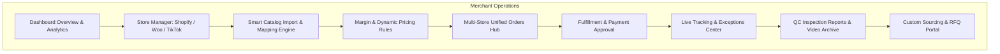

### 7.2 Detailed Functional Breakdown

#### 7.2.1 Store Integration & Synchronization Hub
* **Multi-Store Management:** Connect unlimited Shopify, WooCommerce, and TikTok Shop stores under a single master organization.
* **Bi-Directional Real-Time Webhooks:** Real-time listeners for order creation, order cancellation, address edits, and inventory queries.
* **Connection Health Monitor:** Live indicator of API token validity, webhook status, and rate-limit headroom.

#### 7.2.2 Product Management, Sourcing & Smart Mapping
* **1-Click Store Push:** Push selected catalog items directly to connected stores with synchronized titles, optimized descriptions, structured variant matrices (Color, Size, Bundle), and high-resolution web-optimized WebP images.
* **Advanced Multi-Supplier Variant Mapping:** Map individual Shopify variants to completely different upstream factory SKUs. (e.g., Shopify SKU `SHIRT-BLK-S` maps to Factory A SKU `FA-881`, while `SHIRT-BLK-XL` maps to Factory B SKU `FB-902`).
* **Automated Margin & Pricing Rules Engine:**
  * Fixed markup rule (e.g., Factory Cost + $15.00).
  * Percentage multiplier rule (e.g., Factory Cost × 2.75).
  * Tiered margin matrix (e.g., products costing $0–$10 get a 300% markup; $10–$30 get a 200% markup).
  * Automated currency conversion based on daily live forex feeds (USD, EUR, GBP, CAD, AUD).
  * Auto-rounding configuration (e.g., round all retail prices to `.99` or `.95`).

#### 7.2.3 Unified Multi-Store Order Management System (OMS)
* **Consolidated Order Grid:** Ingests orders across all connected platforms into a standardized data model. Filters by: Awaiting Payment, Sourcing in Progress, In Ground QC, Dispatched, In Transit, Exception/Customs Hold, Delivered.
* **Automated vs. Manual Fulfillment Toggle:**
  * *Manual Mode:* Merchant reviews incoming orders, validates shipping addresses against USPS/Google Maps address validation APIs, and clicks "Approve & Pay."
  * *Automated Mode:* System automatically charges merchant's saved card / Stripe payment method or draws from approved credit terms, routes orders to upstream factories, and queues warehouse pick-and-pack immediately upon customer checkout.
* **Split-Order Intelligence:** When a customer buys Product X (from Factory 1 in Yiwu) and Product Y (from Factory 2 in Guangzhou), the system offers two fulfillment modes:
  1. *Consolidated Dispatch (Default):* Both items shipped domestically to Yiwu Central Hub, merged into a single custom-branded box, and shipped under one international tracking number.
  2. *Split Direct Dispatch:* Two independent shipments dispatched direct to customer with distinct tracking numbers (saving 2 business days at the expense of secondary shipping fee).

#### 7.2.4 Real-Time Ground QC & Photo/Video Verification Center
* **QC Inspection Stream:** For every fulfilled batch or custom-packaged order, the merchant dashboard displays a dedicated "Quality Inspection" drawer.
* **Visual Verification Assets:** Features 3–5 high-resolution inspection photos (measuring tape verification, barcode scan check, cosmetic finish) and a 10-second packaging seal video recorded at the Yiwu staging desk before parcel handover.
* **Inspection Pass/Fail Alerts:** Instant SMS/Dashboard notification if an item fails AQL inspection (e.g., color mismatch or loose stitching), with options to: (1) Reorder from factory with priority dispatch, or (2) Accept item with a discount.

#### 7.2.5 Custom Sourcing & RFQ Request Engine
* **Universal Sourcing Submission:** Sellers can submit sourcing requests via 1688 URL, Taobao URL, AliExpress URL, Amazon ASIN, or simple photo upload with target purchase price and monthly volume.
* **24-Hour SLA Commitment:** Dedicated ground agent investigates factory sources in Yiwu/Guangzhou, negotiates volume discounts, verifies sample availability, and delivers an authoritative quote sheet within 24 hours featuring:
  * Exact Factory Unit Price.
  * Verified Domestic Inbound Shipping.
  * Recommended International Express Carrier & Rates.
  * Minimum Order Quantities (MOQ) for custom logo/packaging inserts.
* **1-Click Catalog Conversion:** Once approved by the merchant, the custom sourced item is immediately instantiated into their private product catalog and ready for 1-click store publishing.

---

# 8. Supplier & Factory Dashboard Specification

### 8.1 Objectives & Operating Reality
Chinese factory managers and domestic dispatch teams will not adopt complex, jargon-heavy Western enterprise software. The Supplier Dashboard must be ultra-fast, mobile-responsive, bi-lingual (Simplified Chinese `zh-CN` and English `en-US`), and designed specifically around high-speed physical warehouse operations, barcode scanning, and transparent RMB payouts.


### 8.2 Detailed Functional Breakdown

| Supplier Module | Technical Scope & Operational Capabilities |
| :--- | :--- |
| **Supplier KYC & Profile Verification** | * Submission of Chinese Unified Social Credit Code (统一社会信用代码) and business license (营业执照).<br>* Legal representative identity verification and factory location coordinates.<br>* Bank account binding for corporate RMB transfers (UnionPay / domestic business accounts) or cross-border USD/HKD transfers via Airwallex / PingPong. |
| **Multi-Warehouse & Inventory Management** | * Define multiple factory dispatch warehouses (e.g., Yiwu Factory 1, Ningbo Production Facility, Dongguan Assembly).<br>* Real-time inventory buffer configuration (set safety buffers so stock displays as zero on merchant dashboards when factory reserves drop below safe threshold).<br>* Bulk CSV/Excel inventory synchronization and open webhook/API support for ERP integration (e.g., Kingdee / Dianxiaomi). |
| **Product & Tiered Pricing Catalog** | * Create and manage base products, variant hierarchies (Size, Color, Material, Voltage, Plug Type), and domestic SKUs.<br>* Configure tiered factory wholesale pricing matrices based on volume commitments.<br>* Upload factory production specifications, hazardous material declarations (UN38.3 lithium battery certificates, MSDS), and high-resolution packaging dimensions. |
| **Bulk Dispatch & Pick-and-Pack Center** | * High-speed order queue displaying consolidated SKU demand from Supply Handlers.<br>* 1-Click generation of consolidated picking lists and bulk printing of standardized Supply Handlers internal routing labels (Code 128 / QR code format).<br>* Inbound logistics management: Input domestic courier tracking numbers (SF Express, ZTO, Yuantong, J&T) for consolidated deliveries dispatched to the central Yiwu inspection hub. |
| **QC Feedback & Return Settlement** | * Direct review of items rejected at the Yiwu inspection desk.<br>* View defect photographs and inspector notes directly in Chinese.<br>* Automated authorization for return-to-factory for credit or immediate factory replacement dispatch. |
| **Financial Ledger, Escrow & Payouts** | * Real-time ledger showing: Total Delivered Value, Funds in Inspection Escrow, Cleared Withdrawable Balance.<br>* Transparent settlement terms: Funds released within 24 hours of successful Yiwu QC scan.<br>* 1-Click payout request to verified Chinese domestic bank accounts with automated electronic receipt generation. |

---

# 9. Admin Master Operations Portal Specification

### 9.1 Purpose & Role-Based Access Control (RBAC)
The Admin Master Portal is the operational cockpit used by Supply Handlers executives, procurement managers, Yiwu warehouse supervisors, ground QC inspectors, and financial controllers. It provides complete observability over all four quadrants: Merchants, Suppliers, Physical Logistics, and Financial Transactions.


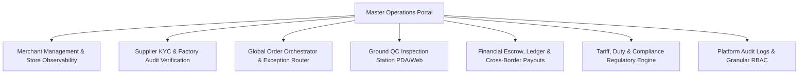

### 9.2 Detailed Functional Breakdown

#### 9.2.1 Granular Role-Based Access Control (RBAC)
The portal enforces strict separation of duties across predefined operational roles:
* `SUPER_ADMIN`: Unrestricted platform configuration, financial withdrawals, database controls, and audit log access.
* `GROUND_QC_SUPERVISOR`: Stationed in Yiwu/Guangzhou. Manages inspection workflows, uploads verification media, approves/rejects factory deliveries, and manages local warehouse inventory.
* `PROCUREMENT_AGENT`: Manages sourcing RFQs, factory price negotiations, supplier communication, and Canton Fair pipeline ingestion.
* `COMPLIANCE_OFFICER`: Manages US Importer of Record documentation, EU GPSR Authorised Representative filings, HTS code mapping, and product safety certs.
* `FINANCIAL_CONTROLLER`: Reconciles Stripe merchant settlements, approves supplier bulk RMB payouts via Airwallex, monitors chargebacks, and audits platform fee margins.
* `SUPPORT_LEAD`: Manages multi-channel disputes, ticket escalation, customer order overrides, and merchant refund authorizations.

#### 9.2.2 Master Operations Grid & Order Orchestrator
* **Real-Time Global Order Stream:** Displays all platform orders with sub-second status updates. 
* **Automated Exception Highlighting:** Instantly flags orders suffering from:
  * Address validation errors (USPS / international postal format mismatch).
  * Factory dispatch latency exceeding 48-hour SLA.
  * Customs clearance inspection holds at US/EU entry ports.
  * Tracking number inactivity (no carrier scan within 48 hours of generation).
* **Manual Override & Re-Routing:** Ability to re-route an order line item to an alternate backup factory with 1 click if the primary supplier encounters a production freeze.

#### 9.2.3 Ground QC Inspection Management Terminal
* **Station Interface:** Optimized for touch-screen warehouse terminals and mobile handheld PDA scanners.
* **Scan-to-Verify Workflow:**
  1. Inspector scans domestic courier package from factory.
  2. Terminal displays expected SKUs, quantities, and reference master photos.
  3. Inspector scans individual unit barcode; system performs automated weight verification against scale API.
  4. Inspector captures 3 standard inspection photos via connected web camera or mobile app; system automatically attaches media to the merchant's order record in real time.
  5. Inspector taps "Pass & Release to International Express" or "Fail & Hold for Supervisor Review."

#### 9.2.4 Financial Escrow, Margin Tracking & Compliance Audits
* **Consolidated Financial Ledger:** Real-time visibility into Gross Merchandise Value (GMV), net platform fee capture, carrier shipping margins, and factory cost obligations.
* **Dual-Currency Reconciliation:** Automated ledger accounting tracking USD received from merchants via Stripe vs. RMB paid to suppliers via domestic banking rails, with real-time foreign exchange gain/loss calculations.
* **Immutable Audit Trail:** Comprehensive, tamper-evident audit log recording every user action, status change, price override, API secret access, and financial disbursement, complete with IP address, user ID, and cryptographic timestamp.

---

# 10. Backend Feature & Technical Requirements

### 10.1 Authentication, Authorization & Identity Management
* **Multi-Tenant Identity Architecture:** Built upon a zero-trust RBAC model supporting hierarchical organizations (e.g., An agency merchant with 1 master account and 15 sub-stores across 8 team members).
* **Authentication Protocols:**
  * Modern stateless JWT tokens with short TTL (15 minutes) paired with cryptographically secure, rotating refresh tokens stored in HTTP-only, `SameSite=Strict` secure cookies.
  * Native OAuth2 / OpenID Connect flows for third-party merchant single sign-on (Sign in with Google, Sign in with Shopify).
  * Mandatory Time-Based One-Time Password (TOTP) 2-Factor Authentication (RFC 6238) for all administrative and supplier roles, and optional for merchants.
* **API Key Infrastructure:** High-performance, scoped API keys (`sh_live_...` and `sh_test_...`) hashed with SHA-256 for external headless merchant integration, rate-limited via token-bucket algorithms in Redis.

### 10.2 Product Catalog & Master Data Management (MDM)
* **Polymorphic Variant Architecture:** Capable of handling arbitrary multi-dimensional variant axes (Color, Size, Material, Bundle Count, Plug Type, Voltage) while preserving normalized factory mapping.
* **Master SKU vs. Supplier SKU vs. Store SKU Graph:**
  * `Internal Master SKU`: The canonical Supply Handlers identifier (e.g., `SH-FIT-001-BLK`).
  * `Supplier SKU`: The physical factory product code (e.g., `YW-XIN-992-B`).
  * `Storefront SKU`: The merchant's custom Shopify/WooCommerce identifier (e.g., `MYBRAND-YOGA-S`).
* **Automated Asset Optimization Pipeline:** Ingests factory imagery and media, runs automated background cleanup, removes Chinese watermark typography, and converts assets to progressive WebP/AVIF formats stored on multi-region S3 object storage with Cloudflare CDN caching.

### 10.3 Distributed Inventory & Multi-Warehouse Reservation Engine
* **Two-Phase Inventory Reservation:** To eliminate the "ghost inventory" problem that plagues CJdropshipping and DSers, inventory is managed via an atomic two-phase commit:
  1. *Soft Reservation (Hold):* When an order arrives from a connected store, stock is immediately locked in Redis via atomic Lua scripts for 60 minutes awaiting merchant payment clearance.
  2. *Hard Allocation (Commit):* Upon successful payment capture, the reservation is permanently committed in PostgreSQL, decrementing available stock and triggering automated factory replenishment if safety thresholds are breached.
  3. *TTL Expiration (Rollback):* If payment fails or is not completed within 60 minutes, the lock is automatically released back to the general pool.
* **Multi-Warehouse Topology:** Supports simultaneous inventory balancing across:
  * Central China Staging Hub (Yiwu).
  * Southern China Express Hub (Guangzhou / Shenzhen).
  * Strategic Domestic Overseas 3PL Facilities (US East - New Jersey, US West - California, Western Europe - Frankfurt).

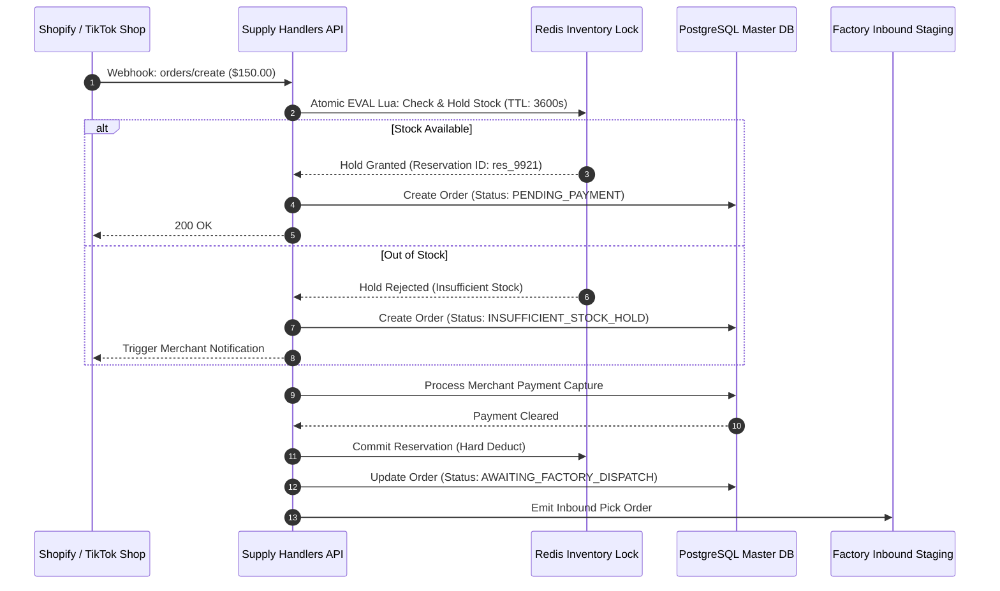

### 10.4 Order Orchestration, Routing & Split-Fulfillment State Machine
* **Deterministic Order Lifecycle:** Governed by an immutable finite state machine (FSM). Invalid state transitions are rejected at the database constraint level.

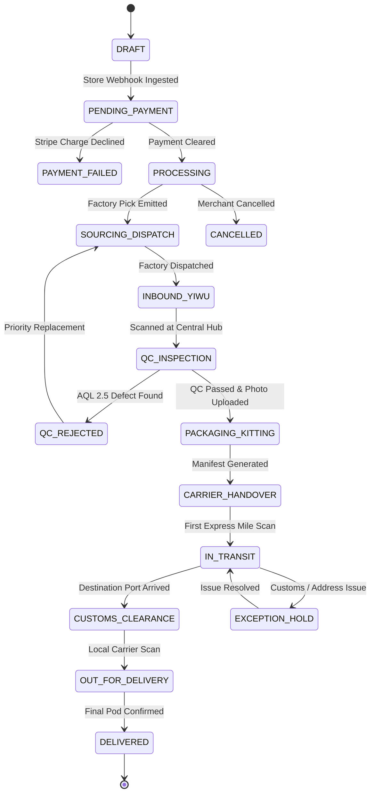

### 10.5 Landed Cost & Harmonized Tariff Engine
* **Dynamic Cost Calculator:** For every international shipment, the backend dynamically calculates:
  $$	ext{Total Landed Cost} = 	ext{Raw Factory Cost} + 	ext{Sourcing Fee} + 	ext{Pick\&Pack} + 	ext{International Freight} + 	ext{Estimated HTS Tariff} + 	ext{Customs Entry Fee}$$
* **Live Tariff Rate Matrix:** Maintains indexed schedules for US Section 301 China tariffs, European Union GPSR handling fees, and UK VAT import rules.

### 10.6 Payment Architecture, Escrow & Dual-Currency Reconciliation
* **Merchant Capture:** Integrated via Stripe Connect Custom / Express. Supports credit cards, Apple Pay, Google Pay, and ACH transfers.
* **Escrow Holding Logic:** Funds received from merchants are held in an isolated escrow balance. The factory cost allocation remains in escrow until the order is successfully scanned and cleared through the Yiwu QC inspection station.
* **Supplier Payout Engine:** Supports programmatic bulk disbursements in Chinese Yuan (RMB) via Airwallex, PingPong Global, and UnionPay rails, with automatic conversion from USD based on locked spot exchange rates.

---

# 11. Database Architecture & Data Model Specifications

The database layer is architected on **PostgreSQL 16**, utilizing relational integrity, strict Foreign Key constraints, Row-Level Security (RLS) for tenant isolation, and JSONB columns for flexible integration payloads.


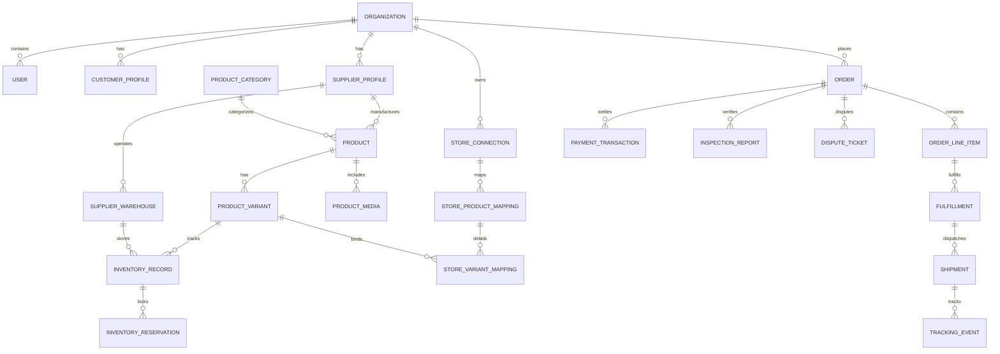

### 11.1 Complete Specification of Core Database Entities

Below are the 32 core relational entities defining the platform's complete operational domain:

| Entity Name | Primary Purpose & Business Function | Critical Fields & Data Types | Foreign Keys & Relationships | Key Indexes & Unique Constraints | Status Fields & Enums |
| :--- | :--- | :--- | :--- | :--- | :--- |
| **1. Organization** | Top-level multi-tenant container for merchant brands, suppliers, or platform operations. | `id` (UUID PK), `name` (VARCHAR), `slug` (VARCHAR), `org_type` (ENUM), `currency` (VARCHAR), `created_at` (TIMESTAMPTZ) | 1:N with Users, StoreConnections, Orders. | `UNIQUE(slug)` | `status` (ACTIVE, SUSPENDED, PENDING_VERIFICATION) |
| **2. User** | Authenticated user account across all portals. | `id` (UUID PK), `org_id` (UUID FK), `email` (VARCHAR), `password_hash` (VARCHAR), `first_name`, `last_name`, `phone`, `locale` (VARCHAR) | Belongs to Organization. 1:N with AuditLogs, DisputeMessages. | `UNIQUE(email)`, `INDEX(org_id)` | `role` (SUPER_ADMIN, GROUND_QC, PROCUREMENT, MERCHANT_ADMIN, SUPPLIER_ADMIN), `is_active` (BOOL) |
| **3. CustomerProfile** | Merchant-specific settings, billing references, and credit limits. | `id` (UUID PK), `org_id` (UUID FK), `stripe_customer_id` (VARCHAR), `auto_fulfill_enabled` (BOOL), `default_shipping_tier` (ENUM), `credit_limit_cents` (BIGINT) | 1:1 with Organization. | `UNIQUE(org_id)`, `UNIQUE(stripe_customer_id)` | `tier` (FREE, PRO, ENTERPRISE) |
| **4. SupplierProfile** | Factory identity, Chinese credit code, and compliance ratings. | `id` (UUID PK), `org_id` (UUID FK), `company_name_cn` (VARCHAR), `uscc_tax_id` (VARCHAR), `legal_rep_name` (VARCHAR), `airwallex_beneficiary_id` (VARCHAR), `rating_score` (DECIMAL) | 1:1 with Organization. 1:N with SupplierWarehouses, Products. | `UNIQUE(uscc_tax_id)`, `INDEX(rating_score)` | `verification_status` (PENDING, APPROVED, REJECTED, AUDIT_REQUIRED) |
| **5. SupplierWarehouse** | Physical factory storage location or staging warehouse. | `id` (UUID PK), `supplier_id` (UUID FK), `name` (VARCHAR), `province` (VARCHAR), `city` (VARCHAR), `address_cn` (TEXT), `postal_code` (VARCHAR), `is_primary` (BOOL) | Belongs to SupplierProfile. 1:N with InventoryRecords. | `INDEX(supplier_id)` | `is_active` (BOOL) |
| **6. ProductCategory** | Hierarchical taxonomy for catalog navigation and HTS duty mapping. | `id` (UUID PK), `parent_id` (UUID FK nullable), `name_en` (VARCHAR), `name_cn` (VARCHAR), `slug` (VARCHAR), `default_hts_code` (VARCHAR), `duty_rate_percent` (DECIMAL) | Self-referencing tree. 1:N with Products. | `UNIQUE(slug)`, `INDEX(parent_id)` | `is_visible` (BOOL) |
| **7. Brand** | Registered brand or private label entity. | `id` (UUID PK), `org_id` (UUID FK), `name` (VARCHAR), `logo_url` (VARCHAR), `website` (VARCHAR) | Belongs to Organization. 1:N with Products. | `UNIQUE(org_id, name)` | `is_verified` (BOOL) |
| **8. Product** | Master canonical product listing. | `id` (UUID PK), `supplier_id` (UUID FK), `category_id` (UUID FK), `brand_id` (UUID FK nullable), `master_sku` (VARCHAR), `title_en` (VARCHAR), `title_cn` (VARCHAR), `description_en` (TEXT), `description_cn` (TEXT), `base_factory_price_usd` (DECIMAL), `weight_grams` (INT), `hs_code` (VARCHAR) | Belongs to SupplierProfile, ProductCategory. 1:N with Variants, Media, Mappings. | `UNIQUE(master_sku)`, `INDEX(category_id)`, `INDEX(supplier_id)` | `moderation_status` (DRAFT, IN_REVIEW, APPROVED, REJECTED, ARCHIVED) |
| **9. ProductVariant** | Specific physical SKU variant (Color, Size, Specification). | `id` (UUID PK), `product_id` (UUID FK), `variant_sku` (VARCHAR), `supplier_sku` (VARCHAR), `attribute_matrix` (JSONB), `factory_cost_usd` (DECIMAL), `weight_grams` (INT), `barcode_upc` (VARCHAR) | Belongs to Product. 1:N with InventoryRecords, OrderLineItems, StoreVariantMappings. | `UNIQUE(variant_sku)`, `INDEX(product_id)` | `is_active` (BOOL) |
| **10. ProductMedia** | High-resolution photography, 360-video, and factory inspection footage. | `id` (UUID PK), `product_id` (UUID FK), `media_type` (IMAGE, VIDEO_4K, INSPECTION_PROOF), `url` (VARCHAR), `cdn_thumb_url` (VARCHAR), `sort_order` (INT), `is_clean_white_bg` (BOOL) | Belongs to Product. | `INDEX(product_id)` | `processing_status` (UPLOADED, OPTIMIZED, READY) |
| **11. InventoryRecord** | Real-time physical inventory tracked per warehouse location. | `id` (UUID PK), `variant_id` (UUID FK), `warehouse_id` (UUID FK), `quantity_on_hand` (INT), `quantity_reserved` (INT), `safety_buffer` (INT), `low_stock_threshold` (INT) | Belongs to ProductVariant, SupplierWarehouse. | `UNIQUE(variant_id, warehouse_id)` | `stock_status` (IN_STOCK, LOW_STOCK, OUT_OF_STOCK) |
| **12. InventoryReservation**| Temporary Redis-backed atomic reservation for pending orders. | `id` (UUID PK), `variant_id` (UUID FK), `warehouse_id` (UUID FK), `order_id` (UUID FK nullable), `reserved_quantity` (INT), `expires_at` (TIMESTAMPTZ) | Belongs to ProductVariant, SupplierWarehouse. | `INDEX(expires_at)`, `INDEX(order_id)` | `status` (PENDING, COMMITTED, EXPIRED, CANCELLED) |
| **13. InventoryTransaction**| Immutable audit ledger recording every stock movement. | `id` (UUID PK), `inventory_record_id` (UUID FK), `delta_quantity` (INT), `transaction_type` (ENUM), `reference_id` (UUID nullable), `reason` (TEXT), `created_at` (TIMESTAMPTZ) | Belongs to InventoryRecord. | `INDEX(inventory_record_id, created_at)` | `type` (INBOUND_PURCHASE, OUTBOUND_FULFILLMENT, DAMAGE_WRITE_OFF, AUDIT_ADJUSTMENT) |
| **14. StoreConnection** | Integrated ecommerce storefront credential and webhook container. | `id` (UUID PK), `org_id` (UUID FK), `platform` (SHOPIFY, WOOCOMMERCE, TIKTOK_SHOP, AMAZON), `store_name` (VARCHAR), `store_domain` (VARCHAR), `access_token_encrypted` (TEXT), `webhook_secret_encrypted` (TEXT), `sync_status` (ACTIVE, DEGRADED, REVOKED) | Belongs to Organization. 1:N with StoreProductMappings, Orders. | `UNIQUE(org_id, store_domain)` | `is_active` (BOOL) |
| **15. StoreProductMapping**| Relational link between remote storefront product and internal product. | `id` (UUID PK), `store_connection_id` (UUID FK), `product_id` (UUID FK), `remote_product_id` (VARCHAR), `pricing_rule_override` (JSONB) | Belongs to StoreConnection, Product. 1:N with StoreVariantMappings. | `UNIQUE(store_connection_id, remote_product_id)` | `sync_enabled` (BOOL) |
| **16. StoreVariantMapping**| Variant-level mapping link between remote store SKU and factory variant. | `id` (UUID PK), `store_product_mapping_id` (UUID FK), `variant_id` (UUID FK), `remote_variant_id` (VARCHAR), `remote_sku` (VARCHAR) | Belongs to StoreProductMapping, ProductVariant. | `UNIQUE(store_product_mapping_id, remote_variant_id)` | `auto_fulfill` (BOOL) |
| **17. Order** | Canonical master order ingested from external channels or created manually. | `id` (UUID PK), `org_id` (UUID FK), `store_connection_id` (UUID FK nullable), `external_order_id` (VARCHAR), `external_order_number` (VARCHAR), `customer_name` (VARCHAR), `customer_email` (VARCHAR), `shipping_address` (JSONB), `currency` (VARCHAR), `total_charged_usd` (DECIMAL), `factory_cost_usd` (DECIMAL), `shipping_cost_usd` (DECIMAL), `platform_fee_usd` (DECIMAL) | Belongs to Organization, StoreConnection. 1:N with OrderLineItems, Fulfillments, Payments. | `INDEX(org_id, created_at)`, `UNIQUE(store_connection_id, external_order_id)` | `status` (DRAFT, PENDING_PAYMENT, PROCESSING, FULFILLED, PARTIAL, CANCELLED, REFUNDED) |
| **18. OrderLineItem** | Individual SKU line item within a master order. | `id` (UUID PK), `order_id` (UUID FK), `variant_id` (UUID FK), `external_line_item_id` (VARCHAR), `quantity` (INT), `unit_price_usd` (DECIMAL), `factory_unit_cost_usd` (DECIMAL), `assigned_supplier_id` (UUID FK) | Belongs to Order, ProductVariant, SupplierProfile. | `INDEX(order_id)`, `INDEX(assigned_supplier_id)` | `fulfillment_status` (UNFULFILLED, ASSIGNED, SOURCED, QC_PASSED, SHIPPED, CANCELLED) |
| **19. Fulfillment** | Physical grouping of line items dispatched from a specific warehouse. | `id` (UUID PK), `order_id` (UUID FK), `warehouse_id` (UUID FK), `carrier_id` (VARCHAR), `tracking_number` (VARCHAR), `shipping_label_url` (VARCHAR), `dispatched_at` (TIMESTAMPTZ) | Belongs to Order, SupplierWarehouse. 1:N with Shipments. | `INDEX(order_id)`, `INDEX(tracking_number)` | `status` (QUEUED, PICKING, QC_IN_PROGRESS, DISPATCHED, DELIVERED, EXCEPTION) |
| **20. Shipment** | Logistical transit package handled by international express line. | `id` (UUID PK), `fulfillment_id` (UUID FK), `carrier_code` (YUNEXPRESS, DHL, FOUR_PX, USPS), `tracking_number` (VARCHAR), `service_tier` (STANDARD_AIR, EXPRESS, SEA_FREIGHT), `weight_billed_grams` (INT), `shipping_cost_usd` (DECIMAL) | Belongs to Fulfillment. 1:N with TrackingEvents. | `UNIQUE(tracking_number)` | `delivery_status` (MANIFEST_CREATED, ACCEPTED, IN_TRANSIT, CUSTOMS_HOLD, DELIVERED) |
| **21. TrackingEvent** | Real-time milestone event emitted by carrier tracking APIs. | `id` (UUID PK), `shipment_id` (UUID FK), `event_timestamp` (TIMESTAMPTZ), `location` (VARCHAR), `status_code` (VARCHAR), `description` (TEXT), `raw_payload` (JSONB) | Belongs to Shipment. | `INDEX(shipment_id, event_timestamp)` | `event_type` (PICKUP, DEPARTURE_PORT, ARRIVAL_PORT, CUSTOMS_CLEAR, OUT_FOR_DELIVERY, DELIVERED) |
| **22. PaymentTransaction**| Financial ledger entry for merchant charge or refund via Stripe. | `id` (UUID PK), `order_id` (UUID FK nullable), `org_id` (UUID FK), `amount_cents` (BIGINT), `currency` (VARCHAR), `gateway` (STRIPE, PAYPAL), `gateway_transaction_id` (VARCHAR), `idempotency_key` (VARCHAR) | Belongs to Order, Organization. | `UNIQUE(gateway_transaction_id)`, `UNIQUE(idempotency_key)` | `status` (SUCCEEDED, PENDING, FAILED, REFUNDED, DISPUTED) |
| **23. EscrowBalance** | Isolated operational holding account for unverified orders. | `id` (UUID PK), `order_id` (UUID FK), `supplier_id` (UUID FK), `held_amount_cents` (BIGINT), `released_at` (TIMESTAMPTZ nullable), `hold_reason` (VARCHAR) | Belongs to Order, SupplierProfile. | `UNIQUE(order_id, supplier_id)` | `status` (HELD, RELEASED_TO_SUPPLIER, REFUNDED_TO_MERCHANT) |
| **24. SupplierPayout** | Batch disbursement of cleared escrow funds to factory bank account. | `id` (UUID PK), `supplier_id` (UUID FK), `batch_reference` (VARCHAR), `amount_rmb` (DECIMAL), `fx_rate` (DECIMAL), `payout_method` (AIRWALLEX, UNIONPAY), `beneficiary_details` (JSONB), `processed_at` (TIMESTAMPTZ) | Belongs to SupplierProfile. | `UNIQUE(batch_reference)` | `status` (DRAFT, PROCESSING, COMPLETED, FAILED) |
| **25. SourcingRequest** | Custom RFQ submission for factory discovery and price negotiation. | `id` (UUID PK), `org_id` (UUID FK), `assigned_agent_id` (UUID FK nullable), `source_url` (VARCHAR), `target_price_usd` (DECIMAL), `monthly_volume` (INT), `notes` (TEXT), `quote_factory_cost_usd` (DECIMAL nullable), `quoted_at` (TIMESTAMPTZ nullable) | Belongs to Organization, User (Agent). | `INDEX(org_id)`, `INDEX(assigned_agent_id)` | `status` (SUBMITTED, UNDER_INVESTIGATION, QUOTED, ACCEPTED, REJECTED, EXPIRED) |
| **26. InspectionReport** | Physical AQL 2.5 ground inspection record with media proof. | `id` (UUID PK), `order_id` (UUID FK), `inspector_user_id` (UUID FK), `inspected_quantity` (INT), `defects_found` (INT), `photo_urls` (TEXT[]), `video_proof_url` (VARCHAR), `inspector_notes` (TEXT) | Belongs to Order, User (Ground QC). | `INDEX(order_id)` | `result` (PASSED, CONDITIONAL_PASS, FAILED_REORDER) |
| **27. DisputeTicket** | Formal issue resolution thread between merchant, ops, and factory. | `id` (UUID PK), `order_id` (UUID FK), `opened_by_user_id` (UUID FK), `dispute_reason` (DEFECTIVE_PRODUCT, WRONG_ITEM, LOST_IN_TRANSIT, CUSTOMS_SEIZURE), `claimed_amount_usd` (DECIMAL) | Belongs to Order, User. 1:N with DisputeMessages. | `INDEX(order_id)` | `status` (OPEN, UNDER_OPS_REVIEW, ESCALATED_TO_FACTORY, RESOLVED_REFUND, CLOSED) |
| **28. DisputeMessage** | Chronological message thread within a dispute ticket. | `id` (UUID PK), `dispute_ticket_id` (UUID FK), `sender_user_id` (UUID FK), `message_body` (TEXT), `attachments` (TEXT[]), `created_at` (TIMESTAMPTZ) | Belongs to DisputeTicket, User. | `INDEX(dispute_ticket_id, created_at)` | N/A |
| **29. TariffRateSchedule**| Master HTS code duty and tax configuration table. | `id` (UUID PK), `hts_code` (VARCHAR), `destination_country` (VARCHAR), `duty_rate_percent` (DECIMAL), `additional_tariff_percent` (DECIMAL), `description` (TEXT) | Referenced by ProductCategory and Landed Cost Engine. | `UNIQUE(hts_code, destination_country)` | `is_active` (BOOL) |
| **30. AuditLog** | Tamper-evident operational audit trail for all sensitive actions. | `id` (UUID PK), `actor_user_id` (UUID FK nullable), `action` (VARCHAR), `entity_type` (VARCHAR), `entity_id` (VARCHAR), `ip_address` (INET), `before_payload` (JSONB), `after_payload` (JSONB), `created_at` (TIMESTAMPTZ) | Belongs to User. | `INDEX(entity_type, entity_id)`, `INDEX(created_at)` | N/A |
| **31. Notification** | Multi-channel user alert (In-app, Email, SMS, Webhook). | `id` (UUID PK), `user_id` (UUID FK), `notification_type` (ENUM), `title` (VARCHAR), `message` (TEXT), `action_url` (VARCHAR), `read_at` (TIMESTAMPTZ nullable) | Belongs to User. | `INDEX(user_id, read_at)` | `delivery_channel` (IN_APP, EMAIL, SMS) |
| **32. WebhookSubscription**| External merchant webhook endpoint registration. | `id` (UUID PK), `org_id` (UUID FK), `target_url` (VARCHAR), `secret_key` (VARCHAR), `subscribed_events` (TEXT[]), `failure_count` (INT) | Belongs to Organization. | `INDEX(org_id)` | `is_active` (BOOL) |

---

# 12. API Architecture, Webhooks & Asynchronous Processing

### 12.1 RESTful Resource Structure
The backend exposes a strictly typed, versioned REST API (`/api/v1/...`) with native OpenAPI 3.1 documentation auto-generated via FastAPI and Pydantic v2 schema validation.

#### Example Core Endpoints:
* **Authentication & Identity:**
  * `POST /api/v1/auth/register` — Merchant / Supplier onboarding.
  * `POST /api/v1/auth/login` — JWT credential validation & MFA challenge.
  * `POST /api/v1/auth/refresh` — Cryptographic refresh token rotation.
* **Product Catalog & Sourcing:**
  * `GET /api/v1/products` — Filtered catalog search (Meilisearch backed, p99 < 40ms).
  * `POST /api/v1/products/import-to-store` — Push mapped product to Shopify/Woo.
  * `POST /api/v1/sourcing/rfq` — Submit custom URL/photo sourcing request.
* **Order & Fulfillment Orchestration:**
  * `GET /api/v1/orders` — Multi-store consolidated order list.
  * `POST /api/v1/orders/{id}/fulfill` — 1-Click order payment capture & factory dispatch.
  * `POST /api/v1/orders/{id}/split` — Split order across multiple factory lines.
* **Ground QC & Inspection:**
  * `POST /api/v1/admin/qc/scan` — PDA warehouse barcode scan terminal ingest.
  * `POST /api/v1/admin/qc/{id}/upload-proof` — Ingest 3-point inspection photo/video bundle.
* **Financial & Supplier Settlements:**
  * `GET /api/v1/supplier/ledger` — Real-time cleared escrow balance.
  * `POST /api/v1/supplier/payouts/request` — Initiate RMB domestic bank transfer.

### 12.2 Asynchronous Event Architecture (Redis & ARQ / Celery Workers)
High-throughput background jobs are isolated from synchronous HTTP request threads using **ARQ (Asyncio Redis Queue) / Celery on Redis 7**:

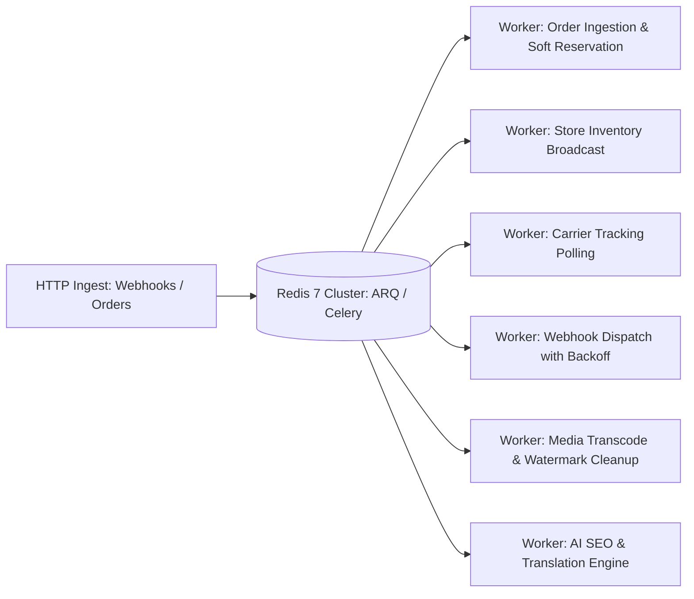

* **Core Queue Topology:**
  1. `order.sync.queue`: Concurrency 50. Ingests store webhooks, parses payloads, locks inventory.
  2. `inventory.broadcast.queue`: Concurrency 20. Pushes stock adjustments to connected Shopify stores.
  3. `tracking.poll.queue`: Concurrency 10. Periodically queries 17TRACK and carrier APIs for in-transit shipments.
  4. `webhook.dispatch.queue`: Concurrency 100. Dispatches outgoing merchant webhooks with exponential backoff (retries: 5, intervals: 10s, 1m, 5m, 1h, 24h).
  5. `media.processing.queue`: Concurrency 5. Processes 4K inspection videos, generates thumbnails, optimizes WebP.

---

# 13. Ecommerce & External Third-Party Integrations

### 13.1 Tier-1 Ecommerce Store Integrations

| Platform | Integration Protocol & API Version | Key Capabilities Implemented | Technical Considerations & Webhooks |
| :--- | :--- | :--- | :--- |
| **Shopify** | Shopify GraphQL Admin API (`2024-10`) + REST fallback. | * 2-way live product and variant publishing.<br>* Automated `FulfillmentOrder` API integration.<br>* Real-time inventory level adjustments across specific location IDs. | * Webhook HMAC SHA-256 signature verification.<br>* Uses `orders/create`, `orders/cancelled`, `app/uninstalled`.<br>* Strictly conforms to Shopify's 2024 Fulfillment Service API deprecations. |
| **WooCommerce** | WooCommerce REST API (`v3`) with OAuth 1.0a / Basic Auth over HTTPS. | * Batch product creation and update.<br>* Order status transitions (`processing` to `completed`).<br>* Tracking number and carrier link injection into customer order notes. | * Requires webhook endpoint for `order.created` and `order.updated`.<br>* Fallback cron polling (every 15 min) for shared hosting servers where outbound webhooks fail. |
| **TikTok Shop** | TikTok Shop Open API (`v202309`). | * Fast catalog sync conforming to category attribute rules.<br>* Strict order dispatch notification adhering to TikTok's 48-hour tracking scan mandate.<br>* Native shipping label generation where TikTok shipping is enforced. | * Complex OAuth token refresh cycle (tokens expire every 7 days).<br>* Direct compliance with TikTok Shop logistics SLA to prevent merchant violation points. |
| **Amazon SP-API** | Amazon Selling Partner API (SP-API) *(Phase 2)*. | * FBM (Fulfillment by Merchant) order fulfillment injection.<br>* Inventory synchronization for DTC merchant storefronts. | * Requires AWS IAM role-based authentication and strict PII data encryption standards conforming to Amazon DPP. |

### 13.2 Payment, Logistics & Infrastructure External Services

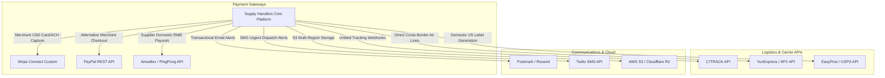

---

# 14. Pragmatic AI Features Roadmap

### 14.1 Value Filter: Genuine Utility vs. Marketing Gimmicks
A primary lesson from the competitor analysis of Zendrop and AutoDS is that superficial AI features (such as "1-Click AI Store Builders" that generate generic, unoptimized Shopify stores with placeholder copy) suffer from near-100% churn. Supply Handlers implements AI **exclusively where it eliminates manual human bottlenecks in the cross-border supply chain**.

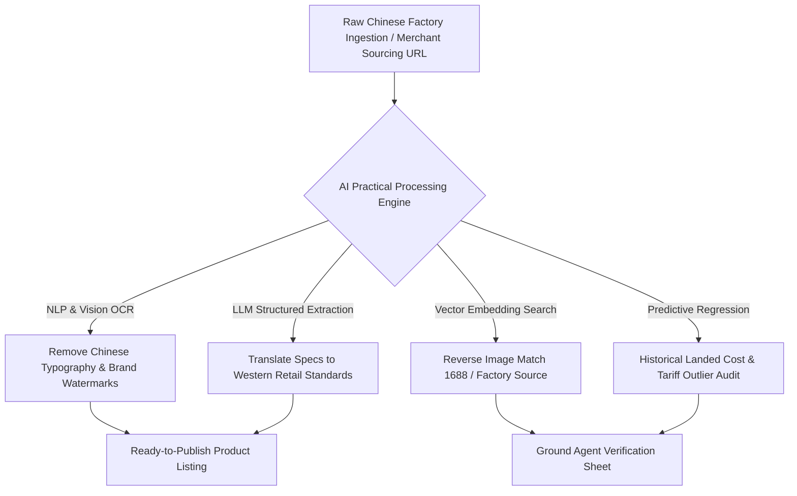

### 14.2 Phased AI Implementation Roadmap

| Phased Horizon | AI Feature Module | Technical Implementation & Stack | Business & Operational Value |
| :--- | :--- | :--- | :--- |
| **MVP (Phase 1)** | **Automated Chinese-to-English Spec Translation** | DeepL API + Fine-tuned GPT-4o-mini structured JSON prompt. | Converts raw Chinese factory spec sheets into clean, standardized English title, bullet points, and variant matrices without human copywriters. |
| **MVP (Phase 1)** | **Visual Watermark & Typography Removal** | Stable Diffusion Inpainting / Rembg background removal models running via Replicate API. | Automatically removes Chinese factory logos, phone numbers, and watermarks from product photos, delivering clean white-background DTC hero images. |
| **Phase 2 (Growth)** | **Reverse Image 1688 / Factory Matching** | CLIP (Contrastive Language-Image Pretraining) vector embeddings indexed in pgvector / Pinecone. | When a merchant uploads a photo or Instagram/TikTok video screenshot, the system instantly identifies the 3 closest upstream Chinese manufacturing lines. |
| **Phase 2 (Growth)** | **Automated Landed Cost Anomaly Detection** | Python scikit-learn isolation forest running in asynchronous worker. | Flags unexpected spikes in shipping volumetric weight or unannounced factory price increases before orders are dispatched. |
| **Phase 3 (Enterprise)**| **Predictive Inventory Replenishment Engine** | Time-series forecasting (Prophet / Temporal Fusion Transformers) combining historical order velocity + ad spend signals. | Alerts merchants when to pre-stock inventory in US/EU warehouses 3 weeks before Q4 holiday demand spikes, avoiding air freight surges. |
| **Phase 3 (Enterprise)**| **Automated Dispute Sentiment & Triage Agent** | Fine-tuned LLM evaluating customer tracking events, photographic evidence, and merchant claim notes. | Auto-approves clear-cut shipping delay refunds (< $25) while escalating potential fraud cases to human supervisors. |

---

# 15. End-to-End User Workflows & Failure Modes

### 15.1 Flow A: The Merchant / Seller Journey
The complete lifecycle from initial storefront connection to customer unboxing:

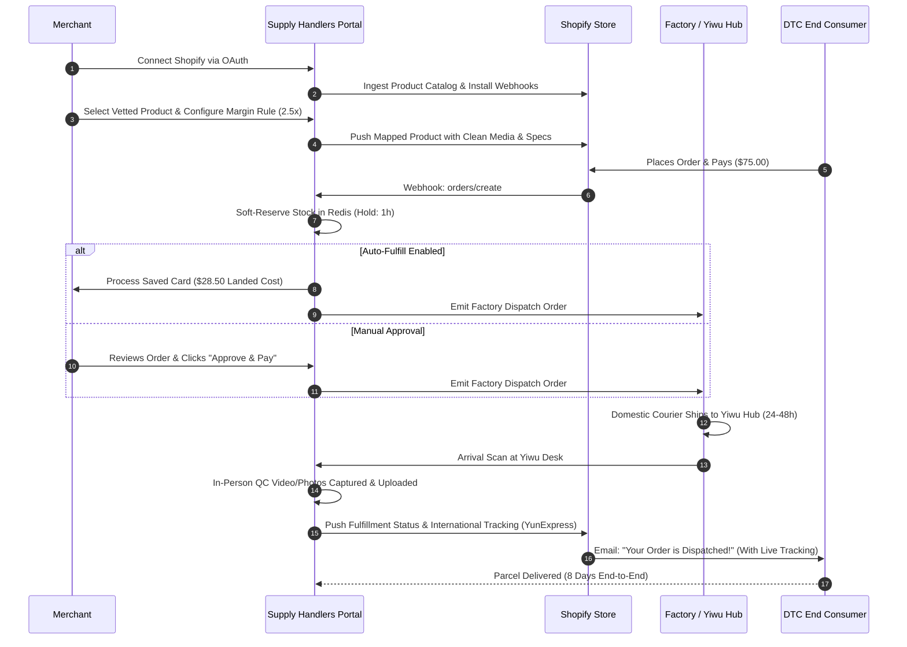

### 15.2 Flow B: The Supplier / Factory Journey
1. **Onboarding & KYC:** Factory uploads Chinese business license (营业执照) and binds bank details. Supply Handlers ground team verifies credentials.
2. **Catalog & Inventory:** Factory inputs SKU specifications, tiered pricing, and real inventory counts with automated buffer limits.
3. **Order Reception:** Factory receives consolidated daily pick order; prints standardized internal barcodes.
4. **Domestic Dispatch:** Factory bundles batch and dispatches via domestic express (SF Express / ZTO) to the Yiwu Central Staging Hub.
5. **QC Clearance & Escrow Release:** Once the Yiwu hub scans the batch and confirms zero AQL defects, the order line is marked "QC_PASSED", releasing funds from escrow to the factory's withdrawable RMB balance.
6. **Payout:** Factory requests payout; funds arrive via domestic banking rails within 24 hours.

### 15.3 Flow C: Ground Operations & Inspection Workflow
1. **Inbound Ingestion:** Warehouse receiver scans domestic incoming parcel barcode via mobile PDA terminal.
2. **Weight & Dimension Validation:** System captures automated digital scale weight and volumetric dimensions, flagging any discrepancies against factory declarations.
3. **Bench Inspection:** Unit opened; checked against physical master sample for color accuracy, stitching/seam integrity, and correct plug/voltage.
4. **Media Capture:** Inspector records 3 photos and a 10-second packing video directly through the web terminal, which instantly attaches to the merchant's customer dashboard.
5. **International Label Application:** Standardized international express label (YunExpress, DHL eCommerce, USPS Type 86) printed and applied.
6. **Carrier Dispatch:** Handed over to international air cargo line for same-day line-haul departure.

### 15.4 Failure Modes & Edge Case Resolution Matrix

| Failure Mode / Edge Case | System Impact | Automated Fallback Protocol | Operational / Human Resolution Protocol |
| :--- | :--- | :--- | :--- |
| **Factory Out-of-Stock Post-Checkout** | Order cannot be fulfilled by primary supplier. | System checks secondary mapped factory in variant graph. If alternate available at $\le 105\%$ cost, auto-routes to backup. | If no backup exists, system alerts merchant within 4 hours; offers 1-click alternative SKU or instant full refund to merchant balance. |
| **Defect Detected During Yiwu In-Person QC** | Product fails AQL 2.5 standard (e.g., scuffed casing). | Order status transitions to `QC_REJECTED`. Replacement order instantly dispatched from factory local stock buffer. | Ground team returns defective unit to factory for domestic credit; merchant dashboard shows "Under Quality Replacement" with zero penalty. |
| **Carrier Tracking Dead-Stop (> 7 Days Inactive)** | Parcel stalled at international transit airport or customs. | Webhook worker flags shipment as `CARRIER_STALLED`. Automated query dispatched to carrier API. | Dedicated logistics liaison files formal inquiry with air line. If unlocatable within 72 hours, insurance claim automatically triggered. |
| **Customer Initiates Chargeback on Shopify** | Merchant faces dispute from end consumer. | Webhook captures chargeback event. System freezes associated supplier payout if still in escrow. | System auto-generates comprehensive dispute evidence pack: Signed proof-of-delivery (POD), GPS coordinates, pre-shipment QC photos. |
| **Destination Customs Hold (Missing Tax/HTS Info)** | Parcel detained by US CBP or EU customs. | Compliance engine generates amended Type 86 or GPSR documentation. | Wyoming LLC or EU Authorised Representative transmits formal clearance documentation to broker within 12 hours. |

---

# 16. Technical Stack Evaluation & System Architecture

### 16.1 Technology Evaluation & Selection Rationale

| Architecture Layer | Evaluated Frameworks | Selected Production Technology | Architectural Justification |
| :--- | :--- | :--- | :--- |
| **Frontend Applications** | React SPA, Vue 3, Next.js 14+ | **Next.js 14+ (App Router, TypeScript)** | Provides optimal hybrid rendering: Server-Side Rendering (SSR) for the public marketing site and SEO catalog, and React Server Components (RSC) with optimistic UI updates for the complex dashboards. |
| **Backend API Engine** | Django (Python), Laravel (PHP), NestJS (Node/TS), FastAPI (Python) | **FastAPI (Python 3.12+ Async ASGI)** | Native unification with Python AI/ML ecosystem (CLIP reverse-image sourcing, inpainting, tariff anomaly detection); Rust-backed Pydantic v2 validation performance; auto-generated OpenAPI 3.1 specs; non-blocking high-throughput async webhook ingestion via Uvicorn. |
| **Primary Database** | MySQL 8, MongoDB, PostgreSQL 16 | **PostgreSQL 16** | Unmatched relational reliability, native JSONB support for integration payloads, Row-Level Security (RLS) for tenant isolation, and atomic transactional integrity for financial escrows. |
| **Cache & Event Queuing** | RabbitMQ, Kafka, Redis 7 + ARQ / Celery | **Redis 7 + ARQ / Celery** | Redis provides ultra-low latency for atomic Lua-scripted inventory reservations, while ARQ/Celery provides robust, observable, multi-queue async job processing in native Python without Kafka overhead. |
| **Catalog Search Engine** | Elasticsearch, Algolia, Meilisearch | **Meilisearch** | Algolia-grade developer experience and sub-50ms search latency with typo tolerance, without the multi-gigabyte RAM overhead and operational complexity of Elasticsearch. |
| **Media & Asset Storage** | Cloudinary, AWS S3 / MinIO | **AWS S3 / MinIO + Cloudflare R2** | MinIO for local development; Cloudflare R2 / S3 for production. Zero-egress fee architecture through Cloudflare Edge caching saves thousands monthly in video streaming costs. |

### 16.2 Production System Architecture Diagram

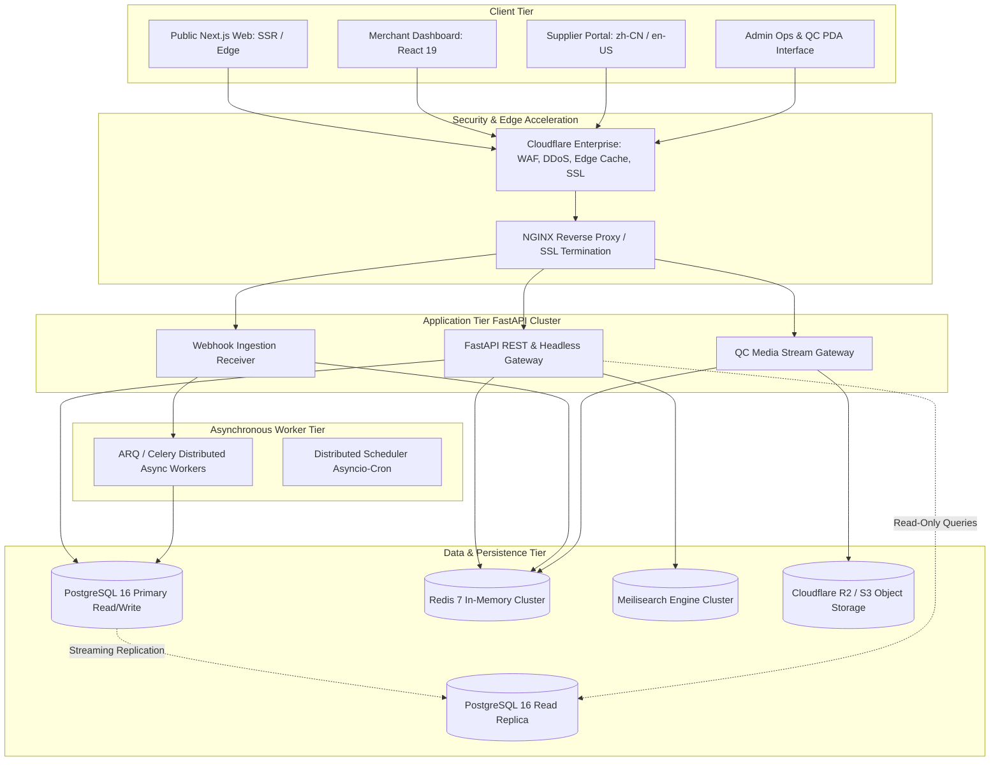

---

# 17. Security, Regulatory Compliance & Non-Functional Requirements

### 17.1 Security Architecture & Data Protection
* **Defense-in-Depth Network Security:** Cloudflare WAF configured with strict OWASP rule sets, automated rate limiting (maximum 120 requests/minute per IP on authenticated routes; 30/minute on auth routes), and strict TLS 1.3 encryption.
* **Sensitive Credential Management:** All third-party merchant API tokens (Shopify access tokens, WooCommerce client secrets, TikTok Shop tokens) are encrypted at rest using **AES-256-GCM** with unique per-tenant initialization vectors (IVs). Encryption keys are managed via AWS Key Management Service (KMS) or HashiCorp Vault.
* **Financial Ledger Immutability:** Financial ledger entries (`PaymentTransaction`, `EscrowBalance`, `SupplierPayout`) are strictly append-only. Updates and deletions are blocked at the PostgreSQL trigger level; corrections require offsetting reversal transactions.

### 17.2 Regulatory Compliance Frameworks

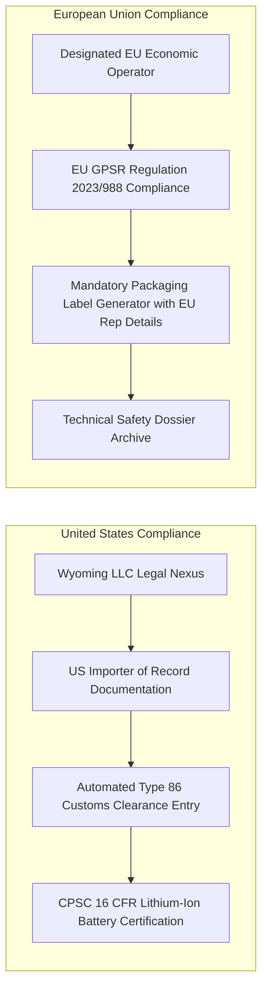

### 17.3 Non-Functional Technical Benchmarks

| Metric Category | Target Performance SLA | Verification & Monitoring Tool |
| :--- | :--- | :--- |
| **API Response Time** | p95 < 80ms, p99 < 180ms across all core CRUD routes. | Datadog APM / OpenTelemetry |
| **Search Query Latency** | Sub-40ms response time on catalog queries up to 100,000 SKUs. | Meilisearch Analytics |
| **Webhook Ingestion Throughput** | Capable of ingesting 2,500 store webhooks/second without queue lag. | ARQ / Flower Dashboard / Grafana |
| **Platform Availability / Uptime**| 99.95% monthly uptime (excluding scheduled maintenance). | BetterStack / Pingdom |
| **Data Recovery Point Objective** | RPO < 5 minutes (via Continuous WAL Archiving to S3). | AWS RDS Automated Backups |
| **Data Recovery Time Objective**  | RTO < 30 minutes (Automated Terraform multi-AZ restore). | Disaster Recovery Runbook |

---

# 18. Formal Statement & Scope of Work (SOW)

### 18.1 SOW Purpose & Executive Alignment
This **Statement of Work (SOW)** establishes the definitive technical and commercial agreement for the development, deployment, and initial operation of the **Supply Handlers™ Cross-Border Sourcing & Fulfillment Platform**. It defines the exact software deliverables, technical boundaries, division of responsibilities between Client and Development Team, milestone acceptance criteria, and post-launch governance for the **Minimum Viable Product (MVP)**.

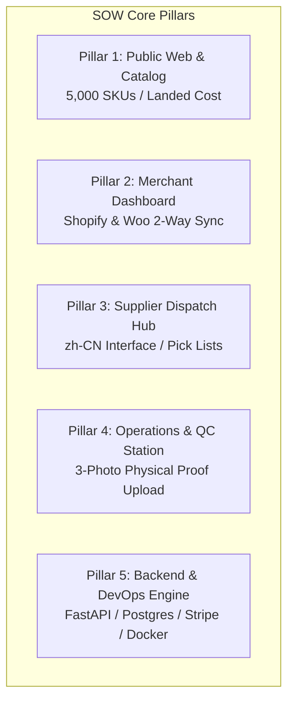

---

### 18.2 SOW Core Deliverables Matrix

| Pillar | Sub-System / Module | Specific SOW Deliverables & Acceptance Scope |
| :--- | :--- | :--- |
| **Pillar 1: Public Web** | **Marketing & Catalog Showcase** | • Responsive Next.js 14+ frontend with dynamic catalog browsing (up to 5,000 SKUs).<br>• Dynamic Landed Cost Calculator widget showing estimated freight and tariff breakdowns.<br>• Sourcing Request (RFQ) submission form with file upload for product reference links/photos.<br>• SEO metadata, OpenGraph tags, and mobile-optimized layouts. |
| **Pillar 2: Merchant Portal** | **Store Connectors & Order Sync** | • Native OAuth 2.0 connectors for **Shopify** and **WooCommerce**.<br>• 2-Way inventory and product publishing (pushing Supply Handlers SKUs to merchant stores).<br>• Multi-variant product mapping interface with global and per-category pricing markup rules.<br>• Orders Hub displaying live status: *Awaiting Payment*, *Sourced*, *In Yiwu QC*, *Dispatched*, *In Transit*.<br>• 1-Click order fulfillment and automated balance auto-charge toggle. |
| **Pillar 3: Supplier Portal** | **Factory Dispatch Hub (zh-CN)** | • Simplified Chinese localized web interface for Yiwu and Guangzhou factory partners.<br>• Batch pick-list generation (PDF / CSV export) grouped by SKU and variant.<br>• Inbound tracking number upload for domestic factory-to-hub shipments.<br>• Supplier payment ledger reflecting released escrow disbursements. |
| **Pillar 4: Admin Hub** | **Master Operations & Ground QC** | • Master operational dashboard with global order filtering, merchant KYC, and RFQ management.<br>• Mobile-optimized **Ground QC Terminal interface** for Yiwu warehouse staff.<br>• Mandatory **3-Photo QC Inspection upload** (Packaging, Barcode/Label, Unboxed Product) tied to each order line item.<br>• Carrier tracking sync engine pushing dispatched tracking numbers back to Shopify/Woo. |
| **Pillar 5: Technical Core** | **Backend, Database & DevOps** | • Python FastAPI high-concurrency async ASGI backend.<br>• PostgreSQL 16 schema with strict Foreign Keys, Indexes, and Row-Level Security (RLS).<br>• Redis 7 in-memory cache and ARQ asynchronous background event workers.<br>• Stripe Connect payment gateway integration for USD merchant payment capture.<br>• 17TRACK, YunExpress, and 4PX automated webhook ingestion.<br>• 100% Dockerized container setup with automated GitHub Actions CI/CD deployment. |

---

### 18.3 Division of Responsibilities: Client vs. Development Team

To maintain the **$29,000 USD discounted budget** and **12 to 16-week delivery timeframe**, project responsibilities are strictly divided as follows:

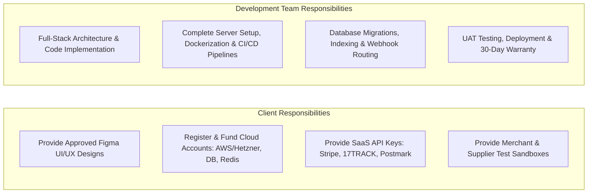

#### A. Client Responsibilities & Dependencies:
1. **UI/UX Design Package:** Client provides complete, production-ready Figma or Adobe XD designs for all desktop and mobile portal screens, including component states, design tokens (colors, typography), and modal overlays.
2. **Infrastructure & Third-Party SaaS Accounts:** Client directly registers, owns, and funds:
   * Cloud hosting compute (AWS ECS / EC2 or Hetzner Cloud).
   * Managed PostgreSQL 16 and Redis instances.
   * Cloudflare domain DNS and WAF configuration.
   * Stripe Connect, Postmark (email), Twilio (SMS), and 17TRACK API accounts.
3. **Domain & Brand Assets:** Provision of production domain names, SSL ownership, logos, and legal privacy/terms text.
4. **Subject Matter Input:** Timely review and sign-off on milestone deliverables (within 3 business days of milestone presentation).

#### B. Development Team Responsibilities (Included at Zero Extra Fee):
1. **End-to-End Software Engineering:** Complete frontend (Next.js/React) and backend (FastAPI/Python) code implementation matching the approved design specifications.
2. **Turnkey Server Architecture & Setup:** 100% of cloud environment provisioning, Linux OS hardening, PostgreSQL migration scripts, Docker container orchestration, and automated CI/CD deployment pipelines.
3. **Integration & API Wiring:** Complete bidirectional webhook handling for Shopify, WooCommerce, Stripe, and 17TRACK.
4. **Quality Assurance & Verification:** Unit testing, end-to-end API testing, security review, and User Acceptance Testing (UAT) assistance.
5. **Post-Launch Warranty:** 30 calendar days of complimentary critical bug remediation following production go-live.

---

### 18.4 Explicit Scope Boundaries: In-Scope vs. Deferred vs. Out-of-Scope

| Scope Category | Module / Functional Capability | Status in this SOW |
| :--- | :--- | :---: |
| **In-Scope (MVP)** | Public Marketing Website with 5,000 SKU Catalog | ✅ **Delivered in MVP** |
| **In-Scope (MVP)** | Shopify & WooCommerce OAuth 2.0 Bi-Directional Connectors | ✅ **Delivered in MVP** |
| **In-Scope (MVP)** | Merchant Orders Hub with 1-Click / Auto Fulfillment | ✅ **Delivered in MVP** |
| **In-Scope (MVP)** | Simplified Chinese Supplier Dispatch Portal (zh-CN) | ✅ **Delivered in MVP** |
| **In-Scope (MVP)** | Ground QC Inspection Mobile PDA Station (3-Photo Capture) | ✅ **Delivered in MVP** |
| **In-Scope (MVP)** | Stripe Payment Capture & Internal Escrow Balance Ledger | ✅ **Delivered in MVP** |
| **In-Scope (MVP)** | 17TRACK / YunExpress / 4PX Automated Tracking Sync | ✅ **Delivered in MVP** |
| **In-Scope (MVP)** | Complete Cloud Server & Docker CI/CD Deployment Setup | ✅ **Delivered in MVP** |
| **Deferred (Phase 2)** | TikTok Shop US & UK Open API Integration | ⏳ *Phase 2 (Growth)* |
| **Deferred (Phase 2)** | 10-Second High-Definition Packaging Video Upload & Streaming | ⏳ *Phase 2 (Growth)* |
| **Deferred (Phase 2)** | EU GPSR Compliance Label Generator | ⏳ *Phase 2 (Growth)* |
| **Deferred (Phase 2)** | Consolidated Creator Sample Box Portal | ⏳ *Phase 2 (Growth)* |
| **Deferred (Phase 3)** | Amazon SP-API & Walmart Marketplace Integrations | ⏳ *Phase 3 (Enterprise)* |
| **Deferred (Phase 3)** | CLIP Vector Search AI Reverse-Image Sourcing | ⏳ *Phase 3 (Enterprise)* |
| **Deferred (Phase 3)** | Multi-Warehouse US Domestic 3PL Stock Balancing | ⏳ *Phase 3 (Enterprise)* |
| **Explicitly Excluded** | Ongoing Third-Party Cloud/API Billing (AWS, Cloudflare, Stripe fees) | ❌ *Client Direct Bill* |
| **Explicitly Excluded** | Physical Warehouse Scanners, Label Printers, or Weighing Scales | ❌ *Hardware Excluded* |
| **Explicitly Excluded** | Legal Corporate Formation (Wyoming LLC) or EU Rep Retainers | ❌ *Legal Excluded* |
| **Explicitly Excluded** | Paid Digital Marketing, Ad Campaigns, Copywriting & Translations | ❌ *Marketing Excluded* |

---

### 18.5 Milestone Acceptance Criteria & Formal Sign-Off Procedure

Each milestone must meet explicit, verifiable technical criteria before payment release:

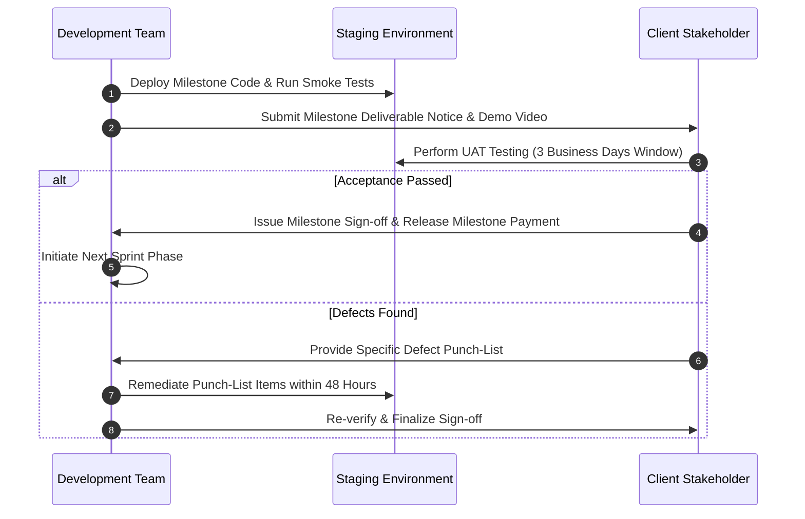

1. **Milestone 1 Acceptance Criteria ($5,800 USD | Weeks 1–3):** Client Figma ingested into Tailwind design tokens; FastAPI scaffolding running with Docker Compose; PostgreSQL 16 schema deployed with active migrations; JWT auth and RBAC functional.
2. **Milestone 2 Acceptance Criteria ($7,250 USD | Weeks 4–7):** Catalog browsing and searching functional; Shopify and WooCommerce OAuth connects to test store; product push and price multiplier rules verified; merchant dashboard renders live test store data.
3. **Milestone 3 Acceptance Criteria ($7,250 USD | Weeks 8–11):** Simplified Chinese supplier portal allows pick-list export; Ground QC terminal permits 3-photo upload linked to test order; Stripe payment capture populates escrow ledger.
4. **Milestone 4 Acceptance Criteria ($5,800 USD | Weeks 12–14):** End-to-end simulated order flows from test Shopify store → Supply Handlers → Supplier dispatch → QC photo approval → 17TRACK webhook tracking update pushed back to Shopify.
5. **Milestone 5 Acceptance Criteria ($2,900 USD | Weeks 15–16):** Production cloud infrastructure live on client's AWS/Hetzner account; SSL active; automated CI/CD deployment operational; zero critical security vulnerabilities; handover documentation delivered.

---

### 18.6 Post-Launch Maintenance Retainer ($200 USD / Month)
Upon expiration of the 30-day post-launch warranty, platform support transitions to the **$200 USD / month** ongoing maintenance plan:
* **Uptime & Health Assurance:** 24/7 automated ping checks, memory/CPU load monitoring, and Docker process crash restarts.
* **Security & System Maintenance:** Routine Linux OS patches, container base-image updates, and SSL renewal verification.
* **Database & Backup Audits:** Verification of automated daily PostgreSQL backups and Redis memory hygiene.
* **Bug Fixes:** Priority remediation of unexpected errors or edge cases in delivered codebase.
* **Webhook Schema Upkeep:** Ongoing maintenance for minor API schema changes from Shopify, WooCommerce, or 17TRACK.

---

### 18.7 Out-of-Scope Change Management & New Feature SOW Governance
* **Baseline Integrity:** Any functionality not explicitly listed in Section 18.2 is classified as an **Out-of-Scope New Feature**.
* **Change Request Process:** If the client requests additional features, new marketplace channels (e.g., TikTok Shop), or custom workflows during or after MVP delivery:
  1. A formal **Change Request (CR) / New Feature SOW** is drafted outlining the feature requirements.
  2. The development team provides an isolated estimate of engineering hours, fixed quotation, and delivery impact.
  3. Work on the new feature begins only upon mutual written sign-off of the CR, leaving the core MVP timeline and budget unaffected.

---

# 19. Phase 2 Scope Definition — Differentiated Services

### 19.1 Growth & Channel Diversification (Months 5–8)
Phase 2 transforms the platform from a lean transactional tool into an enterprise-grade cross-border fulfillment engine:
* **Native TikTok Shop Open API Integration:** Full bi-directional product catalog sync, inventory reservation, and 48-hour tracking scan SLA compliance for TikTok Shop US and UK merchants.
* **10-Second Packaging Video Engine:** Upgrading the Ground QC terminal to record and stream a 10-second high-definition packaging video for every parcel directly in the merchant order drawer.
* **EU GPSR Compliance Module:** Automated generation of compliant product packaging labels embedding the designated EU Authorised Representative details and safety icons.
* **Consolidated Creator Sample Box System:** Dedicated public portal allowing DTC brands and TikTok creators to order multi-factory sample boxes with flat-rate express air shipping.
* **Advanced Multi-Supplier Routing:** Automated split-fulfillment engine that routes distinct order line items across multiple factories and combines them at the Yiwu hub into a single custom-branded box.
* **Automated Landed Cost & Tariff Outlier Engine:** Anomaly detection flagging volumetric shipping spikes or unexpected factory price changes before dispatch.

---

# 20. Phase 3 Scope Definition — Scale & Defensible Moats

### 20.1 Enterprise Infrastructure & Physical Moats (Months 9–14)
Phase 3 expands the physical and technological moats to an institutional scale:
* **US Domestic 3PL Pre-Stock Balancing:** Automated inventory balancing between China central hubs and leased US 3PL facilities (California and New Jersey) for guaranteed 2-to-4 day domestic US delivery.
* **Canton Fair Biannual Pipeline Drop:** Dedicated seasonal product launch infrastructure, featuring 200+ freshly audited factory lines cataloged with high-resolution 360-degree interactive video.
* **Amazon SP-API & Walmart Marketplace Integrations:** Certified FBM order fulfillment and inventory feeds adhering to strict marketplace merchant developer policies.
* **Predictive Inventory Replenishment Forecasting:** Machine-learning models analyzing store sales velocity and ad spend trajectory to recommend pre-stock replenishment schedules.
* **Live Factory Webcams & Public Defect Dashboards:** Real-time visibility into participating partner factory assembly lines and public supplier defect scorecards.

---

# 21. Development Effort Estimation (Granular Module Breakdown)

The project scope has been meticulously decomposed into **22 functional modules**, analyzing frontend, backend, quality assurance, and architecture requirements. Hours reflect realistic, production-ready engineering standards (including webhook edge cases, database transactions, idempotency handling, and responsive cross-browser testing) based on a standard development rate of **$25.00 USD / billable engineer hour**.

### 21.1 Comprehensive Module Estimation Table

| Module ID & Title | Detailed Functional Scope | Frontend Hours | Backend Hours | QA & Testing Hours | Total Module Hours | Complexity Rating |
| :--- | :--- | :---: | :---: | :---: | :---: | :---: |
| **MOD-01: UI/UX Design System & Tokens** | High-fidelity Figma design system, tokens, typography, component library (dark/light mode, mobile responsive). | 110 | 20 | 30 | **160** | Medium |
| **MOD-02: Public Web & Marketing Portal** | Next.js SSR landing pages, value proposition, landed cost calculator widget, compliance guide, FAQ. | 95 | 60 | 35 | **190** | Medium |
| **MOD-03: Auth & Zero-Trust RBAC** | JWT refresh rotation, OAuth2 (Google/Shopify), TOTP 2FA, multi-tenant organization context, permission guards. | 50 | 90 | 40 | **180** | High |
| **MOD-04: Merchant Dashboard Core** | Executive analytics, store switcher, unified navigation, notification center, team member management. | 90 | 70 | 35 | **195** | Medium |
| **MOD-05: Supplier / Factory Portal** | Bi-lingual (zh-CN/en-US) dashboard, order dispatch queue, picking list generation, barcode label printing. | 85 | 80 | 40 | **205** | High |
| **MOD-06: Admin Master Operations Portal** | Master order orchestrator, exception queues, user/merchant management, fee configuration, system health. | 110 | 110 | 50 | **270** | High |
| **MOD-07: Product Catalog & Variant Engine**| Master SKU vs Supplier SKU graph, polymorphic variant matrix, dynamic pricing multiplier rules engine. | 80 | 120 | 45 | **245** | Very High |
| **MOD-08: Multi-Warehouse Inventory System**| Atomic Lua Redis reservations, hard commit/rollback, multi-warehouse buffers, low-stock threshold alerts. | 60 | 130 | 55 | **245** | Very High |
| **MOD-09: Order Orchestration & Split Routing**| FSM order lifecycle, multi-store ingestion, split-order routing, consolidation at Yiwu staging hub. | 75 | 150 | 60 | **285** | Very High |
| **MOD-10: Ground QC & Inspection Module** | Mobile PDA web interface, barcode scan verification, scale integration, 3-photo & video proof upload to S3. | 90 | 85 | 45 | **220** | High |
| **MOD-11: Shipping Carrier & Tracking Engine**| 17TRACK, YunExpress, 4PX API integrations, automated tracking event ingestion, milestone push. | 50 | 110 | 40 | **200** | High |
| **MOD-12: Stripe Payments & Escrow Ledger** | Stripe Connect Custom capture, escrow holding logic, double-entry financial ledger, refund handling. | 65 | 130 | 55 | **250** | Very High |
| **MOD-13: Supplier Payouts (RMB / Airwallex)**| Airwallex / PingPong API integration, currency conversion ledger, bulk domestic Chinese bank payouts. | 45 | 95 | 40 | **180** | High |
| **MOD-14: Shopify Native Integration** | GraphQL 2024-10 Admin API, FulfillmentOrder API, bi-directional webhooks, HMAC verification. | 70 | 140 | 60 | **270** | Very High |
| **MOD-15: WooCommerce Native Integration** | REST API v3 wrapper, webhook receiver, cron fallback polling, tracking link injection into order notes. | 55 | 95 | 40 | **190** | Medium |
| **MOD-16: TikTok Shop Integration** *(Phase 2)* | TikTok Open API v202309, catalog validation, 48-hour SLA dispatch compliance, native shipping labels. | 80 | 140 | 55 | **275** | Very High |
| **MOD-17: Webhook Gateway & Ingestion** | High-throughput signature-verified event gateway, Redis buffer, exponential backoff dispatch. | 35 | 90 | 35 | **160** | High |
| **MOD-18: Custom Sourcing RFQ Engine** | Universal URL/photo submission, 24-hour agent quote sheet generator, 1-click catalog conversion. | 65 | 75 | 30 | **170** | Medium |
| **MOD-19: Meilisearch Catalog Search Engine**| Sub-50ms typo-tolerant search, faceted filtering, category indexing, synchronic stock availability. | 45 | 65 | 30 | **140** | Medium |
| **MOD-20: Multi-Channel Notification Engine** | In-app alerts, transactional emails (Postmark), urgent SMS dispatch (Twilio), customizable webhooks. | 40 | 60 | 25 | **125** | Low |
| **MOD-21: Asynchronous Queue & Workers** | ARQ / Celery queue topology, job monitoring UI, dead-letter queue management, distributed async scheduler. | 25 | 100 | 40 | **165** | High |
| **MOD-22: DevOps, CI/CD, Security & Auditing**| Dockerized FastAPI microservices, Terraform infrastructure-as-code, GitHub Actions CI/CD, immutable audit logs. | 30 | 150 | 55 | **235** | High |
| **Total Engineering Breakdown** | **Full Scope Cumulative Hours** | **1,500** | **2,205** | **905** | **4,610** | **Enterprise** |

*Note: The remaining 500 hours across the 5,110 full-scope roadmap are allocated to project management, systems architecture oversight, and technical documentation.*

---

# 22. Professional Client Quotation

### 22.1 Commercial Structure: Phased Options
To ensure executive clarity and mitigate commercial risk, the quotation is divided into structured delivery options, with a special discounted launch tier for when the client provides UI/UX designs and the engineering team leverages an AI-accelerated development workflow.


### 22.2 Detailed Commercial Quotation Tiers

| Commercial Quotation Tier | Target Scope & Included Modules | Total Hours | Billable Rate | Total Fixed Cost | Estimated Delivery |
| :--- | :--- | :---: | :---: | :---: | :---: |
| ⭐ **SPECIAL DISCOUNTED MVP** *(Client Provides Design + AI Accelerated)* | * **Complete Option A MVP Scope Delivered.**<br>* **Zero Design Fee Markup:** Client supplies Figma/UI components.<br>* Public Marketing Site & Curated 5,000 SKU Catalog.<br>* Merchant Dashboard with **Shopify & WooCommerce** 2-way sync.<br>* Simplified Chinese Supplier Portal for dispatch & pick lists.<br>* Admin Hub with **Ground QC 3-Photo Inspection Upload**.<br>* Stripe Merchant Capture & Escrow Balance Ledger.<br>* YunExpress & 4PX Tracking Sync via 17TRACK.<br>* Core FastAPI Backend, Redis ARQ Queues & PostgreSQL DB. | **~1,160** | **~$25.00 / hr** | **$29,000 USD** | **12 to 16 Weeks** (3–4 Months) |
| **OPTION A: Full Turnkey MVP** *(Agency handles UI/UX from Scratch)* | * All core MVP modules above, plus complete end-to-end UX research, wireframing, high-fidelity design system, and multi-portal responsive mockups from scratch. | **2,140** | **$25.00 / hr** | **$53,500 USD** | **16 Weeks** (4 Months) |
| **OPTION B: Professional Growth Suite** | * **All Option A (MVP) Features Included.**<br>* **Native TikTok Shop Open API Integration** (48h SLA sync).<br>* **10-Second Packaging Video Upload & Streaming Engine**.<br>* **EU GPSR Compliance Label Generator**.<br>* **Creator Sample Box Ordering Portal**.<br>* Multi-Supplier Split-Fulfillment Engine.<br>* Automated Landed Cost & Tariff Outlier Detection.<br>* Postmark Email + Twilio SMS Alert Engine.<br>* Dedicated Sourcing Agent In-App Messenger. | **3,570** | **$25.00 / hr** | **$89,250 USD** | **26 Weeks** (6.5 Months) |
| **OPTION C: Full CJ-Style Enterprise Ecosystem** | * **All Option A & Option B Features Included.**<br>* **Amazon SP-API & Walmart Marketplace Integrations**.<br>* Multi-Warehouse Domestic US 3PL Balancing.<br>* AI Reverse-Image Factory Sourcing (CLIP Vector Search).<br>* Canton Fair Biannual Pipeline & 360 Video Drop.<br>* Predictive ML Inventory Replenishment Engine.<br>* Automated Dispute Sentiment Triage Agent.<br>* Public Supplier Defect Scorecard & Live QC Streams.<br>* Complete High-Availability Kubernetes Infrastructure. | **5,110** | **$25.00 / hr** | **$127,750 USD** | **36 Weeks** (9 Months) |

### 22.3 Clear Separation: Discounted MVP vs. Standard vs. Enterprise
* **The Discounted MVP Quotation ($29,000 USD / 12–16 Weeks):** Optimized specifically for maximum capital efficiency. By having the client provide approved Figma designs and using modern AI-assisted engineering pipelines, development hours are focused 100% on high-performance code, Shopify/WooCommerce synchronization, and physical warehouse QC workflows.
* **The Full Turnkey MVP ($53,500 USD / 2,140 Hours / 16 Weeks):** Includes exhaustive product UX research, user testing, and complete agency-crafted design systems alongside the core technical build.
* **The Full CJ-Style Enterprise Quotation ($127,750 USD / 5,110 Hours):** Represents the complete, scaled software counterpart to CJdropshipping, incorporating complex multi-marketplace integrations (TikTok Shop, Amazon, Walmart), automated tariff computation, AI visual vector matching, and US domestic 3PL balancing.

### 22.4 Payment Milestones for Special Discounted Offer ($29,000 USD)
For the **Special Discounted MVP ($29,000 USD / 12–16 Weeks)**, billing is structured across five performance-linked milestones:
1. **Milestone 1 (20% - $5,800 USD | Weeks 1–3):** Ingestion of Client Figma Designs, Tailwind Design Token Setup, FastAPI ASGI Scaffolding, PostgreSQL Database Schemas & JWT/OAuth2 Security.
2. **Milestone 2 (25% - $7,250 USD | Weeks 4–7):** 5,000 SKU Product Catalog Engine, Shopify & WooCommerce 2-Way Product/Inventory Connectors, and Merchant Dashboard Alpha.
3. **Milestone 3 (25% - $7,250 USD | Weeks 8–11):** Supplier Dispatch Portal (Simplified Chinese), Ground QC Mobile Inspection Terminal (3-Photo Capture), and Stripe Custom Escrow Balance Engine.
4. **Milestone 4 (20% - $5,800 USD | Weeks 12–14):** End-to-End Automated Order Routing, 17TRACK / YunExpress / 4PX Webhook Logistics Sync, and Beta User Acceptance Testing (UAT).
5. **Milestone 5 (10% - $2,900 USD | Weeks 15–16):** Production Cloud Deployment (AWS / Hetzner), Security Audit Remediation, and 30-Day Launch Warranty.

*(Note: For the standard Turnkey MVP at $53,500 USD, milestones follow the 20% / 25% / 25% / 20% / 10% ratio as $10,700 / $13,375 / $13,375 / $10,700 / $5,350 USD across 16 weeks).*

### 22.5 Server & Cloud Infrastructure Provision
* **Client-Supplied Accounts:** All cloud hosting environments (AWS / Hetzner), managed database instances (RDS PostgreSQL 16), in-memory queues (Redis), edge networks (Cloudflare), and transactional SaaS APIs (Stripe, Twilio, Postmark, 17TRACK) will be **registered, owned, and funded directly by the client**.
* **Zero-Cost DevOps & Setup by Development Team:** Our engineering team handles **100% of the end-to-end infrastructure architecture, server configuration, Linux OS hardening, Docker container orchestration, database migration setup, SSL certificate installation, and automated CI/CD deployment pipelines at no additional setup charge** (fully covered within the project contract).

### 22.6 Monthly Maintenance & Technical Support Agreement ($200 USD / Month)
To ensure uninterrupted platform operations, high availability, and proactive system health following the 30-day warranty period, an ongoing **Monthly Maintenance & Support Retainer** is established at **$200 USD / month**:
* **24/7 Server Health & Uptime Monitoring:** Real-time uptime checks, ping diagnostics, and server resource alerting (CPU, memory, disk usage).
* **Security & System Maintenance:** Routine Linux OS security patches, Docker base-image vulnerability updates, and SSL/TLS certificate renewals.
* **Database & Queue Integrity:** Automated daily PostgreSQL snapshot verification, database connection pool optimization, and Redis queue health checks.
* **Core Bug Resolution & Troubleshooting:** Priority diagnosis and patching of any technical anomalies, unexpected edge-case errors, or workflow regressions within the delivered codebase.
* **Third-Party API & Webhook Upkeep:** Ongoing maintenance and minor adjustments to carrier and store webhook listeners (handling minor API schema shifts from Shopify, WooCommerce, and 17TRACK).
* **Technical SLA Support:** Direct developer email and communication channel support for platform operational queries during business hours.

### 22.7 Out-of-Scope Change Management & New Feature Policy
* **Strict Baseline Protection:** The fixed-price quotation ($29,000 USD discounted / $53,500 USD turnkey) strictly covers the functional specifications, database models, and API integrations documented in this PRD.
* **Formal Quotation for New Features:** Any new feature requests, additional third-party marketplace connectors (e.g., TikTok Shop, Amazon SP-API, Walmart), advanced AI models, or fundamental workflow modifications outside the approved MVP scope will be handled via an official **Change Order / New Feature Quotation**.
* **Transparent Scoping:** Each new feature request will be documented with functional requirements, technical effort hours, fixed cost quotation, and delivery timeline before development begins, ensuring zero budget creep and complete financial transparency.

* **Explicit Exclusions from Development Quotation:**
  * Direct third-party SaaS subscription fees (AWS, Cloudflare, Stripe fees, Twilio, Postmark) paid directly by client.
  * Legal filing fees for Wyoming LLC registration or European GPSR authorized representative retainers.
  * Physical warehouse hardware (handheld barcode scanners, label printers, digital scales).
  * Ongoing digital ad spend, copywriting, or physical factory auditing travel expenses.

---

# 23. Infrastructure & Recurring Operational Cost Model

Monthly recurring infrastructure and third-party API operational costs are completely distinct from software development fees. **All server and third-party SaaS accounts are funded directly by the client**, while our development team executes **100% of initial DevOps setup, Docker orchestration, and CI/CD pipelines at zero additional cost**, backed by our **$200 USD / month ongoing maintenance and support plan**. Below is a granular, realistic monthly operating budget modeled across three corporate growth stages:

### 23.1 Monthly Operational Cost Comparison Table

| Operational Cost Component | MVP Stage (0 – 10k Orders/Mo) | Growth Stage (10k – 50k Orders/Mo) | Enterprise Scale (50k – 250k Orders/Mo) | Primary Provider & Pricing Model |
| :--- | :---: | :---: | :---: | :--- |
| **Compute Application Servers** | $120.00 | $350.00 | $950.00 | Hetzner Cloud / AWS ECS Fargate (Containerized FastAPI & Next.js SSR clusters). |
| **Managed PostgreSQL Database** | $85.00 | $240.00 | $680.00 | AWS RDS PostgreSQL 16 (Multi-AZ with read replica at Growth/Enterprise). |
| **Managed Redis Cache / Queues** | $40.00 | $95.00 | $220.00 | Redis Cloud / AWS ElastiCache (In-memory storage for ARQ/Celery and inventory locks). |
| **Meilisearch Search Cluster** | $35.00 | $85.00 | $180.00 | Meilisearch Cloud / Self-hosted Hetzner high-memory node. |
| **Object Storage (Media/Video)** | $25.00 | $80.00 | $280.00 | Cloudflare R2 / AWS S3 (Zero egress bandwidth fees via Cloudflare). |
| **Cloudflare WAF / Enterprise CDN** | $20.00 | $200.00 | $450.00 | Cloudflare Pro ($20/mo) scaling to Business/Enterprise for DDoS and edge caching. |
| **Transactional Email Delivery** | $15.00 | $65.00 | $190.00 | Postmark ($15/mo for 10k emails; scaling linearly with order dispatch alerts). |
| **SMS Operational Alerts** | $20.00 | $75.00 | $250.00 | Twilio ($0.0079 per SMS for critical warehouse dispatch notifications). |
| **Carrier Tracking API (17TRACK)** | $30.00 | $110.00 | $350.00 | 17TRACK API ($0.03 to $0.01 per tracked shipment milestone lifecycle). |
| **AI Translation & Inpainting API**| $20.00 | $70.00 | $180.00 | DeepL Pro API ($5.49/mo + $25/M characters) + Replicate image cleanup tokens. |
| **Application APM & Logging** | $10.00 | $80.00 | $240.00 | BetterStack Logtail + Sentry Error Monitoring + Uptime Heartbeats. |
| **Total Estimated Monthly OPEX** | **$420.00 / mo** | **$1,450.00 / mo** | **$3,970.00 / mo** | *Excludes variable payment gateway processing fees (Stripe 2.9% + $0.30).* |

---

# 24. Technical Risk Assessment & Mitigation Matrix

Cross-border supply chain platforms face unique distributed failure modes spanning international firewalls, third-party platform policy shifts, and multi-currency liquidity risks.

```mermaid
graph TD
    R1[Shopify / TikTok API Rate Limiting] --> M1[Token-Bucket Throttling & Redis Queue Buffering]
    R2[Inventory Race Conditions Multi-Store] --> M2[Atomic Redis Lua Scripting & 2-Phase Commits]
    R3[China-to-US Gateway Network Latency] --> M3[Cloudflare China Network & Async Event Queues]
    R4[Cross-Border FX & Supplier Escrow Risk] --> M4[Locked Real-Time Spot FX & 24h Inspection Holds]
```

### 24.1 Comprehensive Risk Register & Mitigation Strategy

| Risk ID & Category | Technical / Operational Risk Scenario | Probability & Impact | Root Cause & System Vulnerability | Engineered Technical Mitigation Strategy |
| :--- | :--- | :---: | :--- | :--- |
| **RSK-01: Integration** | **Shopify / TikTok API Rate Limit Throttling** | High / High | High-volume merchant runs viral TikTok campaign; thousands of orders hit webhook receiver simultaneously, exhausting store API rate limits. | Implement Redis-backed token-bucket rate limiter. Outgoing API calls to Shopify GraphQL are metered strictly to 40 cost points/sec; bulk operations use Shopify Bulk Operations GraphQL API. |
| **RSK-02: Inventory** | **Concurrent Inventory Overselling Across Stores** | Medium / Critical | Two independent Shopify stores connected to the same factory SKU sell the final 5 units simultaneously. | Two-phase atomic reservation using Redis Lua scripts. Soft reservation locks available quantity with 60-minute TTL. First payment capture commits stock; second is gracefully declined before charge. |
| **RSK-03: Network** | **China-to-Western API Latency & Firewall Drops** | High / Medium | Ground QC staff in Yiwu experience slow API response times or dropped connections to Western AWS servers due to the Great Firewall. | Deploy dual-region edge routing. Public dashboard hosted on Cloudflare Enterprise; static assets and media cached at Hong Kong / Tokyo edge nodes; API calls accelerated via Cloudflare Argo Smart Routing. |
| **RSK-04: Financial** | **Chargeback Exposure on Cross-Border Parcels** | Medium / High | End customer files fraudulent chargeback on Shopify while factory has already been paid in RMB. | Funds held in escrow until Yiwu QC inspection clearance scan. Platform captures digital proof-of-fulfillment (signed carrier manifest + weigh-in photo + GPS carrier scan) auto-compiled for Stripe dispute rebuttal. |
| **RSK-05: Regulatory** | **Customs Parcel Seizures Under Stricter De Minimis** | Medium / Critical | US CBP or EU customs halts air cargo pallets due to inaccurate HTS tariff declarations or missing GPSR importer details. | Mandatory HTS classification audit in product catalog engine. Automated Type 86 clearance data generation linking Wyoming LLC as verified importer-of-record facilitator. |

---

# 25. Strategic Exclusions: What NOT to Build in MVP

A critical finding from studying failing and bloated competitors (such as AutoDS and Dropified) is that attempting to build every feature simultaneously leads to an unmaintainable codebase, high bug density, and delayed time-to-market. The following features are **explicitly excluded from the MVP scope**:

```mermaid
pie title Features Excluded from MVP to Ensure Rapid Launch
    "AI Store Builders (Low Retention)" : 30
    "50+ Obscure Marketplace Connectors" : 25
    "Arbitrary Wallet / Point Systems" : 20
    "Speculative US Warehouse Leases" : 15
    "Full In-App Live Video Streaming" : 10
```

1. **"1-Click AI Store Builders" (Do NOT Build):** Zendrop and AutoDS market automated store builders. In practice, they produce low-converting, cookie-cutter storefronts with 90%+ 30-day merchant churn. Supply Handlers targets serious merchants who already operate branded Shopify/WooCommerce stores.
2. **Proprietary "Wallet / In-App Credit" Scheme (Do NOT Build):** Incumbents force sellers to deposit hundreds of dollars into proprietary "wallets," sparking severe complaints and chargeback disputes when sellers request refunds. Supply Handlers will use transparent pay-as-you-fulfill Stripe card captures.
3. **50+ Marginal Marketplace Integrations (Do NOT Build):** Platforms boasting 30+ integrations (Etsy, Wish, Mercari, Magento, PrestaShop) spend 80% of their engineering bandwidth fixing broken webhook connections. MVP will focus with surgical excellence strictly on **Shopify and WooCommerce**, adding **TikTok Shop** in Phase 2.
4. **Speculative Leased US Warehouses (Do NOT Build):** Leasing physical warehouse space in California or New Jersey in Year 1 introduces massive fixed real estate overhead. Supply Handlers will focus on the high-margin **Yiwu Central Sourcing & Inspection Hub**, partnering with established 3PLs on a pay-per-pallet basis only when demand justifies it.
5. **Real-Time Live Video Streaming on Packing Desks (Do NOT Build):** Streaming live WebRTC video from warehouse inspection desks introduces severe bandwidth costs and latency over Chinese cross-border networks. Phase 1 will use **high-resolution 3-point static photos**, followed by asynchronous **10-second compressed video clips** in Phase 2.

---

# 26. Final Recommendations & Implementation Strategy

### 26.1 Recommended Delivery Scope: Option A (MVP)
The executive engineering recommendation is to initiate **Option A (Lean MVP Platform)**. 

* **Special Discounted Accelerated Offer:** **$29,000 USD** delivered in **12 to 16 calendar weeks** (leveraging client-supplied Figma design assets and AI-accelerated code generation).
* **Full Agency Turnkey Scope:** **$53,500 USD** delivered in **16 calendar weeks** (including bespoke UI/UX research, design system creation, and 2,140 billable hours @ $25.00/hr).
* **Hosting & Infrastructure Ownership:** Server hosting and SaaS accounts (AWS/Hetzner, PostgreSQL, Redis, Cloudflare, Postmark, Twilio, 17TRACK) are **provided and funded directly by the client**. Our team provides **100% of end-to-end DevOps setup, Docker configuration, and CI/CD deployment pipelines at no extra fee**.
* **Monthly Post-Launch Support Retainer:** **$200 USD / month** for continuous uptime/health monitoring, security patches, database backup auditing, and bug troubleshooting.
* **New Features Policy:** Any out-of-scope functional requests or new integrations beyond the MVP specification will be scoped and billed under a **new formal quotation / change order**.

This approach allows Supply Handlers to:
* Validate the physical Yiwu ground inspection model with real, paying DTC merchants.
* Generate immediate transactional revenue via sourcing margins and pick-and-pack fulfillment fees.
* Build an impenetrable reputation for transparent billing and verified quality control while competitors struggle with customer churn.

### 26.2 Dedicated Implementation Team Composition
To execute this 16-week delivery schedule smoothly, the following 6-person multidisciplinary engineering squad is recommended:

```mermaid
graph TD
    TL[Lead Solutions Architect / PM<br><i>Part-Time: 15h/wk</i>]
    FE1[Senior Frontend Engineer<br>Next.js 14 / TypeScript / UI]
    FE2[Mid Frontend Engineer<br>Merchant & Supplier Dashboards]
    BE1[Senior Backend Architect<br>FastAPI / PostgreSQL / ARQ]
    BE2[Integration Engineer<br>Shopify / Woo / Stripe / Carriers]
    QA[Lead QA & Automation Engineer<br>Cypress / Playwright / Webhooks]
    
    TL --- FE1 & FE2 & BE1 & BE2 & QA
```

* **1x Principal Solutions Architect / Technical Lead:** System design, security governance, database optimization, and client alignment.
* **2x Fullstack / Frontend Engineers (React / Next.js / TypeScript):** UI/UX implementation across Public Web, Merchant Dashboard, and Bi-Lingual Supplier Portal.
* **2x Backend / Systems Engineers (FastAPI / Python / PostgreSQL / Redis):** Distributed inventory logic, webhook ingestion, Shopify/Woo connectors, Stripe payment escrow, and carrier integrations.
* **1x QA Automation & Security Engineer:** End-to-end webhook simulation, cross-browser compatibility, penetration testing, and load testing.

### 26.3 Final Standardized Technology Stack
* **Frontend:** Next.js 14+ (App Router), React 19, TypeScript, Tailwind CSS, Lucide Icons, Shadcn UI / Radix Primitives.
* **Backend:** FastAPI (Python 3.12+ Async ASGI), Pydantic v2, SQLAlchemy 2.0 (Async) + Alembic, asyncpg driver.
* **Persistence & Caching:** PostgreSQL 16 (Multi-AZ), Redis 7 (In-Memory Cluster & Lua Scripting).
* **Asynchronous Queuing:** ARQ (Asyncio Redis Queue) / Celery on Redis 7 with Flower / ARQ-dashboard operational monitoring.
* **Search Engine:** Meilisearch v1.8+ (Typo-tolerant, sub-50ms catalog indexing).
* **Storage & Edge:** Cloudflare R2 / AWS S3, Cloudflare Enterprise CDN / WAF.
* **Infrastructure Orchestration:** Docker, Kubernetes (EKS / Hetzner K3s), GitHub Actions CI/CD.

---

# 27. Master Development Roadmap & Sprint Schedule

The 16-week MVP implementation is structured into **8 distinct 2-week agile sprints**, with tangible working software delivered at every milestone.

```mermaid
gantt
    title Supply Handlers MVP 16-Week Implementation Roadmap
    dateFormat  YYYY-MM-DD
    section Sprint 1 & 2: Architecture & Foundation
    Database Schema & Next.js Scaffolding      :done, s1, 2026-11-01, 14d
    Zero-Trust Auth & RBAC (JWT/2FA)           :done, s2, 2026-11-08, 14d
    Public Web & Landed Cost Calculator        :active, s3, 2026-11-15, 14d
    section Sprint 3 & 4: Catalog & Integrations
    Product Master SKU Graph & Pricing Rules   :crit, s4, 2026-11-22, 14d
    Shopify GraphQL & Fulfillment API Connector:crit, s5, 2026-11-29, 14d
    WooCommerce REST API & Webhook Ingest      :s6, 2026-12-06, 14d
    section Sprint 5 & 6: Operations & Hardware
    Redis 2-Phase Inventory Reservation Engine :crit, s7, 2026-12-13, 14d
    Supplier Portal (zh-CN) & Barcode Gen      :s8, 2026-12-20, 14d
    Ground QC Mobile PDA Interface & S3 Photos :s9, 2026-12-27, 14d
    section Sprint 7 & 8: Payments & Launch
    Stripe Connect Escrow & Financial Ledger   :crit, s10, 2027-01-03, 14d
    17TRACK & Carrier Logistics Sync           :s11, 2027-01-10, 14d
    End-to-End Load Testing & UAT Sign-off     :s12, 2027-01-17, 14d
    Production Deployment & 30-Day Warranty    :s13, 2027-01-24, 7d
```

### 27.1 Detailed Sprint Breakdown
* **Sprint 1 (Weeks 1–2): System Architecture, Design System & Auth Foundation**
  * Finalize high-fidelity Figma component library and Tailwind design tokens.
  * Scaffold PostgreSQL 16 database with SQLAlchemy 2.0 and Alembic; execute core schema migrations for Organizations, Users, and Roles.
  * Implement stateless JWT authentication with refresh token rotation, TOTP 2FA, and permission guards.
* **Sprint 2 (Weeks 3–4): Public Web & Interactive Landed Cost Engine**
  * Build responsive Next.js SSR public marketing pages, value proposition showcase, and factory walkthrough video hub.
  * Deploy interactive public Landed Cost Calculator widget comparing Supply Handlers against CJ/Spocket.
  * Configure Meilisearch cluster; index initial 5,000 pre-vetted catalog SKUs with sub-50ms search latency.
* **Sprint 3 (Weeks 5–6): Product Catalog, Variant Graph & Shopify Connector**
  * Build master product catalog engine supporting polymorphic variant axes and custom pricing multiplier rules.
  * Complete Shopify OAuth flow, product push engine, and bi-directional inventory synchronization.
  * Implement webhook receiver with HMAC signature verification and Redis queue buffering.
* **Sprint 4 (Weeks 7–8): WooCommerce Connector & Distributed Inventory Engine**
  * Deploy WooCommerce REST API v3 integration with automated tracking injection into customer order notes.
  * Implement Redis-backed two-phase atomic inventory reservation engine using custom Lua scripts.
  * Build Merchant Dashboard store switcher and multi-variant mapping interface.
* **Sprint 5 (Weeks 9–10): Supplier Dispatch Portal & Ground QC Terminal**
  * Develop mobile-responsive, bi-lingual (`zh-CN` / `en-US`) Supplier Portal for factory picking and dispatch.
  * Deploy Ground QC Mobile PDA web interface supporting barcode scanning and automated scale verification.
  * Implement direct-to-S3 multi-photo upload pipeline attaching inspection proof to merchant order drawers.
* **Sprint 6 (Weeks 11–12): Stripe Payments, Escrow Ledger & Order Orchestration**
  * Integrate Stripe Connect Custom for automated merchant card capture upon order checkout.
  * Engineer immutable double-entry escrow ledger holding factory funds until Yiwu QC inspection clearance.
  * Deploy Order Orchestrator FSM managing states from `DRAFT` to `DISPATCHED`.
* **Sprint 7 (Weeks 13–14): Logistics Tracking, Custom RFQ & Notification Engine**
  * Integrate 17TRACK, YunExpress, and 4PX tracking webhooks; push automated tracking links to connected stores.
  * Build custom Sourcing RFQ module enabling merchants to submit 1688 URLs with guaranteed 24h quote SLA.
  * Configure Postmark transactional email alerts and Twilio SMS dispatch notifications.
* **Sprint 8 (Weeks 15–16): Security Hardening, Penetration Testing & Production Launch**
  * Execute comprehensive end-to-end integration tests using Playwright and webhook simulation suites.
  * Perform OWASP security audits, rate-limit stress tests, and automated database disaster recovery drills.
  * Deploy containerized production cluster to AWS/Hetzner with Cloudflare Enterprise WAF; initiate 30-day warranty.

---

## Document Approval & Sign-Off

| Stakeholder Role | Name & Title | Signature | Date |
| :--- | :--- | :--- | :--- |
| **Client Executive Sponsor** | Managing Director, Supply Handlers | _________________________ | ____ / ____ / 2026 |
| **Principal Solutions Architect** | Lead Technical Consultant | _________________________ | ____ / ____ / 2026 |
| **Lead Operations Director** | Head of China Logistics (Yiwu/Guangzhou) | _________________________ | ____ / ____ / 2026 |

*End of Comprehensive Product Requirements Document, Technical Architecture, and Commercial Quotation.*
