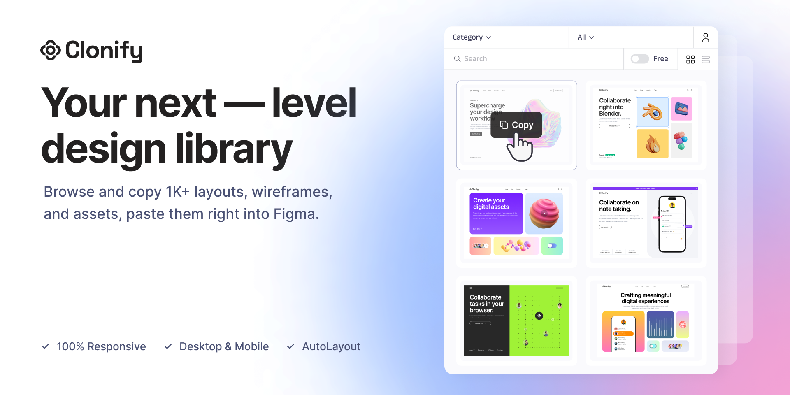

# Clonify Figma Plugin

## What It Does

Designers can browse the entire Clonify component library without leaving Figma. Find a template you like, click import, and it lands on your canvas with layouts and styling intact. No more switching between browser tabs and Figma.

**Plugin:** [Clonify Library on Figma Community](https://www.figma.com/community/plugin/1282271698729766959/clonify-library)

---

## What I Built

- Complete Figma plugin using the Figma Plugin API and TypeScript
- Integration with Clonify's backend API for fetching templates
- One-click import that preserves component structure and styling
- Subscription-based access: free users get a subset, premium gets everything
- Caching and lazy loading so the plugin stays responsive

---

## The Hard Parts

**Mapping Clonify data to Figma frames.** Clonify's component format doesn't map 1:1 to Figma's frame structure. I had to build a translation layer that converts Clonify components into proper Figma nodes while keeping the visual output accurate.

**Auth inside a Figma plugin.** Handling user login, subscription checks, and session tokens within Figma's plugin sandbox has constraints you don't deal with in a normal web app. Had to work around the plugin's limited storage and network access.

**Importing complex components without freezing the UI.** Multi-layer components can take a moment to build. I batched the creation operations and added progressive rendering so the plugin stays usable during imports.

---

## Tech Stack

| Layer | Tech |
|-------|------|
| Plugin | Figma Plugin API, TypeScript |
| Backend | Clonify API |
| Auth | Token-based, subscription-gated |
