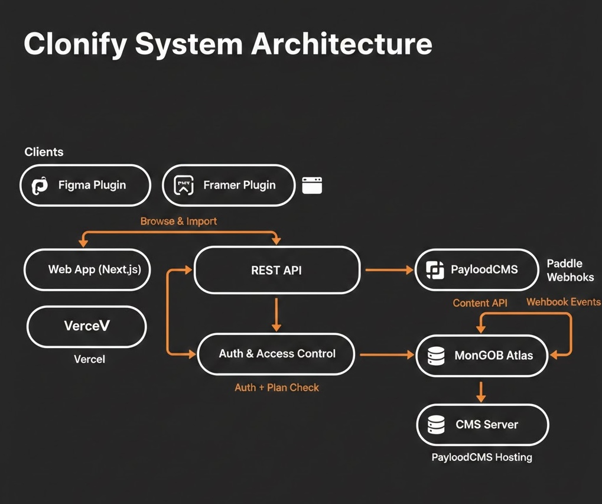
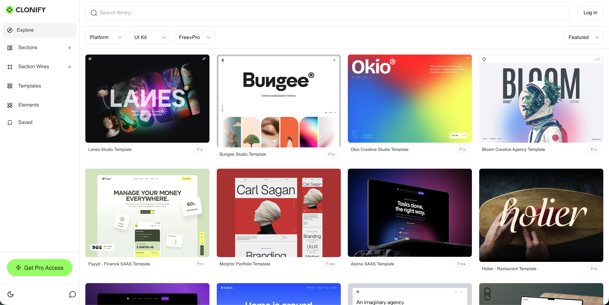
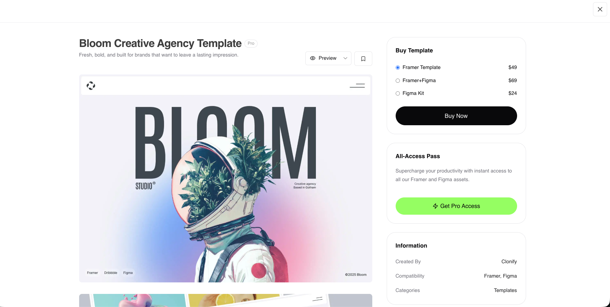

# Clonify: UI Library Platform for Framer & Figma


## What is Clonify?

Clonify is a SaaS platform where designers browse, preview, and use **1,000+ UI templates, wireframes, and sections** for Framer and Figma. Think of it as a Netflix for design components — you subscribe, and you get access to a massive library you can pull from directly inside your design tool.

The client (Clonify Labs) came with the product vision and UI designs. I designed the entire technical system and led the build from zero to production with one teammate. Every architecture decision, tech choice, and system design call was mine.

**Live:** [library.clonify.io](https://library.clonify.io/) | [clonify.io](https://clonify.io)
**Timeline:** January – May 2025

---

## My Role: Lead Developer & System Architect

The client handed us Figma designs and a feature list. From there, I:

- Designed the full system architecture (what services, how they talk, what goes where)
- Chose the tech stack and justified every choice
- Led a team of two (myself + one teammate)
- Built the core platform, billing system, and CMS pipeline
- Made the calls on database modeling, caching strategy, and deployment setup

My teammate helped with frontend implementation while I owned the architecture, backend, integrations, and infrastructure.

---

## Architecture & System Design

Here's how I structured the whole thing:



### Frontend (Next.js)

Chose Next.js because we needed:
- **Server-side rendering** for SEO (the library pages need to be indexable so designers find Clonify through Google)
- **Fast client-side navigation** between templates (browsing 1,000+ items needs to feel snappy)
- **API routes** for lightweight backend logic without spinning up a separate server for simple things

The browsing experience was the hardest frontend challenge. 1,000+ templates can't all load at once. I implemented:
- Lazy loading with intersection observers (components load as you scroll)
- Image optimization with responsive srcsets
- Custom client-side caching so going back to a page you already visited is instant
- Skeleton loading states so the UI doesn't feel broken while assets load

### CMS Backend (PayloadCMS)

This is the decision that saved us the most time and money. Instead of building a custom admin panel and content management system from scratch (which would have taken weeks), I chose **PayloadCMS** because:

- It gives us a full admin UI for free — the Clonify team can add, edit, and organize templates without touching code
- It's built on top of Express and MongoDB, so I have full control when I need to customize
- It generates a REST API automatically from the content models I define
- It handles media uploads, user roles, and content versioning out of the box

Without PayloadCMS, we would have spent 3-4 extra weeks building admin CRUD interfaces, media management, and content APIs. With it, I defined the data models, configured the admin panel, and the content pipeline was ready.

**Content models I designed:**

```
Templates
├── title, description, category, tags
├── preview images (multiple sizes for responsive)
├── template data (the actual component structure)
├── access tier (free / premium)
├── compatible platforms (Framer, Figma, or both)
└── metadata (created, updated, download count)

Categories
├── name, slug, description
├── icon, cover image
└── sort order

Plans
├── name, price, billing cycle
├── feature limits
└── Paddle plan ID (for payment sync)
```

### Payment System (Paddle)

Chose Paddle over Stripe for a specific reason: **Paddle acts as the Merchant of Record**. This means Paddle handles all sales tax, VAT, and compliance globally. For a SaaS selling to designers worldwide, this removes a massive legal and accounting burden from the client.

The billing flow I built:

1. User clicks "Subscribe" → Paddle checkout overlay opens
2. User pays → Paddle sends a webhook to our API
3. Our webhook handler verifies the signature, creates/updates the subscription record
4. User's access tier updates immediately (they can browse premium content)
5. On renewal/cancellation/failure → Paddle webhook fires again → we update accordingly

I built the webhook handler to be **idempotent** — if Paddle sends the same event twice (which happens), we don't accidentally double-process it.

### Access Control

The trickiest part of the billing integration. Free users see a subset of templates, premium users see everything. This needs to work in three places:

1. **The library browsing UI** — premium templates show a lock icon for free users
2. **The API** — template data endpoints check the user's plan before returning full content
3. **The plugins** (Figma/Framer) — same access checks, different context

I centralized the permission logic in a single service that all three consumers call. One source of truth for "can this user access this template?"

### Database (MongoDB)

Went with MongoDB because:
- PayloadCMS uses it natively (no ORM translation layer)
- Template data is document-shaped (nested, variable structure) — fits MongoDB better than relational tables
- The read pattern is heavy browsing with filters — MongoDB's indexing and aggregation pipeline handle this well

Key indexes I set up:
- Compound index on `category + accessTier + platform` for filtered browsing
- Text index on `title + description + tags` for search
- Index on `createdAt` for "newest first" sorting

---

## What I Built, Step by Step

### 1. Project Setup & Architecture Planning
- Evaluated tech options and documented the architecture decision
- Set up the monorepo: Next.js app + PayloadCMS in the same project
- Configured TypeScript, ESLint, and the development environment
- Designed all data models before writing any feature code

### 2. CMS & Content Pipeline
- Defined PayloadCMS collections (Templates, Categories, Plans, Users)
- Customized the admin panel for the Clonify team's workflow
- Set up media upload handling with automatic image resizing
- Built the content publishing pipeline (draft → review → published)

### 3. Authentication & User System
- User registration and login
- Plan-based access tiers synced with Paddle subscriptions
- Session management with secure tokens
- Admin roles for the Clonify content team

### 4. Subscription Billing
- Paddle integration with checkout overlay
- Webhook handling for all subscription lifecycle events (new, renewed, cancelled, past due, refunded)
- Plan upgrade/downgrade logic with prorated billing
- Graceful handling of failed payments and expired subscriptions

### 5. Template Library & Browsing
- Browse page with category filtering, search, and sorting
- Lazy loading for smooth performance with 1,000+ items
- Template detail pages with full previews
- Access gating (free vs. premium content)

### 6. Frontend Implementation
- Translated client's Figma designs to React components (with my teammate)
- Mobile-first responsive design
- Loading states, error boundaries, and empty states
- Smooth animations and transitions for browsing




### 7. Plugin Integration Points
- Built the API endpoints that the Figma and Framer plugins consume
- Authentication flow for plugin contexts (different from web auth)
- Rate limiting and caching for plugin API calls

### 8. Deployment & Infrastructure
- Deployed to Vercel (Next.js frontend) with PayloadCMS on a separate server
- Set up MongoDB Atlas for the database
- Configured environment variables for dev/staging/production
- Monitoring and error tracking

---

## The Hard Parts

**Keeping 1,000+ templates browsable without lag.** The naive approach (load everything, filter on the client) would destroy the user experience. I moved filtering and pagination to the server, used MongoDB aggregation for fast queries, implemented lazy loading on the frontend, and cached frequently-accessed data. The result: browsing feels fast even with the full library loaded.

**PayloadCMS customization for non-standard workflows.** PayloadCMS is great out of the box, but Clonify's content pipeline had specific needs (bulk template uploads, access tier management, cross-platform compatibility flags). I wrote custom hooks and endpoints that extend PayloadCMS without fighting against its architecture.

**Paddle webhook reliability.** Payment events need to be processed correctly every single time. Webhooks can arrive out of order, arrive late, or fire multiple times. I built the handler with idempotency keys and state machine logic so the subscription state is always correct regardless of webhook timing.

**Syncing access across web and plugins.** When a user upgrades their plan on the website, the Figma plugin they have open should reflect that immediately (or at least within seconds). I designed the access check as a centralized API call rather than cached permissions, so all clients always get the latest access state.

**Coordinating with a teammate.** With two developers on the project, clear architecture boundaries mattered. I owned the backend, CMS, billing, and infrastructure. My teammate handled frontend components from the Figma designs. We synced daily and I reviewed all PRs to keep the codebase consistent.

---

## Tech Stack

| Layer | Tech | Why I Chose It |
|-------|------|---------------|
| Frontend | Next.js | SSR for SEO, fast browsing with client-side navigation |
| CMS | PayloadCMS | Saved 3-4 weeks of admin panel development, MongoDB-native |
| Database | MongoDB (Atlas) | Document-shaped data, fits templates well, strong aggregation |
| Payments | Paddle | Merchant of Record handles global tax/VAT compliance |
| Backend | Express (via PayloadCMS) | Comes with PayloadCMS, extended with custom routes |
| Hosting | Vercel + separate CMS server | Fast edge delivery for the frontend, dedicated CMS backend |

---

## What We Delivered

- A live SaaS platform serving 1,000+ design templates
- Content pipeline where the Clonify team publishes new templates without developer help
- Subscription billing that handles upgrades, downgrades, cancellations, and failed payments
- API layer that powers both the website and the Figma/Framer plugins
- Clean, documented codebase another developer can pick up
- The client provided the designs and the product vision. I designed the system and built it with one teammate.

