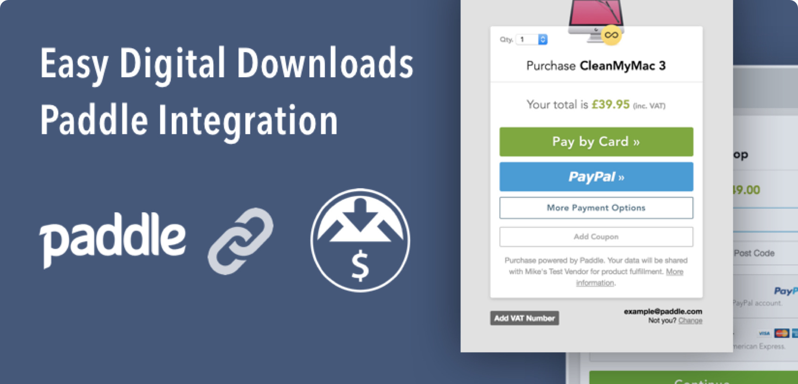
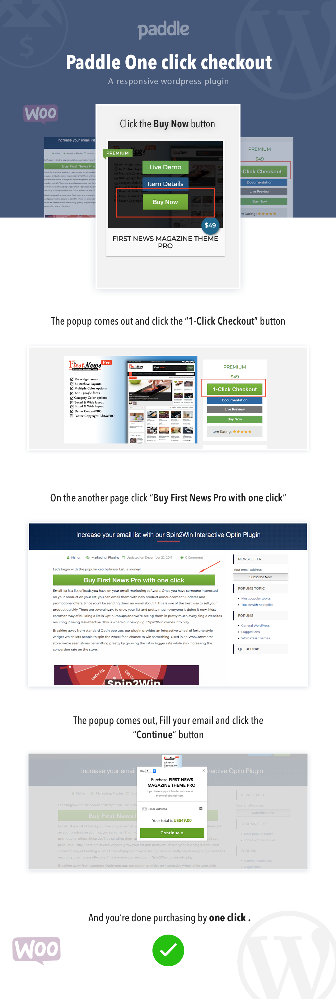

# EDD Paddle Integration: WordPress Payment Plugin

## What It Does

A WordPress plugin that adds Paddle as a payment gateway for Easy Digital Downloads. Customers get Paddle's one-click checkout overlay: enter card details or use PayPal, pay, and download. Paddle also handles EU VAT and international tax compliance automatically, which is a huge headache for digital product sellers.

---

## How It Works

- Hooks into EDD's existing product and cart system
- Adds Paddle's checkout overlay on purchase
- Supports credit cards, debit cards, and PayPal through a single integration
- Automatic VAT/tax handling for international customers
- No changes needed to the store owner's existing EDD workflow

---

## Tech Stack

WordPress, PHP, Paddle API, Easy Digital Downloads, Bootstrap
