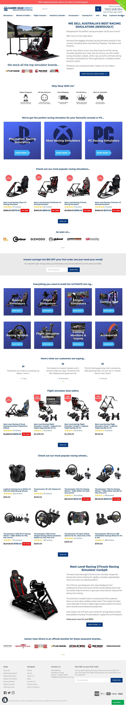
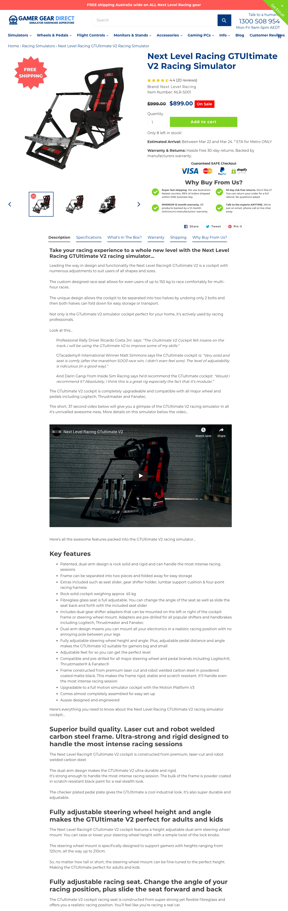

# Gamer Gear Direct: Ongoing Shopify Development

## The Project

Gamer Gear Direct is Australia's biggest racing simulator hardware superstore. They stock brands like Playseat, Next Level Racing, Trak Racer, and Prosimu. I've been their go-to Shopify developer since 2020, handling everything from theme updates to custom features to performance work.

The store serves **20,000+ customers**.

**Live:** [gamergeardirect.com.au](https://gamergeardirect.com.au/)

---

## What I Handle

- Theme customization as the store evolves (new product categories, promotions, layout changes)
- Custom features that go beyond what standard Shopify apps offer
- Performance tuning to keep a high-traffic store fast
- Bug fixes and troubleshooting
- Third-party app integrations (shipping, reviews, analytics, marketing tools)

---

## Why This Project Matters

This isn't a one-off build. It's an ongoing relationship where the store keeps growing and I keep adapting the tech to match. Racing simulators are complex products with lots of variants, accessories, and compatibility considerations. The store's Shopify setup needs to handle that complexity while still being easy for customers to navigate.

The fact that they've kept me on for years says more than any case study could.

---

## Tech Stack

Shopify, Liquid, HTML/CSS, JavaScript
