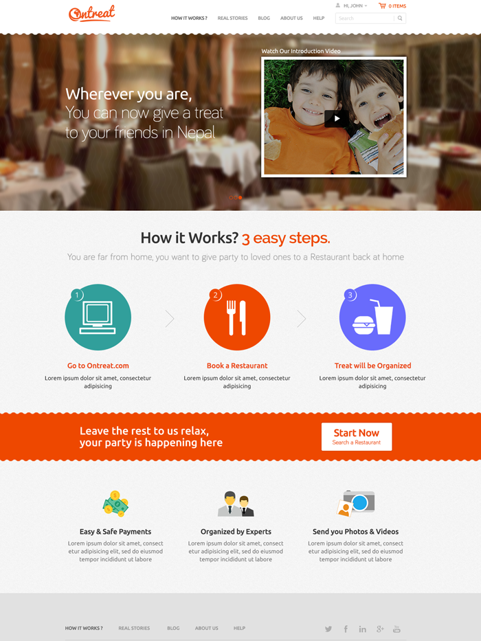

# Ontreat: Restaurant Booking & Gifting Platform

## What is Ontreat?

Think Airbnb, but for restaurants. The idea: you're living abroad and want to treat your friend or family member back in Nepal to a nice dinner. You go to Ontreat, browse restaurants, pick items from their menu, pay online, and the restaurant organizes the treat. They even send you photos and videos of the event.

**How it works:**
1. Browse restaurants and menus on Ontreat
2. Select items and book a treat for someone
3. The restaurant handles everything and sends you photos

---

## The Team

This was my second Django project, and I built it alongside my mentor, Krishna Sunuwar. Krishna guided me through architecture decisions and production-level best practices while I handled the bulk of the development. The design came from a separate design team — we focused entirely on the backend, APIs, and frontend implementation.

My first Django project taught me the basics, but Ontreat is where I really learned how to structure a production application: proper API design, payment integration patterns, and managing complexity as a codebase grows. Having a mentor who'd been through this before made a huge difference — I picked up patterns and practices that would have taken much longer to learn on my own.

---

## What We Built

- Full Django/DRF backend with REST APIs
- Restaurant dashboard for managing menus and bookings
- Customer-facing booking and gifting flow
- Three payment gateways: **Stripe** (international cards), **E-Sewa** (Nepal's digital wallet), **NIBL** (Nepal bank gateway)
- Booking lifecycle management from payment through to completion

---

## The Hard Parts

**Three different payment APIs.** Stripe, E-Sewa, and NIBL all have completely different APIs, response formats, and flows. We built an abstraction layer so the booking system treats all three uniformly, while each gateway handles its own quirks underneath.

**The booking state machine.** A treat goes through multiple stages: paid, confirmed by restaurant, scheduled, completed, photos sent. Tracking this lifecycle with proper error handling (what if the restaurant declines?) required careful state management.

**Restaurant onboarding.** Getting restaurants to upload their menus and manage bookings needed a simple admin interface. Most restaurant owners aren't technical, so the UI had to be straightforward.

---

## Tech Stack

| Layer | Tech |
|-------|------|
| Backend | Django, Django REST Framework |
| Database | MySQL |
| Frontend | Bootstrap, jQuery, AJAX |
| Payments | Stripe, E-Sewa, NIBL |
