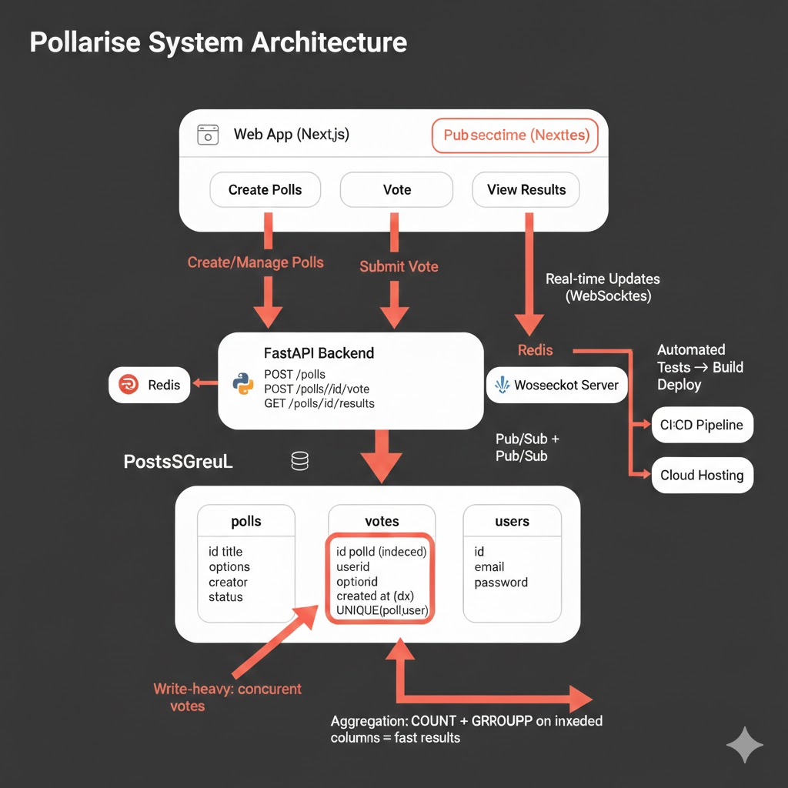

# Pollarise: Interactive Polling & Survey Platform

## What is Pollarise?

Pollarise is a polling and survey platform where users create polls, share them publicly, collect votes in real-time, and watch results update live with visual breakdowns. Think of it as a modern, fast alternative to tools like StrawPoll, but with richer features and a cleaner experience.

The client came to me with the UI designs and the product vision. I took it from there and handled **everything on the technical side**: system architecture, database design, API design, frontend development, backend development, deployment pipeline, and production infrastructure. From zero code to a live, working product.

---

## My Role: Full-Stack Developer & System Architect

The client provided Figma designs and feature requirements. I made every technical decision:

- How to structure the system (what talks to what, and why)
- Which technologies to use and why
- How the database should be modeled
- How to handle real-time data without things falling apart under load
- How to deploy it and keep it running reliably

---

## Architecture & System Design

Here's how I designed the system from the ground up:

### Frontend (Next.js)
Chose Next.js for the frontend because it gives us server-side rendering (good for SEO when polls are shared publicly), file-based routing (keeps things organized), and React's component model for building the interactive poll UI. The real-time results view uses efficient polling with optimistic UI updates so the experience feels instant.

### Backend API (FastAPI)
Went with FastAPI (Python) for the backend. It's async by default, which matters here because vote submissions can spike when a poll goes viral. FastAPI handles concurrent requests well without the overhead of Django. The API follows REST conventions with clear endpoint structure:

- `POST /polls` — create a new poll
- `GET /polls/{id}` — fetch poll details and current results
- `POST /polls/{id}/vote` — submit a vote
- `GET /polls/{id}/results` — real-time results with aggregation

### Database Design (PostgreSQL)
This was one of the more interesting design decisions. Polling apps are **write-heavy** — lots of concurrent votes hitting the database at the same time. I designed the schema with this in mind:

- **Polls table**: stores poll metadata (title, options, creator, settings, timestamps)
- **Votes table**: append-only log of individual votes, indexed for fast aggregation
- **Users table**: registration data with hashed passwords
- Used database-level constraints to prevent double voting
- Indexed the votes table on `poll_id` and `created_at` for fast count queries
- Aggregation queries use `COUNT` with `GROUP BY` rather than maintaining a separate counter (avoids race conditions)

### Authentication
Built a complete auth system: user registration, login, password hashing with bcrypt, JWT tokens for session management. Poll creators can manage their polls, see detailed analytics, and close voting when ready.

### Real-Time Results
When someone votes, results need to update for everyone viewing the poll. Rather than WebSockets (which adds infrastructure complexity), I used efficient short-polling with smart caching on the backend. The aggregation query is fast enough (thanks to proper indexing) that polling every few seconds works without hammering the database.

---

## What I Built, Step by Step

### 1. Project Setup & Architecture
- Set up the monorepo structure with Next.js frontend and FastAPI backend
- Configured TypeScript on the frontend, Python type hints on the backend
- Designed the database schema and created migrations
- Set up local development environment with Docker

### 2. User System
- Registration with email validation
- Login with JWT-based authentication
- Password hashing (bcrypt)
- Protected routes on both frontend and API

### 3. Poll Management
- Create polls with multiple choice options
- Set poll duration (open-ended or time-limited)
- Edit and delete your own polls
- Close voting manually
- Share polls via unique URLs

### 4. Voting System
- One vote per user per poll (enforced at the database level)
- Vote submission with immediate feedback
- Input validation and error handling
- Anonymous voting option for polls that don't require login

### 5. Results & Visualization
- Real-time vote counts with percentage breakdowns
- Visual bar/chart representation of results
- Live updating as new votes come in
- Total vote count display

### 6. Frontend Implementation
- Translated the client's Figma designs into React components
- Responsive layout that works on desktop, tablet, and mobile
- Loading states, error handling, and empty states
- Clean URL structure for sharing polls

### 7. Deployment & CI/CD
- Set up CI/CD pipeline for automated testing and deployment
- Configured production environment on cloud infrastructure
- Database backups and monitoring
- Environment-based configuration (dev, staging, production)

---

## The Hard Parts

**Concurrent vote handling.** When a popular poll gets hundreds of votes in a short window, you need the database to handle all those writes without losing data or creating race conditions. I solved this with append-only vote records and database-level unique constraints (instead of application-level checks, which can fail under concurrency).

**Fast aggregation on large polls.** A poll with 10,000+ votes needs to return results in milliseconds, not seconds. Proper indexing on the votes table and efficient `GROUP BY` queries keep this fast. I tested with synthetic load to make sure it holds up.

**Translating designs to working UI.** The client's Figma designs looked great but had edge cases that weren't covered: what happens with 20 options? What about really long option text? What does the empty state look like before any votes? I had to make those design decisions on the fly while keeping the overall look consistent.

**Making the whole thing production-ready.** Going from "it works on my machine" to "it runs reliably in production" means handling: environment configuration, database migrations, error logging, health checks, CI/CD, and deployment automation. Set all of this up from scratch.

---

## Tech Stack

| Layer | Tech | Why I Chose It |
|-------|------|---------------|
| Frontend | Next.js (React) | SSR for shared polls, React for interactive UI |
| Backend | FastAPI (Python) | Async performance, fast development, auto-generated API docs |
| Database | PostgreSQL | Reliable, great for aggregation queries, strong concurrency handling |
| Auth | JWT + bcrypt | Stateless auth that works well with API-first architecture |
| Infra | Cloud hosting, CI/CD | Automated deployments, zero-downtime releases |

---

## What I Delivered

- A fully working polling platform, live in production
- Clean codebase the client can hand to another developer if needed
- API documentation (auto-generated by FastAPI's OpenAPI integration)
- Database schema that handles concurrent load without issues
- CI/CD pipeline so updates can be shipped with confidence
- The client provided the designs. I built everything else.
