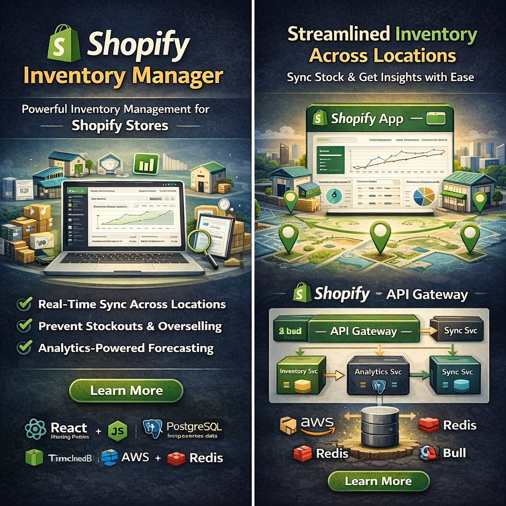

## Overview

The Shopify Inventory Manager is a powerful application designed to help e-commerce businesses manage their inventory across multiple locations with real-time synchronization and comprehensive analytics.

## The Challenge

Many Shopify merchants struggle with:
- Managing inventory across multiple warehouses and retail locations
- Keeping stock levels synchronized in real-time
- Forecasting inventory needs based on sales trends
- Preventing overselling and stockouts

## Solution

I built a comprehensive inventory management solution that integrates seamlessly with Shopify's ecosystem.

### Key Features

**Multi-location Support**
- Manage inventory across unlimited locations
- Transfer stock between locations with tracking
- Set location-specific reorder points

**Real-time Sync**
- Instant inventory updates across all sales channels
- Webhook-based synchronization with Shopify
- Conflict resolution for concurrent updates

**Analytics Dashboard**
- Sales velocity tracking
- Inventory turnover metrics
- Demand forecasting with ML predictions
- Custom reporting and exports


## Technical Implementation

### Architecture

The application uses a microservices architecture for scalability:

```
┌─────────────────┐     ┌─────────────────┐
│   Shopify App   │────▶│   API Gateway   │
└─────────────────┘     └────────┬────────┘
                                 │
        ┌────────────────────────┼────────────────────────┐
        │                        │                        │
        ▼                        ▼                        ▼
┌───────────────┐    ┌───────────────┐    ┌───────────────┐
│ Inventory Svc │    │ Analytics Svc │    │   Sync Svc    │
└───────┬───────┘    └───────┬───────┘    └───────┬───────┘
        │                    │                    │
        └────────────────────┼────────────────────┘
                             │
                    ┌────────▼────────┐
                    │   PostgreSQL    │
                    └─────────────────┘
```

### Tech Stack

- **Frontend**: React with Shopify Polaris design system
- **Backend**: Node.js with Express
- **Database**: PostgreSQL with TimescaleDB for time-series data
- **Queue**: Redis with Bull for background jobs
- **Infrastructure**: AWS (ECS, RDS, ElastiCache)

### Performance Optimizations

- Implemented database connection pooling
- Added Redis caching for frequently accessed data
- Used batch processing for bulk inventory updates
- Optimized GraphQL queries to reduce API calls

## Results

Since launch, the app has achieved:

- **500+ active stores** using the platform
- **99.9% uptime** over the past year
- **< 100ms** average API response time
- **40% reduction** in stockouts for merchants

## Lessons Learned

1. **Start with rate limiting**: Shopify's API limits are strict. Build rate limiting into your architecture from day one.

2. **Invest in monitoring**: Real-time dashboards for API calls, sync status, and error rates are invaluable.

3. **Test with real data**: Synthetic test data doesn't capture the complexity of real merchant catalogs.

---

*Interested in building a similar solution? [Let's discuss your project](/contact).*
