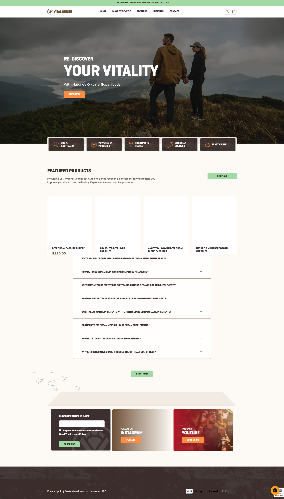
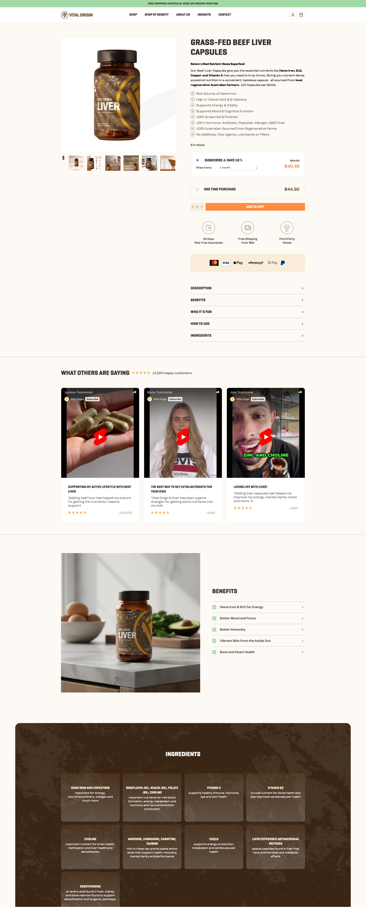

# Vital Origin: Premium Shopify Store for a Wellness Brand

## The Project

Vital Origin is an Australian wellness brand selling natural health supplements. I set up their entire Shopify store from scratch: premium theme customization to match their clean, natural branding, full product and collection setup, and SEO groundwork.

**Live:** [vitalorigin.com.au](https://vitalorigin.com.au/)

---

## What I Did

- Customized a premium Shopify theme to fit the brand's natural, clean aesthetic
- Set up all products, collections, and navigation from scratch
- Optimized for mobile (wellness customers browse a lot on their phones)
- Implemented SEO fundamentals: clean URLs, proper heading structure, meta tags
- Responsive image handling to keep page speed fast without sacrificing image quality

---

## The Hard Parts

**Balancing image quality with speed.** Wellness products need high-quality photos to look credible. But large images kill page speed. I set up responsive images and lazy loading to get both.

**Making it self-manageable.** The client needed to add new products and update content without calling me every time. Built the theme with modular sections they can manage through Shopify's admin.

---

## Tech Stack

Shopify, Liquid, HTML/CSS, JavaScript
